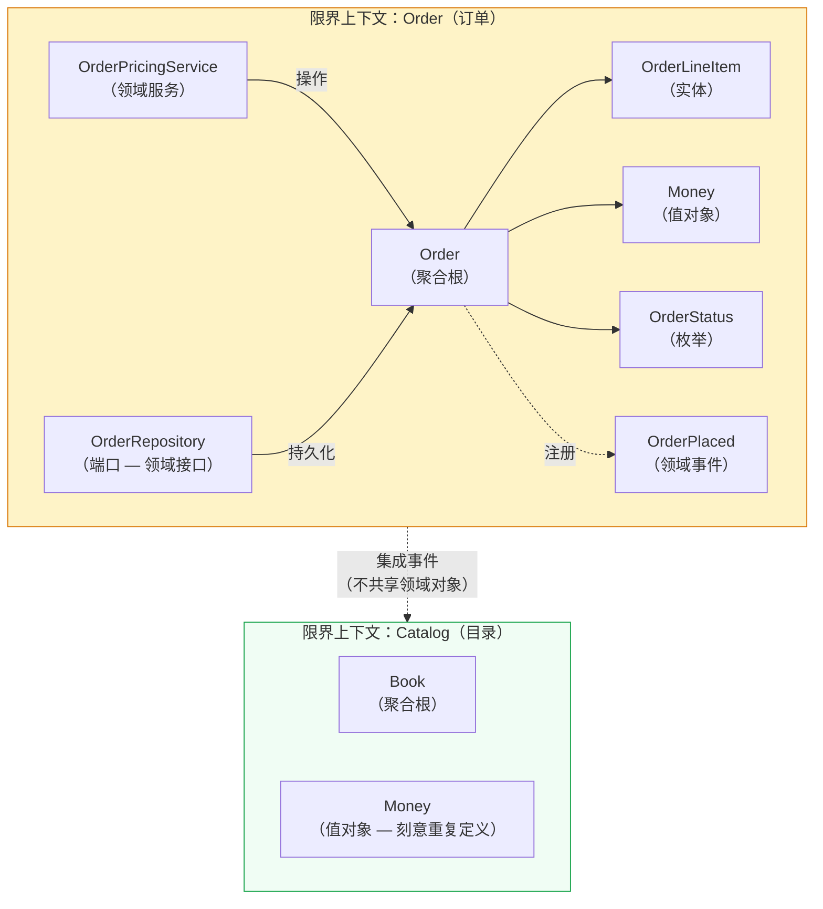
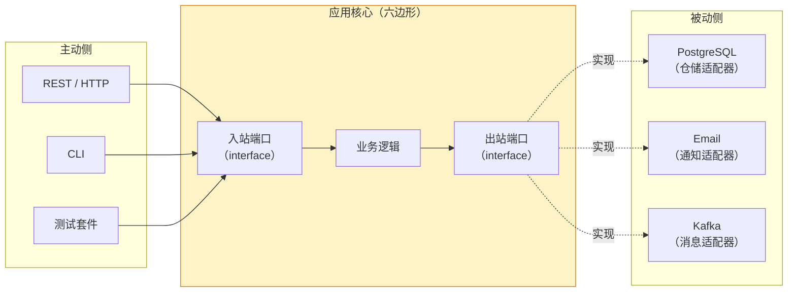
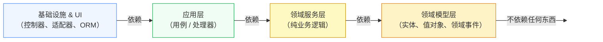
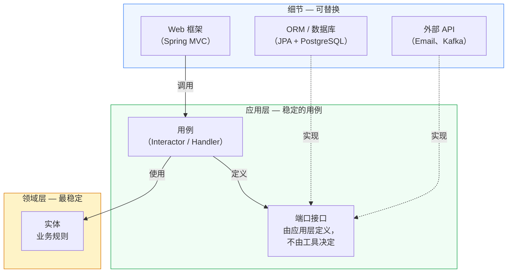
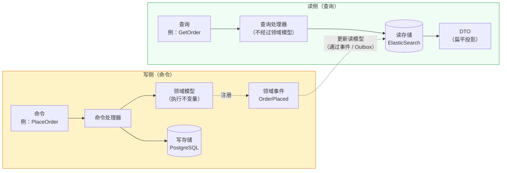
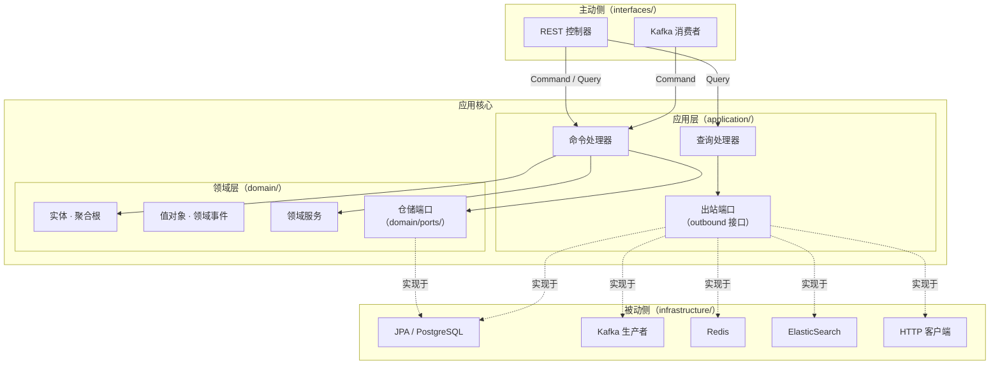
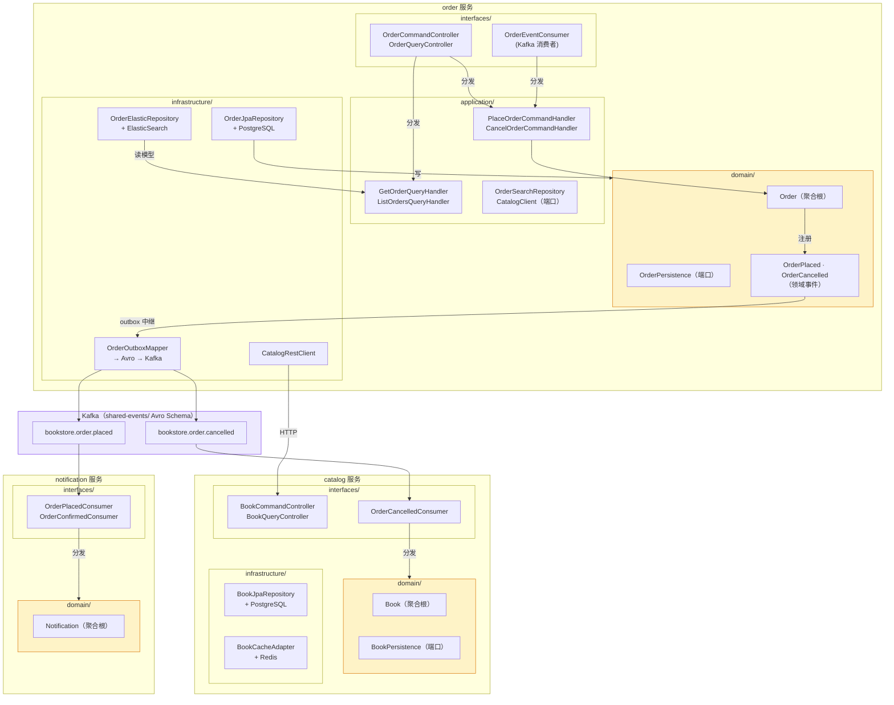

# Explicit Architecture 演示项目 — 在线书店

这是一个生产级演示项目，展示 **DDD、六边形架构、洋葱架构、整洁架构与 CQRS** 如何组合成一个统一的结构模式，以及将它们付诸实践后如何消解其中残留的歧义。

> 参考文章：[Herberto Graça — Explicit Architecture #01](https://herbertograca.com/2017/11/16/explicit-architecture-01-ddd-hexagonal-onion-clean-cqrs-how-i-put-it-all-together/)

---

## 架构演进之路

这套组合中的每个模式，都源于对不同问题的解答。理解每个模式存在的*原因*，才能让最终的融合显得水到渠成，而非人为拼凑。

### 领域驱动设计（DDD）

DDD 从一个问题出发：**业务规则应该由谁负责？**

在传统的分层架构中，业务逻辑往往四散漂移——分布在控制器、服务类和各种工具方法里，没有任何一个地方是权威的。DDD 的答案是：构建一个**领域模型**——由实体（Entity）、值对象（Value Object）、聚合（Aggregate）和领域服务（Domain Service）组成的丰富对象模型——并以此作为应用程序无可争议的核心。持久层、UI 和消息基础设施的存在，都是为了服务这个模型，而不是承载本该属于它的逻辑。

DDD 还引入了**限界上下文（Bounded Context）**：为领域模型划定明确边界，使统一语言（Ubiquitous Language）在边界内保持一致。Order 上下文中的"订单"与 Billing 上下文中的"订单"，含义并不相同。每个上下文完整地拥有自己的模型。



### 六边形架构——端口与适配器

DDD 定义了*中心*包含什么。六边形架构定义了*如何保护它*。

Alistair Cockburn 的洞见：应用程序在其核心逻辑与驱动它或被它驱动的外部组件之间，存在一条自然边界。**端口（Port）** 是这条边界上的接口，使用应用程序自己的语言来定义。**适配器（Adapter）** 是插入端口的外部实现——一个 REST 控制器、一个 PostgreSQL 仓储、一个 Kafka 生产者。

关键洞见：应用核心永远不会导入适配器。适配器导入端口。这种反转意味着可以将 PostgreSQL 换成 MongoDB，或将 HTTP 换成 CLI，而无需触碰任何一行业务逻辑。



### 洋葱架构

六边形架构给了你两侧（主动侧 / 被动侧）。洋葱架构进一步为核心内部的结构添加了**同心圆**。

**依赖规则：** 源码依赖只能指向内层。领域模型不依赖任何东西。应用层只依赖领域层。基础设施层依赖应用层和领域层。这让内层完全可以用普通单元测试来验证——无需框架、无需数据库、无需 Docker。



### 整洁架构

Robert Martin 的整洁架构用同样的依赖规则，更强调**用例（Use Case）作为一等公民**。用例（在整洁架构中称为 Interactor）位于应用层，代表一个单一的业务动作。它们是系统中最稳定的核心。框架、数据库和 UI 都是细节——可以被替换的细节。

关键贡献：**应用层为自己所需的一切定义接口**（仓储、邮件发送器、支付网关）。基础设施层实现这些接口。这是依赖倒置原则在架构层面的应用。



### CQRS——命令查询职责分离

即便有了整洁的架构，读和写在本质上也有截然不同的特性。写操作要执行业务不变量、更新聚合、发布事件。读操作要获取数据——通常需要关联多张表——并返回为展示优化的扁平投影。把两者都强制通过同一个领域模型，会造成不必要的耦合。

CQRS 将两者分开：

- **命令（写侧）**：经过领域模型，执行业务规则，通过仓储持久化，发布领域事件。
- **查询（读侧）**：完全绕过领域模型。查询处理器直接访问数据库并返回 DTO。不加载任何实体，不检查任何不变量。读路径就是一条数据库查询。

这为独立扩展和优化打开了大门：写存储可以是 PostgreSQL，读存储可以是 ElasticSearch——各自针对其工作负载单独调优。



---

## Explicit Architecture：融合的结果

Herberto Graça 的 **Explicit Architecture** 将上述五个模式融合为一个统一的模型。这个名字恰如其分：架构应当从包结构本身就*清晰可见*。读到 `interfaces/rest/OrderCommandController.java`，你就知道它是一个主动适配器；读到 `domain/ports/OrderPersistence.java`，你就知道它是一个领域端口。没有任何东西藏在泛泛的 `service/` 或 `util/` 包里。



**四个区域：**

| 区域 | 包 | 依赖规则 |
|---|---|---|
| 主动适配器 | `interfaces/` | 依赖应用层（通过总线） |
| 应用层 | `application/` | 仅依赖领域层 |
| 领域层 | `domain/` | 不依赖任何东西 |
| 被动适配器 | `infrastructure/` | 依赖应用层 + 领域层 |

**铁律：** 领域模型不导入自身以外的任何东西。不导入 JPA 注解，不导入应用层类型，不导入任何框架接口。这是唯一必须无条件成立的不变量。

---

## Clarified Architecture：消解歧义

Explicit Architecture 是一份出色的概念地图。但当团队实际落地时，会反复遇到五个张力地带——原始模型将决策留给了读者。**Clarified Architecture** 为每个张力提供了一个有明确立场的默认解答。

### 张力一：用例的唯一归属

**问题：** Explicit Architecture 允许用例逻辑放在应用服务（Application Service）或命令处理器（Command Handler）中，造成同一职责有两个竞争性容器。

**解答：** 选一个，全项目统一执行。如果使用命令/查询总线，处理器（Handler）是用例的唯一容器——应用服务作为概念被消除。如果没有总线，则应用服务是容器。两者在新代码中永远不应共存。

本项目使用 **Handler + Bus**。控制器不直接导入处理器，只向 `CommandBus` 或 `QueryBus` 分发。横切关注点（日志、计时）放在总线实现中，不出现在单个处理器里。

### 张力二：领域服务的纯粹性

**问题：** 领域服务有时需要它无法获取的数据（因为它不能依赖仓储），导致层与层之间的"乒乓调用"。

**解答：** 领域服务是**纯函数**。所有输入作为参数传入，返回结果。不持有仓储引用，不触发 I/O，不分发事件。处理器负责所有 I/O——预取所有需要的数据，传入领域服务，处理返回结果。

```
Handler:  加载 OrderA，加载 PricingPolicy  ← 所有 I/O 在此
              ↓
DomainService.applyDiscount(orderA, pricingPolicy)  ← 纯计算
              ↓
Handler:  保存更新后的订单               ← 所有 I/O 在此
```

这让领域服务测试时完全不需要 Mock：`new PricingService().apply(fakeOrder, fakePolicy)`。

### 张力三：仓储的归属与 CQRS 读路径

**问题：** 仓储接口应该放在应用层还是领域层？读路径上的查询投影又放在哪里？

**解答：** 按路径干净地拆分。

- **写路径：** 仓储接口属于 `domain/ports/`。`OrderPersistence` 是领域概念（"所有订单的集合"），参数使用领域类型（`OrderId`、`Order`），不使用原始 UUID。
- **读路径：** 查询处理器完全绕过领域模型，直接访问数据库返回 DTO。读模型端口（`OrderReadRepository`、`OrderSearchRepository`）放在 `application/port/outbound/`，因为它们是没有领域语义的基础设施抽象。

| 路径 | 端口位置 | 经过领域层？ |
|---|---|---|
| 写（命令） | `domain/ports/` | 是——实体执行不变量检查 |
| 读（查询） | `application/port/outbound/` | 否——直接查询数据库返回 DTO |

### 张力四：共享内核的膨胀

**问题：** 共享内核（Shared Kernel）会变成重力中心。每个跨服务通信需求都会往里加事件类、共享值对象和工具类型。久而久之，它变成系统中最大、最不稳定的模块，间接耦合了所有服务。

**解答：** 用**事件注册表（Event Registry）**替代共享内核代码库——一个只包含 Schema（Avro `.avsc` 文件）、不含任何可执行业务逻辑的制品。各服务在构建时从 Schema 生成类型化的代码类；每个服务的领域层只看到自己的类型。Schema 文件是契约；生成的代码类是工程便利。

本项目中，`shared-events/` 只包含 Avro Schema 文件。生成的 Java 类发布到 `mavenLocal()` 并作为库被消费。没有领域逻辑，没有 Spring Bean——只有序列化机制。

### 张力五：跨组件数据一致性

**问题：** Explicit Architecture 没有讨论跨服务数据共享的一致性、故障处理和补偿机制。

**解答：** 根据部署拓扑选择对应模式。

- **微服务：** 每个服务维护本地只读投影，通过集成事件更新。配套实现幂等事件处理器、补偿事务和定期对账。
- **模块化单体：** 用数据库视图（View）作为组件间的读契约。强一致性可免费获得；在这里引入最终一致性是过度设计。

本项目中，跨服务状态变更是事件驱动的。订单取消时，`order` 服务发布 `OrderCancelled`；`catalog` 服务消费后释放预留库存。跨服务状态变更不使用同步 HTTP 调用。

---

## 全景图



**图示说明：**
- 黄色区域（`domain/`）没有任何出站依赖——它们是受保护的核心。
- 实线箭头为源码依赖，虚线箭头为运行时实现。
- Kafka（紫色）是服务间唯一的共享面——且仅通过 Avro Schema 契约，不共享任何领域对象。

---

## 关于本演示

业务场景为**在线书店**，划分出三个限界上下文：

| 服务 | 端口 | 职责 |
|---|---|---|
| [`catalog`](catalog/README-zh.md) | 8081 | 图书/库存管理；Redis 缓存 |
| [`order`](order/README-zh.md) | 8082 | 订单全生命周期（CQRS）；PostgreSQL 写 + ElasticSearch 读 |
| [`notification`](notification/README-zh.md) | 8083 | 事件驱动通知（日志模拟） |
| [`shared-events`](shared-events/README-zh.md) | — | 跨服务事件 Avro Schema SDK |
| `seedwork` | — | 可复用的 DDD + CQRS 基础抽象 |

各服务的 README 包含其领域模型、API 参考、环境变量和部署说明。

---

## 快速开始

```bash
# 1. 发布共享库（需执行一次；每次修改后重新执行）
cd seedwork      && ./gradlew publishToMavenLocal
cd ../shared-events && ./gradlew publishToMavenLocal

# 2. 运行某个服务（需要 PostgreSQL、Redis、Kafka 可访问）
cd catalog && ./gradlew bootRun
```

---

## 延伸阅读

| 文档 | 用途 |
|---|---|
| [`docs/architecture/clarified-architecture/clarified-architecture-zh.md`](docs/architecture/clarified-architecture/clarified-architecture-zh.md) | Clarified Architecture 完整规范（权威来源） |
| [`docs/architecture/architecture-spec-zh.md`](docs/architecture/architecture-spec-zh.md) | 项目专属命名规范、包结构与实现规则 |
| [`docs/architecture/adr/`](docs/architecture/adr/) | 架构决策记录（ADR-001 – ADR-011） |
| [`docs/testing-strategy/`](docs/testing-strategy/) | 测试策略与测试金字塔参考 |
