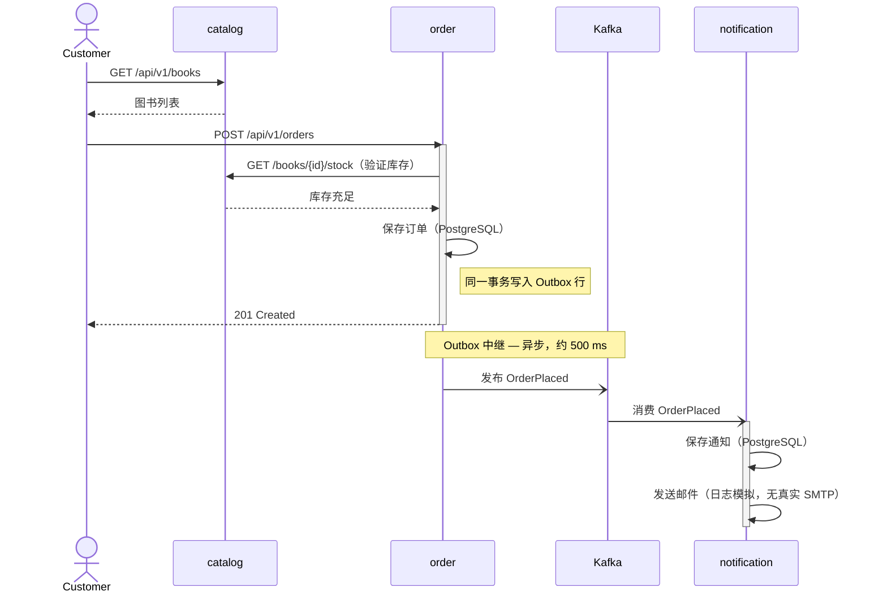
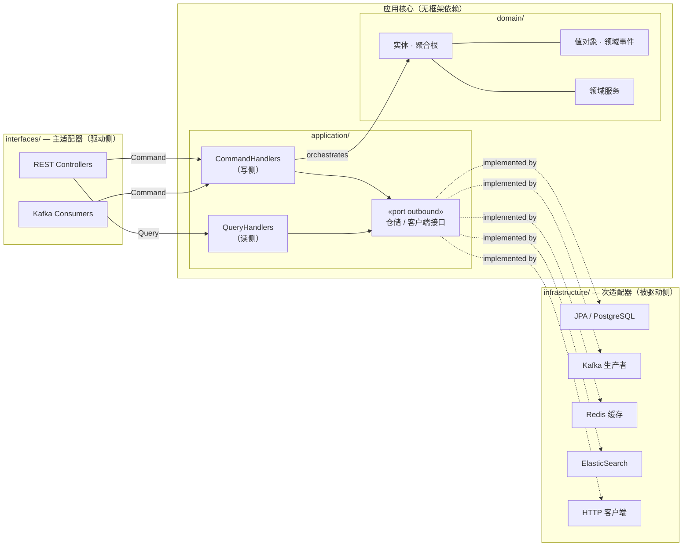
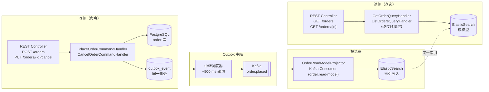

# Explicit Architecture 演示项目 — 在线书店

这是一个生产级演示项目，实现了 Herberto Graça 所描述的 **Explicit Architecture**（DDD + 六边形 + 洋葱 + 整洁 + CQRS）。业务场景为**在线书店**，由三个独立微服务组成。

> 参考文章：[Explicit Architecture #01 – DDD, Hexagonal, Onion, Clean, CQRS, How I Put It All Together](https://herbertograca.com/2017/11/16/explicit-architecture-01-ddd-hexagonal-onion-clean-cqrs-how-i-put-it-all-together/)

---

## 业务场景

客户浏览图书目录、下单，并收到确认通知。由此自然划分出三个限界上下文：

| 微服务 | 限界上下文 | 职责 |
|---|---|---|
| `catalog` | 图书目录 | 图书/作者/分类管理；库存管理 |
| `order` | 订单管理 | 订单全生命周期（CQRS）；支付状态 |
| `notification` | 通知服务 | 事件驱动的邮件/推送通知 |

**下单流程（时序图）：**



**跨服务一致性**通过基于编排的 Saga 保障（参见 [ADR-006](docs/architecture/adr/ADR-006-database-per-service.md)），事件可靠投递通过 Outbox 模式实现（参见 [ADR-005](docs/architecture/adr/ADR-005-outbox-pattern.md)）。

---

## 架构概览

每个微服务均遵循 **Explicit Architecture**，严格划分层次边界：



### 核心原则

- **端口与适配器（六边形）**：`interfaces/` 存放主适配器（驱动侧）；`infrastructure/` 存放次适配器（被驱动侧）。应用核心定义次端口接口，基础设施层提供实现。
- **依赖规则（洋葱/整洁架构）**：依赖方向始终指向内层。领域层对框架零依赖。
- **CQRS**：CommandHandler（写）与 QueryHandler（读）严格分离。`order` 服务写侧使用 PostgreSQL，读侧使用 ElasticSearch。
- **领域事件**：服务之间通过 Kafka 上的领域事件通信，不直接跨服务耦合领域层。
- **限界上下文**：每个微服务完全拥有自己的领域模型，不在服务间共享领域对象。

---

## 领域模型概览

每个微服务完全拥有自己的领域模型（不跨服务共享领域对象）。

| 微服务 | 聚合根 | 领域事件 | 详细说明 |
|---|---|---|---|
| `catalog` | `Book` | `BookAdded`, `StockReserved`, `StockReleased` | [catalog/README.md](catalog/README.md#domain-model) |
| `order` | `Order` | `OrderPlaced`, `OrderConfirmed`, `OrderShipped`, `OrderCancelled` | [order/README.md](order/README.md#domain-model) |
| `notification` | `Notification` | `NotificationSent`, `NotificationFailed` | [notification/README.md](notification/README.md#domain-model) |

---

## CQRS 流程（order 服务）



读模型为**最终一致性** — 通常滞后写侧不超过 500 ms（Outbox 轮询间隔）。

Controller 通过 `CommandBus` / `QueryBus` 派发所有操作，不直接注入具体 Handler 类。

---

## 模块结构（每个微服务）

三个服务的目录结构相同，仅适配器因服务而异（见下方对照表）。

```
{service}/
├── src/
│   ├── main/
│   │   ├── java/com/example/{service}/
│   │   │   ├── domain/                      # 零框架依赖 — 纯 Java
│   │   │   │   ├── model/                   # 实体、聚合根、值对象
│   │   │   │   ├── event/                   # 领域事件（进程内，不可变 record）
│   │   │   │   └── service/                 # 领域服务（跨聚合、无状态）
│   │   │   ├── application/                 # 仅依赖 domain；禁止导入 Spring/JPA/Kafka
│   │   │   │   ├── port/
│   │   │   │   │   └── outbound/            # 次端口：Persistence、Client、SearchRepository 接口
│   │   │   │   ├── command/{aggregate}/     # Command record + @Service CommandHandler（按特性分包）
│   │   │   │   └── query/{aggregate}/       # Query record + @Service QueryHandler + Response DTO
│   │   │   ├── infrastructure/              # 被驱动适配器 — 所有框架代码在此
│   │   │   │   ├── repository/
│   │   │   │   │   ├── jpa/                 # JPA 实体 + Spring Data 仓储 + 持久化适配器
│   │   │   │   │   └── elasticsearch/       # ES 文档 + ES 仓储 + 投影器（仅 order）
│   │   │   │   ├── messaging/
│   │   │   │   │   └── outbox/              # OutboxMapper 实现（catalog + order）
│   │   │   │   ├── cache/                   # Redis 适配器（仅 catalog）
│   │   │   │   └── client/                  # HTTP 客户端（order: CatalogRestClient）
│   │   │   │       └── email/               # 邮件适配器（仅 notification — 日志模拟）
│   │   │   └── interfaces/                  # 主适配器 — 驱动（入站）侧
│   │   │       ├── rest/                    # REST Controller；通过 CommandBus / QueryBus 派发
│   │   │       └── messaging/
│   │   │           └── consumer/            # Kafka 消费者（notification + order 读模型投影器）
│   │   └── resources/
│   │       ├── application.yml
│   │       └── db/
│   │           └── migration/               # Flyway 迁移脚本（V1__xxx.sql, V2__xxx.sql …）
│   └── test/
│       ├── java/com/example/{service}/
│       │   ├── domain/                      # 纯单元测试 — 无 Spring 上下文，无 Docker
│       │   ├── application/                 # Handler 单元测试 — Mock 出站端口
│       │   └── infrastructure/              # 适配器集成测试（@Tag("integration"), Testcontainers）
│       └── resources/
│           └── application-test.yml
├── helm/                                    # 服务专属 Helm Chart
│   ├── Chart.yaml
│   ├── values.yaml
│   └── templates/
│       ├── _helpers.tpl
│       ├── deployment.yaml
│       ├── service.yaml
│       ├── serviceaccount.yaml
│       ├── configmap.yaml
│       ├── hpa.yaml
│       ├── networkpolicy.yaml               # 服务专属流量放行规则
│       ├── virtual.yaml                     # Istio VirtualService（超时/重试）
│       ├── destination-rule.yaml            # Istio DestinationRule（熔断器）
│       └── NOTES.txt
└── build.gradle.kts
```

> 镜像使用 **Jib** 构建（无需 `Dockerfile`）。执行 `./gradlew jibDockerBuild` 即可推送至本地 Docker daemon。

### 各服务适配器对照

| 适配器包 | catalog | order | notification |
|---|---|---|---|
| `interfaces/rest/` | ✅ | ✅ | ✅ |
| `infrastructure/repository/jpa/` | ✅ | ✅ | ✅ |
| `infrastructure/messaging/outbox/` | ✅（发布库存事件） | ✅（Outbox 中继） | — |
| `infrastructure/cache/` | ✅ Redis | — | — |
| `infrastructure/repository/elasticsearch/` | — | ✅ ElasticSearch | — |
| `infrastructure/client/email/` | — | — | ✅ LogEmailAdapter |
| `infrastructure/client/`（HTTP） | — | ✅ CatalogRestClient | — |
| `interfaces/messaging/consumer/` | — | ✅ OrderReadModelProjector | ✅ OrderEventConsumer |

### 领域事件 vs 集成事件

| 类型 | 包位置 | 作用域 | 示例 |
|---|---|---|---|
| **领域事件** | `domain/event/` | 进程内；聚合根所有；触发 Outbox 写入 | `OrderPlaced` |
| **集成事件** | `shared-events/`（Avro） | 跨服务，经 Kafka 传递；schema 契约 | `com.example.events.v1.OrderPlaced` |

Kafka 发布是纯基础设施关注点。Outbox 模式（由 `seedwork` 实现）在同一事务中原子写入事件行。领域对象不导入 `shared-events` Avro 类 — 只有 `OutboxMapper` 才会导入。

> **测试分层**：单元测试（`domain/`、`application/`）无需 Docker，毫秒级完成。集成测试（`infrastructure/`）标注 `@Tag("integration")`，通过 Testcontainers 按需启动 PostgreSQL / Redis / Kafka / ES。

---

## 技术栈

| 分类 | 技术 |
|---|---|
| 语言 | Java 21（虚拟线程、Records、模式匹配） |
| 框架 | Spring Boot 3.x |
| 构建工具 | Gradle 8.x（每个服务独立项目） |
| 数据库 | PostgreSQL 16（写存储） |
| 缓存 | Redis 7（catalog 缓存、幂等键） |
| 搜索 | ElasticSearch 8（order 读/查询侧） |
| 消息系统 | Apache Kafka（领域事件总线） |
| 可观测性 | OpenTelemetry（链路追踪 + 指标）+ SigNoz |
| 容器 | Docker + Kubernetes |
| 服务网格 | Istio（mTLS、流量管理、金丝雀发布） |
| 打包 | Helm 3 |
| 镜像构建 | Jib（无需 Dockerfile） |
| 测试 | JUnit 5、Testcontainers、RestAssured |
| 契约测试 | PactFlow（双向契约测试） |

---

## 项目目录结构

```
explicit-architecture/
├── catalog/                    # 图书目录限界上下文
│   ├── src/
│   ├── helm/                   # 服务专属 Helm Chart
│   └── build.gradle.kts
├── order/                      # 订单管理限界上下文（CQRS）
│   ├── src/
│   ├── helm/
│   └── build.gradle.kts
├── notification/               # 通知服务限界上下文
│   ├── src/
│   ├── helm/
│   └── build.gradle.kts
├── shared-events/              # 事件 Schema SDK（各服务通过 mavenLocal() 依赖）
│   ├── src/main/avro/com/example/events/
│   │   ├── v1/                 # OrderPlaced, OrderCancelled, StockReserved …
│   │   └── v2/                 # 破坏性变更时使用（当前为空占位）
│   ├── scripts/
│   │   └── register-schemas.sh # Schema Registry 一键注册脚本
│   ├── CHANGELOG.md            # 版本变更日志（每次 schema 变更必填）
│   └── build.gradle.kts
├── seedwork/                   # 可复用 DDD + CQRS 框架抽象
│   └── build.gradle.kts
├── e2e/                        # 端到端测试（针对线上环境的 REST 调用）
│   └── build.gradle.kts
├── docs/
│   ├── architecture/           # 架构决策记录（ADR）
│   └── api/                    # OpenAPI 规范文档
├── build.gradle.kts            # 根版本目录（共享依赖版本）
├── settings.gradle.kts
└── README.md
```

> 每个服务（`catalog`、`order`、`notification`、`seedwork`、`shared-events`、`e2e`）都是**独立的 Gradle 项目**，拥有各自的 `settings.gradle.kts`，不存在根多模块构建。根目录的 `build.gradle.kts` 仅提供共享版本目录。

---

## 快速开始

### 前置条件

| 工具 | 版本要求 | 用途 |
|---|---|---|
| JDK | 21+ | 构建并运行服务 |
| Docker | 24+ | 通过 Jib 构建镜像 |
| kubectl | 1.28+ | Kubernetes 部署 |
| Helm | 3.13+ | Chart 打包与部署 |
| minikube / kind | 最新版 | 本地 Kubernetes 集群（可选） |

### 本地开发

```bash
# 1. 将基础设施中间件部署到本地 Kubernetes（minikube / kind）
helm upgrade --install bookstore-infra ./infrastructure/helm -f infrastructure/helm/values.yaml

# 2. 将共享库发布到 mavenLocal（首次使用时执行；每次修改 seedwork/shared-events 后重新执行）
cd seedwork && ./gradlew publishToMavenLocal
cd ../shared-events && ./gradlew publishToMavenLocal

# 3. 本地运行服务（连接到 K8s 中运行的中间件）
cd catalog && ./gradlew bootRun
```

### 运行测试

```bash
# 仅单元测试 — 无需 Docker，秒级完成
cd catalog && ./gradlew test -PtestProfile=unit

# 集成测试 — 需要 Docker（Testcontainers）
cd catalog && ./gradlew test -PtestProfile=integration

# 运行单个服务的全部测试
cd order && ./gradlew test

# 契约测试（无需 Testcontainers）
cd order && ./gradlew test --tests "com.example.order.contract.*"
```

### 验证环境

```bash
# 健康检查
curl http://localhost:8081/actuator/health   # catalog
curl http://localhost:8082/actuator/health   # order
curl http://localhost:8083/actuator/health   # notification

# 端到端冒烟测试
# 1. 获取图书
curl http://localhost:8081/api/v1/books | jq '.[0].id'

# 2. 下单
curl -X POST http://localhost:8082/api/v1/orders \
  -H "Content-Type: application/json" \
  -d '{"customerId":"00000000-0000-0000-0000-000000000001","items":[{"bookId":"<id>","quantity":1}]}'

# 3. 查看通知
curl http://localhost:8083/api/v1/notifications/00000000-0000-0000-0000-000000000001
```

### 构建并推送镜像（Jib）

```bash
# 构建到本地 Docker daemon（不推送至远程仓库）
cd catalog      && ./gradlew jibDockerBuild
cd order        && ./gradlew jibDockerBuild
cd notification && ./gradlew jibDockerBuild

# 推送到镜像仓库
cd catalog      && ./gradlew jib
cd order        && ./gradlew jib
cd notification && ./gradlew jib
```

### Kubernetes 部署

```bash
# 1. 安装 Istio（如尚未安装）
istioctl install --set profile=demo -y
kubectl label namespace bookstore istio-injection=enabled

# 2. 通过 Helm 伞形 Chart 部署
helm install bookstore ./infrastructure/helm/bookstore \
  --namespace bookstore \
  --create-namespace \
  -f infrastructure/helm/bookstore/values-local.yaml

# 3. 检查部署状态
kubectl -n bookstore rollout status deployment/catalog
kubectl -n bookstore get pods

# 4. 端口转发到本地
kubectl -n bookstore port-forward svc/catalog 8081:8081
```

### 升级 / 回滚

```bash
# 升级
helm upgrade bookstore ./infrastructure/helm/bookstore \
  --namespace bookstore \
  -f infrastructure/helm/bookstore/values-local.yaml

# 回滚
helm rollback bookstore 1 --namespace bookstore
```

---

## API 快速参考

完整 OpenAPI 规范：[`docs/api/`](docs/api/)

### catalog `localhost:8081`

| 方法 | 路径 | 描述 | 权限 |
|---|---|---|---|
| `GET` | `/api/v1/books` | 列出图书（分页，可按分类过滤） | 公开 |
| `GET` | `/api/v1/books/{id}` | 获取图书详情及作者信息 | 公开 |
| `POST` | `/api/v1/books` | 新增图书 | 管理员 |
| `PUT` | `/api/v1/books/{id}` | 更新图书元数据或价格 | 管理员 |
| `GET` | `/api/v1/books/{id}/stock` | 查询当前库存量 | 内部 |
| `POST` | `/api/v1/books/{id}/stock/reserve` | 为订单预留库存 | 内部 |
| `GET` | `/actuator/health` | 健康检查 | 内部 |
| `GET` | `/actuator/prometheus` | Prometheus 指标采集端点 | 内部 |

### order `localhost:8082`

| 方法 | 路径 | 描述 | 侧 |
|---|---|---|---|
| `POST` | `/api/v1/orders` | 下单（命令） | 写侧 |
| `PUT` | `/api/v1/orders/{id}/cancel` | 取消订单（命令） | 写侧 |
| `GET` | `/api/v1/orders/{id}` | 按 ID 查询订单（查询，ES 读模型） | 读侧 |
| `GET` | `/api/v1/orders?customerId=&status=&page=&size=` | 搜索订单（ElasticSearch） | 读侧 |
| `GET` | `/actuator/health` | 健康检查 | 内部 |

**下单请求体：**
```json
{
  "customerId": "uuid",
  "items": [
    { "bookId": "uuid", "quantity": 2 }
  ]
}
```

### notification `localhost:8083`

| 方法 | 路径 | 描述 |
|---|---|---|
| `GET` | `/api/v1/notifications?customerId=&page=&size=` | 查询某客户的通知列表 |
| `GET` | `/api/v1/notifications/{id}` | 获取单条通知详情 |
| `GET` | `/actuator/health` | 健康检查 |

---

## 架构决策记录

完整 ADR 索引见 [`docs/architecture/`](docs/architecture/)。

| ADR | 决策内容 |
|---|---|
| [ADR-001](docs/architecture/adr/ADR-001-explicit-architecture-over-layered.md) | 采用 Explicit Architecture，替代传统分层架构 |
| [ADR-002](docs/architecture/adr/ADR-002-cqrs-scope-order-service.md) | CQRS 仅应用于 order 服务（PostgreSQL 写 + ES 读） |
| [ADR-003](docs/architecture/adr/ADR-003-event-schema-ownership.md) | Kafka 事件 Schema 统一由 `shared-events` 模块管理 |
| [ADR-004](docs/architecture/adr/ADR-004-istio-service-mesh.md) | 使用 Istio 实现弹性，替代应用层库（如 Resilience4j） |
| [ADR-005](docs/architecture/adr/ADR-005-outbox-pattern.md) | Outbox 模式保障领域事件至少一次投递 |
| [ADR-006](docs/architecture/adr/ADR-006-database-per-service.md) | 每服务独立数据库，无共享表，采用编排式 Saga |
| [ADR-007](docs/architecture/adr/ADR-007-java21-virtual-threads.md) | Java 21 特性使用规范：虚拟线程、Records、密封类 |
| [ADR-008](docs/architecture/adr/ADR-008-shared-events-versioning.md) | shared-events SDK 版本策略：SemVer + 强制 CHANGELOG + 破坏性变更命名空间隔离 |
| [ADR-009](docs/architecture/adr/ADR-009-kafka-consumer-idempotency-retry.md) | Kafka 消费者幂等性与数据库支持的重试策略 |
| [ADR-010](docs/architecture/adr/ADR-010-opentelemetry-observability.md) | 通过 Kubernetes Operator 统一使用 OpenTelemetry 实现可观测性 |
| [ADR-011](docs/architecture/adr/ADR-011-swaggerhub-pactflow-bdct.md) | API 治理：SwaggerHub + PactFlow 双向契约测试 |

---

## 可观测性

所有服务通过 **OpenTelemetry** 上报链路追踪、指标和日志，统一汇聚到 **SigNoz** — 一体化可观测性平台，替代 Jaeger + Prometheus + Grafana + OTel Collector 的组合方案。

### 本地可观测性入口

| 工具 | URL | 用途 |
|---|---|---|
| SigNoz UI | http://localhost:3301 | 链路追踪、指标、日志、服务地图、告警 |
| SigNoz OTLP（gRPC） | localhost:4317 | 应用 Telemetry 上报端点 |
| SigNoz OTLP（HTTP） | localhost:4318 | 应用 Telemetry 上报端点（备用） |

### 信号采集方式

| 信号 | 采集方式 | 目标 |
|---|---|---|
| 链路追踪 | OTel Java Agent（自动）+ 手动 Span | SigNoz via OTLP gRPC |
| 指标 | Micrometer OTLP Registry（JVM、HTTP、HikariCP） | SigNoz via OTLP gRPC |
| 日志 | Logback JSON（含 `trace_id`、`span_id` 字段） | SigNoz（与 Trace 自动关联） |
| 服务网格指标 | Istio Envoy sidecar | Kiali（Kubernetes 环境） |

### Trace 传播

`traceparent`（W3C 标准）头自动传播：
- **HTTP 调用**：由 Spring Boot OTel 自动插桩注入/提取
- **Kafka 消息**：通过消息头传播；OTel agent 在消费者侧自动提取

Span 命名约定：`{service}.{aggregate}.{operation}`，例如：`order.order.place`、`catalog.book.reserve-stock`

### SigNoz 内置告警

在 SigNoz UI 中配置（无需 AlertManager）：

| 告警 | 触发条件 | 级别 |
|---|---|---|
| 服务高错误率 | 任意服务 5xx 率 > 1% | Critical |
| Kafka 消费积压 | 任意 Consumer Group lag > 1000 | Warning |
| 数据库连接池耗尽 | `hikaricp_connections_pending > 5` | Warning |

---

## 环境变量

每个服务从 `application.yml` 读取配置，所有配置均可通过环境变量覆盖。

### catalog

| 变量 | 默认值 | 描述 |
|---|---|---|
| `SPRING_DATASOURCE_URL` | `jdbc:postgresql://localhost:5432/catalog` | PostgreSQL 连接 URL |
| `SPRING_DATASOURCE_USERNAME` | `bookstore` | 数据库用户名 |
| `SPRING_DATASOURCE_PASSWORD` | `bookstore` | 数据库密码 |
| `SPRING_DATA_REDIS_HOST` | `localhost` | Redis 主机地址 |
| `SPRING_DATA_REDIS_PORT` | `6379` | Redis 端口 |
| `SPRING_KAFKA_BOOTSTRAP_SERVERS` | `localhost:9092` | Kafka Broker 地址 |
| `OTEL_EXPORTER_OTLP_ENDPOINT` | `http://localhost:4317` | OTel 采集器端点 |
| `OTEL_SERVICE_NAME` | `catalog` | 链路追踪中的服务名称 |

### order

| 变量 | 默认值 | 描述 |
|---|---|---|
| `SPRING_DATASOURCE_URL` | `jdbc:postgresql://localhost:5432/order` | PostgreSQL（写侧） |
| `SPRING_DATASOURCE_USERNAME` | `bookstore` | 数据库用户名 |
| `SPRING_DATASOURCE_PASSWORD` | `bookstore` | 数据库密码 |
| `SPRING_ELASTICSEARCH_URIS` | `http://localhost:9200` | ElasticSearch（读侧） |
| `SPRING_KAFKA_BOOTSTRAP_SERVERS` | `localhost:9092` | Kafka Broker 地址 |
| `SPRING_KAFKA_CONSUMER_GROUP_ID` | `order.read-model` | 读模型投影器的 Kafka 消费者组 |
| `CATALOG_SERVICE_URL` | `http://localhost:8081` | catalog 服务基础 URL |
| `OTEL_EXPORTER_OTLP_ENDPOINT` | `http://localhost:4317` | OTel 采集器端点 |
| `OTEL_SERVICE_NAME` | `order` | 链路追踪中的服务名称 |

### notification

| 变量 | 默认值 | 描述 |
|---|---|---|
| `SPRING_DATASOURCE_URL` | `jdbc:postgresql://localhost:5432/notification` | PostgreSQL 连接 URL |
| `SPRING_DATASOURCE_USERNAME` | `bookstore` | 数据库用户名 |
| `SPRING_DATASOURCE_PASSWORD` | `bookstore` | 数据库密码 |
| `SPRING_KAFKA_BOOTSTRAP_SERVERS` | `localhost:9092` | Kafka Broker 地址 |
| `SPRING_KAFKA_CONSUMER_GROUP_ID` | `notification.order-events` | Kafka 消费者组 |
| `NOTIFICATION_EMAIL_LOG_ONLY` | `true` | `true` = 日志模拟；`false` = 真实 SMTP（仅生产环境） |
| `OTEL_EXPORTER_OTLP_ENDPOINT` | `http://localhost:4317` | OTel 采集器端点 |
| `OTEL_SERVICE_NAME` | `notification` | 链路追踪中的服务名称 |

---

## 本地基础设施端口

| 服务 | 端口 | 说明 |
|---|---|---|
| catalog | 8081 | REST API |
| order | 8082 | REST API |
| notification | 8083 | REST API（邮件通过日志模拟） |
| PostgreSQL | 5432 | 三个逻辑数据库；`wal_level=logical` |
| Redis | 6379 | catalog 服务使用 |
| Kafka | 9092 | 领域事件总线 |
| Kafka UI | 8080 | Topic / 消息浏览（集成 Schema Registry） |
| Schema Registry | 8085 | Avro Schema 存储（容器内 8081 → 宿主机 8085） |
| Debezium Connect | 8084 | 注册 Connector 的 REST API（容器内 8083 → 宿主机 8084） |
| ElasticSearch | 9200 | order 读模型 |
| SigNoz UI | 3301 | 链路追踪、指标、日志一体化 |
| SigNoz OTLP gRPC | 4317 | 应用 Telemetry 上报 |
| SigNoz OTLP HTTP | 4318 | 应用 Telemetry 上报（备用） |
