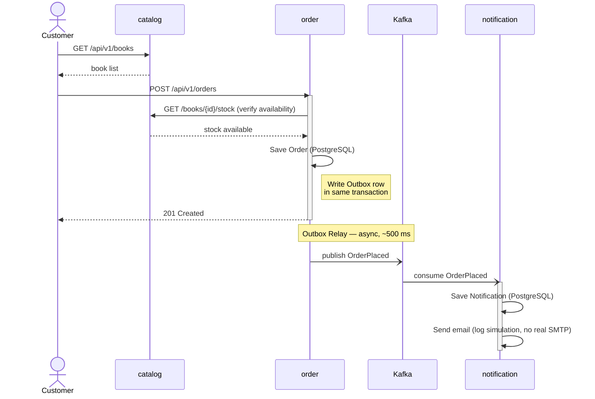
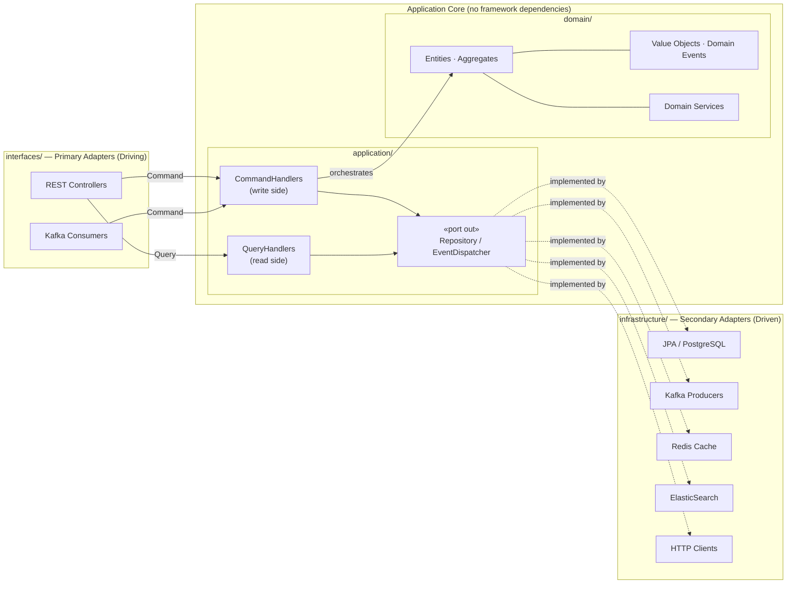
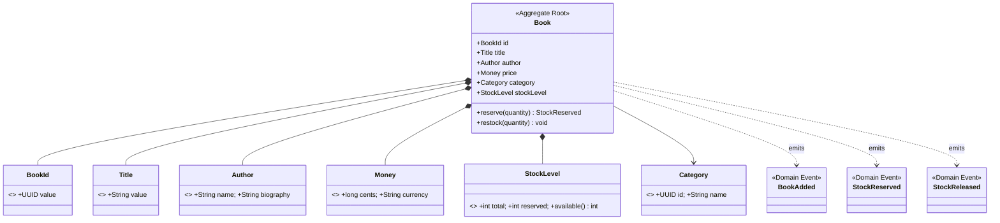
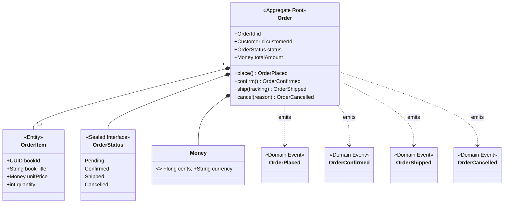
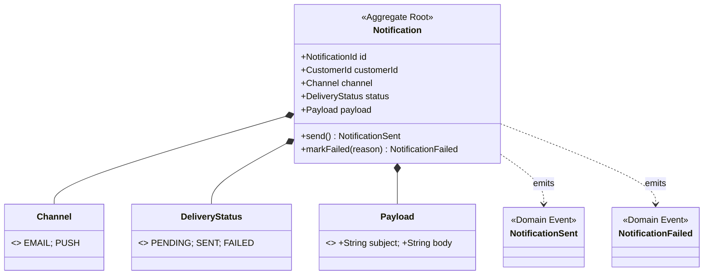
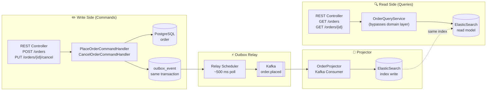

# Explicit Architecture Demo — Online Bookstore

A production-grade demo implementing **Explicit Architecture** (DDD + Hexagonal + Onion + Clean + CQRS) as described by Herberto Graça. The business scenario is an **Online Bookstore** composed of three independent microservices.

> Reference: [Explicit Architecture #01 – DDD, Hexagonal, Onion, Clean, CQRS, How I Put It All Together](https://herbertograca.com/2017/11/16/explicit-architecture-01-ddd-hexagonal-onion-clean-cqrs-how-i-put-it-all-together/)

---

## Business Scenario

A customer browses the book catalog, places an order, and receives a confirmation notification. Three bounded contexts emerge naturally:

| Microservice | Bounded Context | Responsibility |
|---|---|---|
| `catalog` | Book Catalog | Book/author/category management; inventory stock |
| `order` | Order Management | Order lifecycle (CQRS); payment status |
| `notification` | Notifications | Event-driven email/push notifications |

**Order Placement Flow (sequence):**



**Cross consistency** is handled via a Choreography-based Saga (see [ADR-006](docs/architecture/ADR-006-database-per.md)) and guaranteed event delivery via the Outbox Pattern (see [ADR-005](docs/architecture/ADR-005-outbox-pattern.md)).

---

## Architecture Overview

Each microservice follows the **Explicit Architecture** with strict layer boundaries:



### Key Principles

- **Ports & Adapters (Hexagonal)**: `interfaces/` holds primary (driving) adapters; `infrastructure/` holds secondary (driven) adapters. The application core defines secondary port interfaces; infrastructure provides the implementations.
- **Dependency Rule (Onion/Clean)**: Dependencies always point inward. Domain has zero dependencies on frameworks.
- **CQRS**: CommandHandlers (write) and QueryHandlers (read) are strictly separated. `order` uses PostgreSQL for writes and ElasticSearch for reads.
- **Domain Events**: Services communicate via domain events over Kafka. No direct cross-service domain coupling.
- **Bounded Contexts**: Each microservice owns its domain model completely. No shared domain objects across services.

---

## Domain Model Overview

### catalog



### order



> **Snapshot pattern**: `OrderItem` stores a snapshot of book title and price at order time — not a live FK to `catalog`. Order history remains accurate even when catalog data changes later.

### notification



> **Note on snapshots**: `OrderItem` stores a snapshot of book title and price at order time, not a live reference to `catalog`. This preserves order history accuracy even when catalog data changes.

---

## CQRS Flow (order)



Read model is **eventually consistent** — typically lags write by <500ms (Outbox poll interval).

---

## Module Structure (per microservice)

每个服务的目录结构相同，但适配器因服务而异（见下方说明）。

```
{service}/
├── src/
│   ├── main/
│   │   ├── java/com/example/{service}/
│   │   │   ├── domain/                  # zero framework deps — pure Java
│   │   │   │   ├── model/               # Entities, Aggregates, Value Objects
│   │   │   │   ├── event/               # Domain Events (in-process, immutable records)
│   │   │   │   └── service/             # Domain Services (cross-aggregate, stateless)
│   │   │   ├── application/             # depends on domain only; no Spring/JPA/Kafka imports
│   │   │   │   ├── port/
│   │   │   │   │   └── out/             # Secondary Ports (Repository + EventDispatcher interfaces)
│   │   │   │   ├── command/{aggregate}/ # Command record + CommandHandler (package-by-feature)
│   │   │   │   ├── query/{aggregate}/   # Query record + QueryHandler + Response DTO
│   │   │   │   └── service/             # Outbound service-client interfaces (e.g., CatalogClient)
│   │   │   ├── infrastructure/          # driven adapters — framework code lives here
│   │   │   │   ├── persistence/         # JPA entities + Spring Data repositories
│   │   │   │   ├── messaging/           # Kafka producers / Outbox relay
│   │   │   │   ├── cache/               # Redis 适配器（仅 catalog）
│   │   │   │   ├── search/              # ElasticSearch 适配器（仅 order）
│   │   │   │   ├── email/               # 邮件适配器（仅 notification，日志模拟）
│   │   │   │   └── client/              # HTTP clients for outbound calls
│   │   │   └── interfaces/              # driving adapters — primary (inbound) side
│   │   │       └── rest/                # REST Controllers + request/response mappers
│   │   └── resources/
│   │       ├── application.yml
│   │       └── db/
│   │           └── migration/           # Flyway 迁移脚本（V1__xxx.sql, V2__xxx.sql …）
│   └── test/
│       ├── java/com/example/{service}/
│       │   ├── domain/                  # 纯单元测试，无 Spring 上下文，无 Docker
│       │   ├── application/             # Handler 单元测试，Mock 掉 Port
│       │   └── infrastructure/          # 适配器集成测试（@Tag("integration"), Testcontainers）
│       └── resources/
│           └── application-test.yml
├── helm/                                # 服务自带 Helm Chart
│   ├── Chart.yaml
│   ├── values.yaml
│   └── templates/
│       ├── _helpers.tpl
│       ├── deployment.yaml
│       ├── service.yaml
│       ├── serviceaccount.yaml          # 服务独立 ServiceAccount
│       ├── configmap.yaml
│       ├── hpa.yaml
│       ├── networkpolicy.yaml           # 服务特定的流量放行规则
│       ├── virtual.yaml                 # Istio VirtualService（超时/重试）
│       ├── destination-rule.yaml        # Istio DestinationRule（熔断器）
│       └── NOTES.txt
├── build.gradle.kts
└── Dockerfile
```


### 各服务适配器对照

| 适配器包 | catalog | order | notification |
|---|---|---|---|
| `interfaces/rest/` | ✅ | ✅ | ✅ |
| `persistence/` | ✅ | ✅ | ✅ |
| `messaging/` | ✅（发布库存事件） | ✅（Outbox + 投影消费） | ✅（消费订单事件） |
| `cache/` | ✅ Redis | — | — |
| `search/` | — | ✅ ElasticSearch | — |
| `email/` | — | — | ✅ LogEmailAdapter |
| `client/` | — | ✅ CatalogRestClient | — |


### Domain Event vs Integration Event

| Type | Package | Scope | Example |
|---|---|---|---|
| **Domain Event** | `domain/event/` | In-process; aggregate-owned; triggers outbox write | `OrderPlaced` |
| **Integration Event** | `shared-events/` (Avro) | Cross-service via Kafka; schema contract | `com.example.events.v1.OrderPlaced` |

Kafka publishing is kept as a pure infrastructure concern via `port/out/{Aggregate}EventPublisher` (interface in Application Core) implemented by `infrastructure/messaging/Kafka{Aggregate}EventPublisher` (adapter). Domain objects never import `shared-events` Avro classes.

> **测试分层**：单元测试（`domain/`, `application/`）无需 Docker，毫秒级完成。集成测试（`infrastructure/`）标注 `@Tag("integration")`，通过 Testcontainers 按需拉起 PostgreSQL / Redis / Kafka / ES。


---

## Technology Stack

| Category | Technology |
|---|---|
| Language | Java 21 (Virtual Threads, Records, Pattern Matching) |
| Framework | Spring Boot 3.x |
| Build | Gradle 8.x (multi-project) |
| Database | PostgreSQL 16 (write store) |
| Cache | Redis 7 (catalog caching, idempotency keys) |
| Search | ElasticSearch 8 (order read/query side) |
| Messaging | Apache Kafka (domain event bus) |
| Observability | OpenTelemetry (traces + metrics) + Grafana stack |
| Container | Docker + Kubernetes |
| Service Mesh | Istio (mTLS, traffic management, canary) |
| Packaging | Helm 3 |
| Testing | JUnit 5, Testcontainers, RestAssured |

---

## Project Structure

```
explicit-architecture/
├── catalog/            # Book catalog bounded context
│   ├── src/
│   ├── helm/                   # 服务自带 Helm Chart
│   ├── build.gradle.kts
│   └── Dockerfile
├── order/              # Order management bounded context (CQRS)
│   ├── src/
│   ├── helm/
│   ├── build.gradle.kts
│   └── Dockerfile
├── notification/       # Notification bounded context
│   ├── src/
│   ├── helm/
│   ├── build.gradle.kts
│   └── Dockerfile
├── shared-events/              # Event schema SDK（各服务通过 mavenLocal() 依赖）
│   ├── src/main/avro/com/example/events/
│   │   ├── v1/                 # OrderPlaced, OrderCancelled, StockReserved …
│   │   └── v2/                 # 破坏性变更时创建（当前为空占位）
│   ├── schema-registry/
│   │   └── register-schemas.sh # Schema Registry 一键注册脚本
│   ├── CHANGELOG.md            # 版本变更日志（每次 schema 变更必填）
│   └── build.gradle.kts
├── infrastructure/             # 公共基础设施能力（中间件、可观测性、公共 K8s 资源）
│   ├── db/init.sql             # 仅创建数据库和用户
│   ├── k8s/                    # Namespace、RBAC、Deny-All NetworkPolicy
│   ├── helm/bookstore/         # 伞形 Chart（引用各服务自带 Chart）
│   ├── istio/                  # Gateway + 全局 mTLS
│   └── observability/          # OTel Collector、Prometheus、Grafana
├── docs/
│   ├── architecture/           # Architecture Decision Records (ADRs)
│   └── api/                    # OpenAPI specs
├── build.gradle.kts
├── settings.gradle.kts
└── README.md
```

---

## Getting Started

### Prerequisites

| Tool | Version | Purpose |
|---|---|---|
| JDK | 21+ | Build and run services |
| Docker | 24+ | Build images (via Jib) |
| kubectl | 1.28+ | Kubernetes deployment |
| Helm | 3.13+ | Chart packaging and deployment |
| minikube / kind | latest | Local Kubernetes cluster (optional) |

### Local Development

```bash
# 1. Deploy infrastructure middleware to local Kubernetes (minikube / kind)
helm upgrade --install bookstore-infra ./infrastructure/helm -f infrastructure/helm/values.yaml

# 2. Publish shared libraries to mavenLocal
cd seedwork && ./gradlew publishToMavenLocal
cd ../shared-events && ./gradlew publishToMavenLocal

# 3. Run a service locally (connects to middleware running in K8s)
cd catalog && ./gradlew bootRun
```

### Run Tests

```bash
# Unit tests only — no Docker, runs in seconds
./gradlew test -PtestProfile=unit

# Integration tests — requires Docker (Testcontainers)
./gradlew test -PtestProfile=integration

# All tests
./gradlew test

# Single service
./gradlew :order:test
```

### Verify the Setup

```bash
# Health checks
curl http://localhost:8081/actuator/health   # catalog
curl http://localhost:8082/actuator/health   # order
curl http://localhost:8083/actuator/health   # notification

# Place a sample order (end-to-end smoke test)
# 1. Get a book
curl http://localhost:8081/api/v1/books | jq '.[0].id'

# 2. Place an order
curl -X POST http://localhost:8082/api/v1/orders \
  -H "Content-Type: application/json" \
  -d '{"customerId":"00000000-0000-0000-0000-000000000001","items":[{"bookId":"<id>","quantity":1}]}'

# 3. Check notification
curl http://localhost:8083/api/v1/notifications/00000000-0000-0000-0000-000000000001
```

### Kubernetes Deployment

```bash
# 1. Build and push images
./gradlew jib --image=<registry>/catalog:latest    # requires jib plugin
./gradlew jib --image=<registry>/order:latest
./gradlew jib --image=<registry>/notification:latest

# 2. Install Istio (if not already installed)
istioctl install --set profile=demo -y
kubectl label namespace bookstore istio-injection=enabled

# 3. Deploy with Helm umbrella chart
helm install bookstore ./infrastructure/helm/bookstore \
  --namespace bookstore \
  --create-namespace \
  -f infrastructure/helm/bookstore/values-local.yaml

# 4. Check rollout
kubectl -n bookstore rollout status deployment/catalog
kubectl -n bookstore get pods

# 5. Port-forward for local access
kubectl -n bookstore port-forward svc/catalog 8081:8081
```

### Upgrade / Rollback

```bash
# Upgrade
helm upgrade bookstore ./infrastructure/helm/bookstore \
  --namespace bookstore \
  -f infrastructure/helm/bookstore/values-local.yaml

# Rollback
helm rollback bookstore 1 --namespace bookstore
```

---

## API Quick Reference

Full OpenAPI specs: [`docs/api/`](docs/api/)

### catalog `localhost:8081`

| Method | Path | Description | Auth |
|---|---|---|---|
| `GET` | `/api/v1/books` | List books (paginated, filterable by category) | Public |
| `GET` | `/api/v1/books/{id}` | Get book detail with author info | Public |
| `POST` | `/api/v1/books` | Add a book | Admin |
| `PUT` | `/api/v1/books/{id}` | Update book metadata or price | Admin |
| `GET` | `/api/v1/books/{id}/stock` | Check current stock level | Internal |
| `POST` | `/api/v1/books/{id}/stock/reserve` | Reserve stock for an order | Internal |
| `GET` | `/actuator/health` | Health check | Internal |
| `GET` | `/actuator/prometheus` | Prometheus metrics scrape endpoint | Internal |

### order `localhost:8082`

| Method | Path | Description | Side |
|---|---|---|---|
| `POST` | `/api/v1/orders` | Place an order (command) | Write |
| `PUT` | `/api/v1/orders/{id}/cancel` | Cancel an order (command) | Write |
| `GET` | `/api/v1/orders/{id}` | Get order by ID (query, ES read model) | Read |
| `GET` | `/api/v1/orders?customerId=&status=&page=&size=` | Search orders (ElasticSearch) | Read |
| `GET` | `/actuator/health` | Health check | Internal |

**Place Order request body:**
```json
{
  "customerId": "uuid",
  "items": [
    { "bookId": "uuid", "quantity": 2 }
  ]
}
```

### notification `localhost:8083`

| Method | Path | Description |
|---|---|---|
| `GET` | `/api/v1/notifications?customerId=&page=&size=` | List notifications for a customer |
| `GET` | `/api/v1/notifications/{id}` | Get single notification detail |
| `GET` | `/actuator/health` | Health check |

---

## Architecture Decision Records

See [`docs/architecture/`](docs/architecture/) for the full ADR index.

| ADR | Decision |
|---|---|
| [ADR-001](docs/architecture/ADR-001-explicit-architecture-over-layered.md) | Adopt Explicit Architecture over traditional layered architecture |
| [ADR-002](docs/architecture/ADR-002-cqrs-scope-order.md) | Apply CQRS only to order (PostgreSQL write + ES read) |
| [ADR-003](docs/architecture/ADR-003-event-schema-ownership.md) | Centralize Kafka event schemas in `shared-events` module |
| [ADR-004](docs/architecture/ADR-004-istio-mesh.md) | Use Istio for resilience instead of application-level libraries |
| [ADR-005](docs/architecture/ADR-005-outbox-pattern.md) | Outbox Pattern for guaranteed at-least-once domain event delivery |
| [ADR-006](docs/architecture/ADR-006-database-per.md) | Database-per, no shared tables, Choreography Saga |
| [ADR-007](docs/architecture/ADR-007-java21-virtual-threads.md) | Java 21: Virtual Threads, Records, Sealed Classes usage guidelines |
| [ADR-008](docs/architecture/ADR-008-shared-events-versioning.md) | shared-events SDK 版本策略：SemVer + CHANGELOG 强制 + 破坏性变更命名空间隔离 |

---

## Observability

所有服务通过 **OpenTelemetry** 上报 Traces、Metrics、Logs，统一汇聚到 **SigNoz**。

SigNoz 是 All-in-One 可观测性平台，替代 Jaeger + Prometheus + Grafana + OTel Collector 的组合。

### 本地可观测性入口

| 工具 | URL | 用途 |
|---|---|---|
| SigNoz UI | http://localhost:3301 | Traces、Metrics、Logs、服务地图、告警 |
| SigNoz OTLP (gRPC) | localhost:4317 | 应用服务上报端点 |
| SigNoz OTLP (HTTP) | localhost:4318 | 应用服务上报端点（备用） |

### 信号采集

| Signal | 采集方式 | 目标 |
|---|---|---|
| Traces | OTel Java Agent（自动）+ 手动 Span | SigNoz via OTLP gRPC |
| Metrics | Micrometer OTLP Registry（JVM、HTTP、HikariCP） | SigNoz via OTLP gRPC |
| Logs | Logback JSON（含 `trace_id`、`span_id` 字段） | SigNoz（与 Trace 自动关联） |
| 服务网格指标 | Istio Envoy sidecar | Kiali（K8s 环境） |

### Trace 传播

`traceparent`（W3C）头自动传播：
- **HTTP 调用**：Spring Boot OTel Auto-Instrumentation 自动注入/提取
- **Kafka 消息**：Debezium 发布的消息通过消息头传播；消费者 OTel agent 自动提取

Span 命名约定：`{service}.{aggregate}.{operation}`
示例：`order.order.place`、`catalog.book.reserve-stock`

### SigNoz 内置告警

在 SigNoz UI 中配置（无需 AlertManager）：

| 告警 | 条件 | 级别 |
|---|---|---|
| 服务高错误率 | 任意服务 5xx 率 > 1% | Critical |
| Kafka 消费积压 | 任意 Consumer Group lag > 1000 | Warning |
| 数据库连接池耗尽 | `hikaricp_connections_pending > 5` | Warning |

---

## Environment Variables

Each service reads configuration from `application.yml` overridable by environment variables.

### catalog

| Variable | Default | Description |
|---|---|---|
| `SPRING_DATASOURCE_URL` | `jdbc:postgresql://localhost:5432/catalog` | PostgreSQL connection |
| `SPRING_DATASOURCE_USERNAME` | `bookstore` | DB user |
| `SPRING_DATASOURCEPASSWORD` | `bookstore` | DB password |
| `SPRING_DATA_REDIS_HOST` | `localhost` | Redis host |
| `SPRING_DATA_REDIS_PORT` | `6379` | Redis port |
| `SPRING_KAFKA_BOOTSTRAP_SERVERS` | `localhost:9092` | Kafka brokers |
| `OTEL_EXPORTER_OTLP_ENDPOINT` | `http://localhost:4317` | OTel collector |
| `OTEL_SERVICE_NAME` | `catalog` | Service name in traces |

### order

| Variable | Default | Description |
|---|---|---|
| `SPRING_DATASOURCE_URL` | `jdbc:postgresql://localhost:5432/order` | PostgreSQL (write side) |
| `SPRING_DATASOURCE_USERNAME` | `bookstore` | DB user |
| `SPRING_DATASOURCEPASSWORD` | `bookstore` | DB password |
| `SPRING_ELASTICSEARCH_URIS` | `http://localhost:9200` | ElasticSearch (read side) |
| `SPRING_KAFKA_BOOTSTRAP_SERVERS` | `localhost:9092` | Kafka brokers |
| `CATALOG_SERVICE_URL` | `http://localhost:8081` | catalog base URL |
| `OTEL_EXPORTER_OTLP_ENDPOINT` | `http://localhost:4317` | OTel collector |

### notification

| Variable | Default | Description |
|---|---|---|
| `SPRING_DATASOURCE_URL` | `jdbc:postgresql://localhost:5432/notification` | PostgreSQL connection |
| `SPRING_KAFKA_BOOTSTRAP_SERVERS` | `localhost:9092` | Kafka brokers |
| `NOTIFICATION_EMAIL_LOG_ONLY` | `true` | `true` = 日志模拟；`false` = 真实 SMTP（仅 prod） |
| `OTEL_EXPORTER_OTLP_ENDPOINT` | `http://localhost:4317` | OTel collector |

---

## Local Infrastructure Ports

| 服务 | 端口 | 说明 |
|---|---|---|
| catalog | 8081 | REST API |
| order | 8082 | REST API |
| notification | 8083 | REST API（邮件通过日志模拟） |
| PostgreSQL | 5432 | 三个逻辑数据库，`wal_level=logical` |
| Redis | 6379 | catalog 使用 |
| Kafka | 9092 | Domain event bus |
| Kafka UI | 8080 | Topic / 消息浏览（集成 Schema Registry） |
| Schema Registry | 8085 | Avro schema 存储（容器内 8081 → 宿主机 8085） |
| Debezium Connect | 8084 | REST API（注册 Connector，容器内 8083 → 宿主机 8084） |
| ElasticSearch | 9200 | order 读模型 |
| SigNoz UI | 3301 | Traces、Metrics、Logs 一体化 |
| SigNoz OTLP gRPC | 4317 | 应用服务上报 Telemetry |
| SigNoz OTLP HTTP | 4318 | 应用服务上报 Telemetry（备用） |
