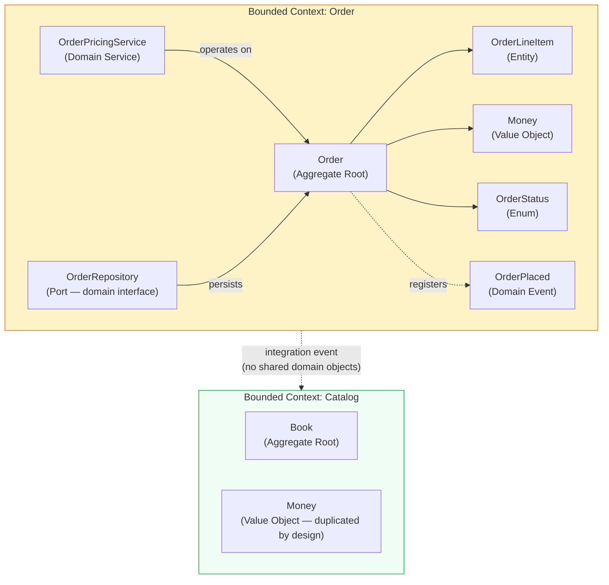
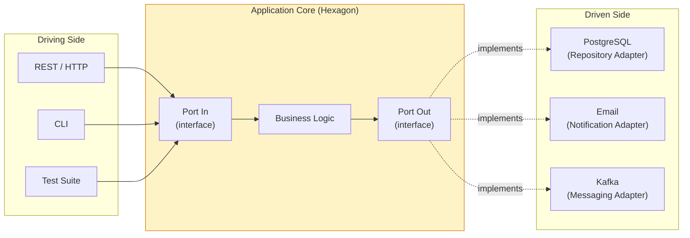
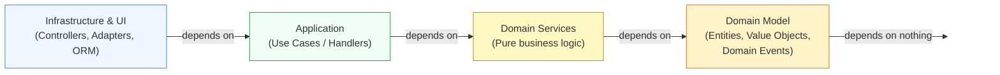
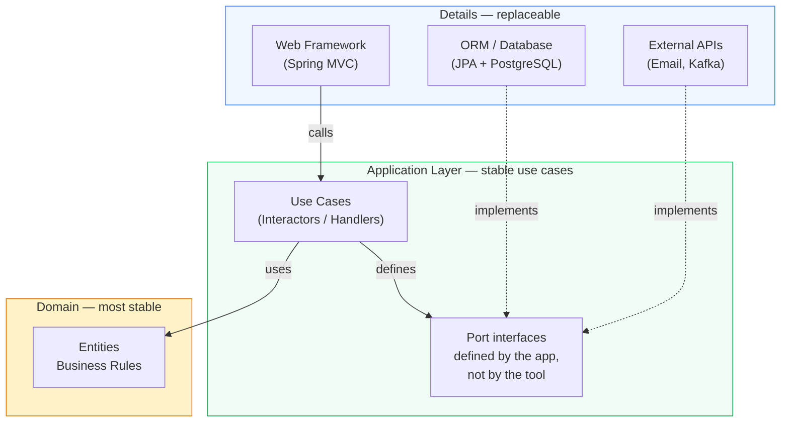
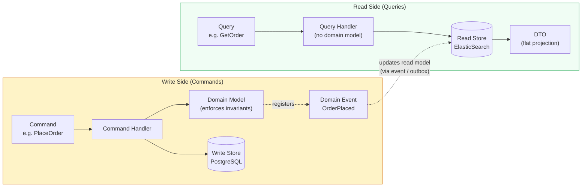
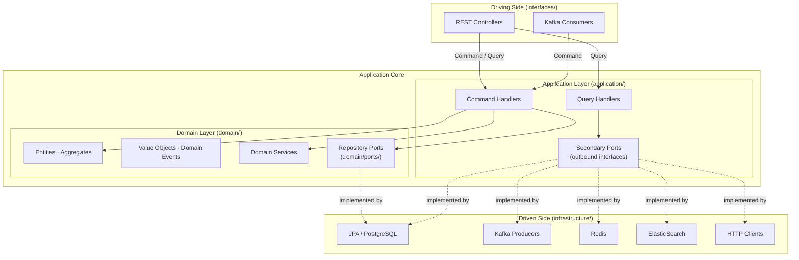
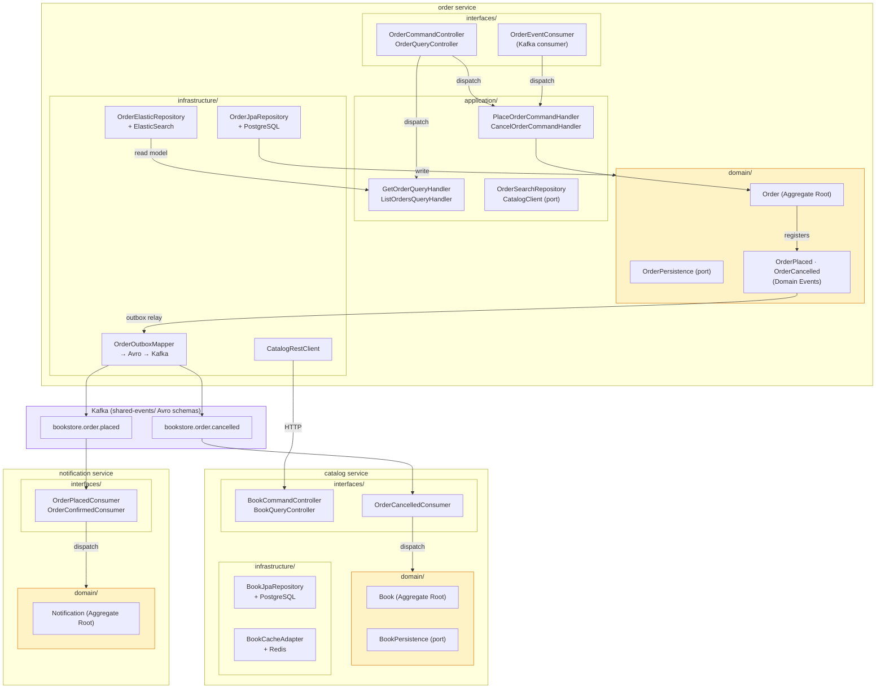

# Explicit Architecture Demo — Online Bookstore

A production-grade demo that shows how **DDD, Hexagonal, Onion, Clean Architecture, and CQRS** compose into a single structural pattern — and how to resolve the ambiguities that remain once you put them together.

> Reference: [Herberto Graça — Explicit Architecture #01](https://herbertograca.com/2017/11/16/explicit-architecture-01-ddd-hexagonal-onion-clean-cqrs-how-i-put-it-all-together/)

---

## The Architecture Journey

Each pattern in the stack emerged from a different problem. Understanding *why* each one exists makes the final synthesis feel inevitable rather than arbitrary.

### Domain-Driven Design (DDD)

DDD starts with a question: **who should own business rules?**

In a traditional layered architecture, business logic drifts. It ends up split across controllers, service classes, and utility helpers, with no single place that is authoritative. DDD answers by creating a **Domain Model** — a rich object model of Entities, Value Objects, Aggregates, and Domain Services — and making it the undisputed center of the application. The persistence layer, the UI, and the messaging infrastructure exist only to serve this model, never to contain logic that belongs in it.

DDD also introduces **Bounded Contexts**: explicit boundaries around a domain model where a consistent language (Ubiquitous Language) applies. What "Order" means inside the Order context is not the same as what "Order" means inside the Billing context. Each context owns its model completely.



### Hexagonal Architecture — Ports & Adapters

DDD defines *what* the center contains. Hexagonal Architecture defines *how to protect it*.

Alistair Cockburn's insight: an application has a natural boundary between its core logic and the things that drive or serve it. **Ports** are interfaces on this boundary, defined in the application's own language. **Adapters** are the external implementations that plug into those ports — a REST controller, a PostgreSQL repository, a Kafka producer.

The critical insight: the application core never imports an adapter. The adapter imports the port. This inversion means you can swap PostgreSQL for MongoDB, or swap HTTP for CLI, without touching a single line of business logic.



### Onion Architecture

Hexagonal gives you two sides (driving / driven). Onion Architecture adds **concentric rings** to describe the internal structure of the core itself.

**Dependency Rule:** source-code dependencies point only inward. The Domain Model depends on nothing. Application depends only on the Domain. Infrastructure depends on Application and Domain. This makes the inner layers fully testable with plain unit tests — no framework, no database, no Docker.



### Clean Architecture

Robert Martin's Clean Architecture restates the same dependency rule with a stronger emphasis on **use cases as first-class citizens**. Use cases (called Interactors in Clean Architecture) live in the Application layer and represent a single business action. They are the stable heart of the system. Frameworks, databases, and UIs are details — details that can be replaced.

The key contribution: **the Application layer defines its own interfaces** for everything it needs from the outside (repositories, email senders, payment gateways). Infrastructure implements those interfaces. This is the Dependency Inversion Principle applied at the architectural level.



### CQRS — Command Query Responsibility Segregation

Even with a clean architecture, reads and writes have fundamentally different characteristics. Writes enforce business invariants, update aggregates, and publish events. Reads fetch data — often joining many tables — and return flat projections optimized for display. Forcing both through the same domain model creates unnecessary coupling.

CQRS separates the two:

- **Commands** (write side): go through the Domain Model, enforce business rules, persist via Repositories, publish Domain Events.
- **Queries** (read side): bypass the Domain Model entirely. A Query Handler goes straight to the database and returns a DTO. No entities are loaded. No invariants are checked. The read path is just a database query.

This unlocks independent scaling and optimization: the write store can be PostgreSQL, the read store can be ElasticSearch — each tuned for its workload.



---

## Explicit Architecture: The Synthesis

Herberto Graça's **Explicit Architecture** fuses all five patterns into one coherent model. The name captures the intent: the architecture should be *visible* from the package structure alone. Reading `interfaces/rest/OrderCommandController.java` tells you it is a driving adapter. Reading `domain/ports/OrderPersistence.java` tells you it is a domain port. Nothing is hidden in generic `service/` or `util/` packages.



**The four zones:**

| Zone | Package | Dependency Rule |
|---|---|---|
| Driving adapters | `interfaces/` | depends on Application (via bus) |
| Application | `application/` | depends on Domain only |
| Domain | `domain/` | depends on nothing |
| Driven adapters | `infrastructure/` | depends on Application + Domain |

**The Iron Rule:** the Domain Model imports nothing outside itself. Not a JPA annotation. Not an application-layer type. Not a framework interface. This is the single invariant that must hold unconditionally.

---

## Clarified Architecture: Resolving the Ambiguities

Explicit Architecture is an outstanding conceptual map. But when teams implement it, five recurring tensions emerge — places where the original model leaves the decision to the reader. **Clarified Architecture** resolves each one with an opinionated default.

### Tension 1: One Home for Use Cases

**Problem:** Explicit Architecture allows use-case logic to live in either an Application Service or a Command Handler, creating two competing containers for the same responsibility.

**Resolution:** Pick one and enforce it project-wide. If you use a Command/Query Bus, Handlers are the sole use-case container — Application Services are eliminated as a concept. If you have no bus, Application Services are the container. The two should never coexist in new code.

This demo uses **Handlers + Bus**. Controllers never import handlers directly; they dispatch to a `CommandBus` or `QueryBus`. Cross-cutting concerns (logging, timing) live in the bus implementation, not in individual handlers.

### Tension 2: Domain Service Purity

**Problem:** Domain Services sometimes need data they cannot fetch (because they must not depend on Repositories), leading to "ping-pong" calls between layers.

**Resolution:** Domain Services are **pure functions**. They receive all inputs as parameters; they return results. They never hold Repository references, never trigger I/O, never dispatch events. The Handler is responsible for all I/O — it prefetches everything, passes it in, and handles the result.

```
Handler:  load OrderA, load PricingPolicy  ← all I/O here
              ↓
DomainService.applyDiscount(orderA, pricingPolicy)  ← pure computation
              ↓
Handler:  save updated order               ← all I/O here
```

This makes Domain Services testable with zero mocks: `new PricingService().apply(fakeOrder, fakePolicy)`.

### Tension 3: Repository Placement and the CQRS Read Path

**Problem:** Where does the Repository interface live? Application layer or Domain layer? And on the read path, where do query projections go?

**Resolution:** Split cleanly by path.

- **Write path:** Repository interfaces belong in `domain/ports/`. `OrderPersistence` is a domain concept ("the collection of all Orders"). It speaks the domain's language: parameters are domain types (`OrderId`, `Order`), not raw UUIDs.
- **Read path:** Query Handlers bypass the Domain Model entirely. They go straight to the database and return DTOs. No entities are loaded. Read-model ports (`OrderReadRepository`, `OrderSearchRepository`) live in `application/port/outbound/` because they are infrastructure abstractions with no domain meaning.

| Path | Port location | Passes through Domain? |
|---|---|---|
| Write (Command) | `domain/ports/` | Yes — entities enforce invariants |
| Read (Query) | `application/port/outbound/` | No — direct query to DTO |

### Tension 4: Shared Kernel Growth

**Problem:** The Shared Kernel becomes a gravity center. Every cross-service communication need adds event classes, shared Value Objects, and utility types. Over time it becomes the most volatile module in the system, coupling all services indirectly.

**Resolution:** Replace the Shared Kernel code library with an **Event Registry** — a schema-only artifact (Avro `.avsc` files) containing no executable business logic. Services generate typed classes from the schema at build time; each service's domain layer sees only its own types. The schema file is the contract; the generated classes are an engineering convenience.

In this demo, `shared-events/` contains only Avro schema files. The generated Java classes are published to `mavenLocal()` and consumed as a library. No domain logic, no Spring beans — only serialization machinery.

### Tension 5: Cross-Component Data Consistency

**Problem:** Explicit Architecture does not discuss the consistency, failure, and compensation implications of cross-service data sharing.

**Resolution:** Match the pattern to the deployment topology.

- **Microservices:** each service maintains local read-only projections, updated via integration events. Pair this with idempotent event handlers, compensating transactions, and periodic reconciliation.
- **Modular monolith:** use database Views as a read contract between components. Strong consistency is available for free; adding eventual consistency here is over-engineering.

In this demo, cross-service state changes are event-driven. When an order is cancelled, `order` publishes `OrderCancelled`; `catalog` consumes it and releases reserved stock. No synchronous HTTP call crosses service boundaries for state changes.

---

## The Full Picture



**Reading the diagram:**
- Yellow zones (`domain/`) have zero outbound dependencies — they are the protected core.
- Solid arrows are source-code dependencies; dashed arrows are runtime implementations.
- Kafka (purple) is the only shared surface between services — and only via Avro schema contracts, never via shared domain objects.

---

## About This Demo

The business scenario is an **Online Bookstore** with three bounded contexts:

| Service | Port | Role |
|---|---|---|
| [`catalog`](catalog/README.md) | 8081 | Book/inventory management; Redis cache |
| [`order`](order/README.md) | 8082 | Order lifecycle (CQRS); PostgreSQL write + ElasticSearch read |
| [`notification`](notification/README.md) | 8083 | Event-driven notifications (log simulation) |
| [`shared-events`](shared-events/README.md) | — | Avro schema SDK for cross-service events |
| `seedwork` | — | Reusable DDD + CQRS base abstractions |

Each service's README contains its domain model, API reference, environment variables, and deployment details.

---

## Quick Start

```bash
# 1. Publish shared libraries (required once; repeat after any change)
cd seedwork      && ./gradlew publishToMavenLocal
cd ../shared-events && ./gradlew publishToMavenLocal

# 2. Run a service (requires PostgreSQL, Redis, Kafka reachable)
cd catalog && ./gradlew bootRun
```

---

## Further Reading

| Document | Purpose |
|---|---|
| [`docs/architecture/clarified-architecture/clarified-architecture-en.md`](docs/architecture/clarified-architecture/clarified-architecture-en.md) | Full Clarified Architecture specification (canonical) |
| [`docs/architecture/architecture-spec.md`](docs/architecture/architecture-spec.md) | Project-specific naming, package layout, and implementation rules |
| [`docs/architecture/adr/`](docs/architecture/adr/) | Architecture Decision Records (ADR-001 – ADR-011) |
| [`docs/testing-strategy/`](docs/testing-strategy/) | Testing strategy and pyramid reference |
