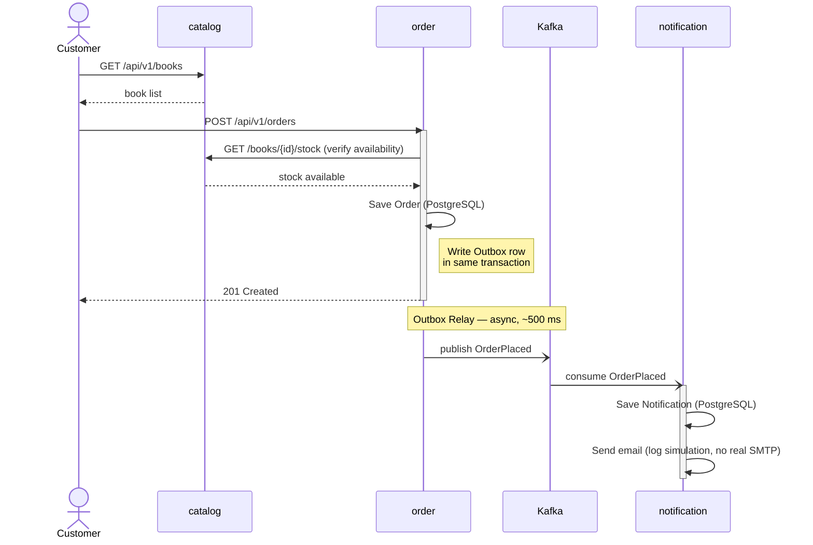
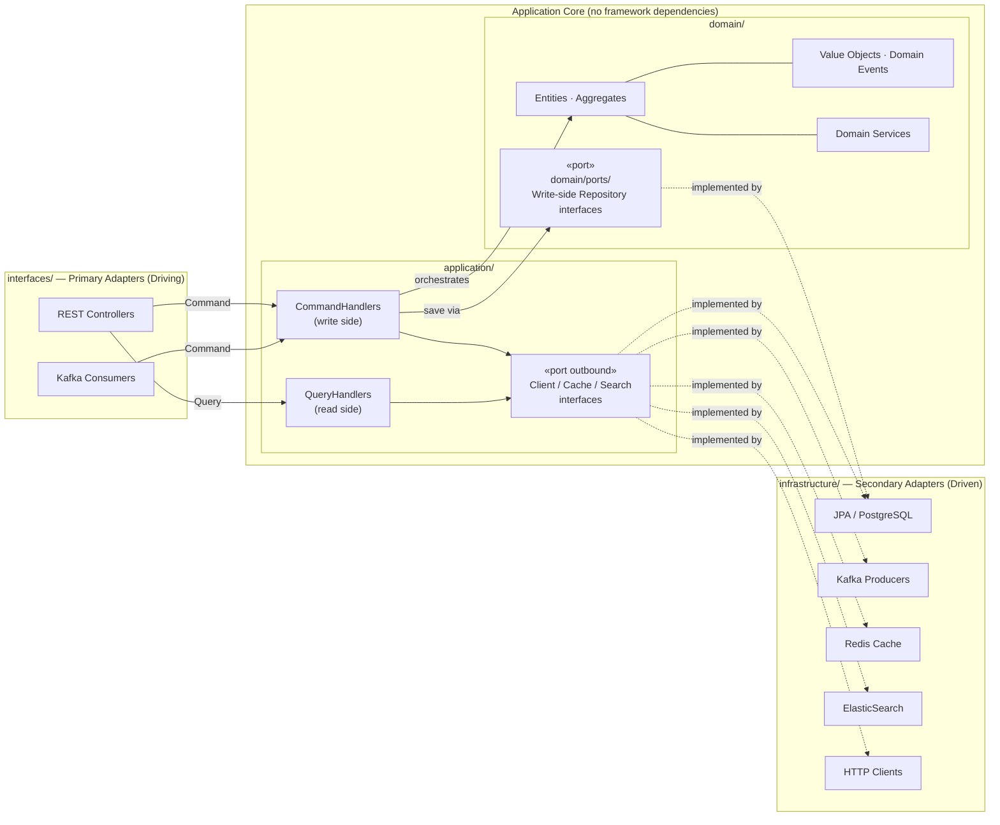
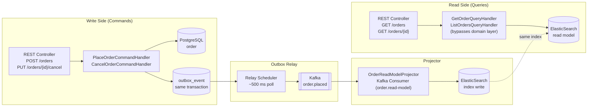

# Explicit Architecture Demo — Online Bookstore

A production-grade demo implementing **Explicit Architecture** (DDD + Hexagonal + Onion + Clean + CQRS) as described by Herberto Graça. The business scenario is an **Online Bookstore** composed of three independent microservices.

> Reference: [Explicit Architecture #01 – DDD, Hexagonal, Onion, Clean, CQRS, How I Put It All Together](https://herbertograca.com/2017/11/16/explicit-architecture-01-ddd-hexagonal-onion-clean-cqrs-how-i-put-it-all-together/)

---

## Business Scenario

A customer browses the book catalog, places an order, and receives a confirmation notification. Three bounded contexts emerge naturally:

| Microservice | Bounded Context | Responsibility |
|---|---|---|
| `catalog` | Book Catalog | Book/author/category management; inventory stock |
| `order` | Order Management | Order lifecycle (CQRS); payment status |
| `notification` | Notifications | Event-driven email/push notifications |

**Order Placement Flow (sequence):**



**Cross-service consistency** is handled via a Choreography-based Saga (see [ADR-006](docs/architecture/adr/ADR-006-database-per-service.md)) and guaranteed event delivery via the Outbox Pattern (see [ADR-005](docs/architecture/adr/ADR-005-outbox-pattern.md)).

---

## Architecture Overview

Each microservice follows the **Explicit Architecture** with strict layer boundaries:



### Key Principles

- **Ports & Adapters (Hexagonal)**: `interfaces/` holds primary (driving) adapters; `infrastructure/` holds secondary (driven) adapters. The application core defines secondary port interfaces; infrastructure provides the implementations.
- **Dependency Rule (Onion/Clean)**: Dependencies always point inward. Domain has zero dependencies on frameworks.
- **CQRS**: CommandHandlers (write) and QueryHandlers (read) are strictly separated. `order` uses PostgreSQL for writes and ElasticSearch for reads.
- **Domain Events**: Services communicate via domain events over Kafka. No direct cross-service domain coupling.
- **Bounded Contexts**: Each microservice owns its domain model completely. No shared domain objects across services.

---

## Domain Model Overview

Each microservice owns its domain model completely (no shared domain objects across services).

| Microservice | Aggregate Root | Domain Events | Details |
|---|---|---|---|
| `catalog` | `Book` | `BookAdded`, `StockReserved`, `StockReleased` | [catalog/README.md](catalog/README.md#domain-model) |
| `order` | `Order` | `OrderPlaced`, `OrderConfirmed`, `OrderShipped`, `OrderCancelled` | [order/README.md](order/README.md#domain-model) |
| `notification` | `Notification` | `NotificationSent`, `NotificationFailed` | [notification/README.md](notification/README.md#domain-model) |

---

## CQRS Flow (order)



Read model is **eventually consistent** — typically lags write by <500 ms (Outbox poll interval).

Controllers dispatch all operations through `CommandBus` / `QueryBus`. Handlers are never injected directly into controllers.

---

## Module Structure (per microservice)

All three services share the same directory layout. Only the adapters differ per service (see the table below).

```
{service}/
├── src/
│   ├── main/
│   │   ├── java/com/example/{service}/
│   │   │   ├── domain/                      # zero framework deps — pure Java
│   │   │   │   ├── model/                   # Entities, Aggregates, Value Objects
│   │   │   │   ├── event/                   # Domain Events (in-process, immutable records)
│   │   │   │   └── service/                 # Domain Services (cross-aggregate, stateless)
│   │   │   ├── application/                 # depends on domain only; no Spring/JPA/Kafka imports
│   │   │   │   ├── port/
│   │   │   │   │   └── outbound/            # Secondary Ports that are NOT domain concepts: Client, Cache, SearchRepository, ReadRepository
│   │   │   │   ├── command/{aggregate}/     # Command record + @Service CommandHandler (package-by-feature)
│   │   │   │   └── query/{aggregate}/       # Query record + @Service QueryHandler + Response DTO
│   │   │   ├── infrastructure/              # driven adapters — all framework code lives here
│   │   │   │   ├── repository/
│   │   │   │   │   ├── jpa/                 # JPA entities + Spring Data repos + persistence adapter
│   │   │   │   │   └── elasticsearch/       # ES documents + ES repo + projector (order only)
│   │   │   │   ├── messaging/
│   │   │   │   │   └── outbox/              # OutboxMapper implementation (catalog + order)
│   │   │   │   ├── cache/                   # Redis adapter (catalog only)
│   │   │   │   └── client/                  # HTTP clients (order: CatalogRestClient)
│   │   │   │       └── email/               # Email adapter (notification only — log simulation)
│   │   │   └── interfaces/                  # primary adapters — driving (inbound) side
│   │   │       ├── rest/                    # REST Controllers; dispatch via CommandBus / QueryBus
│   │   │       └── messaging/
│   │   │           └── consumer/            # Kafka consumers (notification + order read-model projector)
│   │   └── resources/
│   │       ├── application.yml
│   │       └── db/
│   │           └── migration/               # Flyway migration scripts (V1__xxx.sql, V2__xxx.sql …)
│   └── test/
│       ├── java/com/example/{service}/
│       │   ├── domain/                      # pure unit tests — no Spring context, no Docker
│       │   ├── application/                 # handler unit tests — mock outbound ports
│       │   └── infrastructure/              # adapter integration tests (@Tag("integration"), Testcontainers)
│       └── resources/
│           └── application-test.yml
├── helm/                                    # per-service Helm Chart
│   ├── Chart.yaml
│   ├── values.yaml
│   └── templates/
│       ├── _helpers.tpl
│       ├── deployment.yaml
│       ├── service.yaml
│       ├── serviceaccount.yaml
│       ├── configmap.yaml
│       ├── hpa.yaml
│       ├── networkpolicy.yaml               # service-specific traffic rules
│       ├── virtual.yaml                     # Istio VirtualService (timeout / retry)
│       ├── destination-rule.yaml            # Istio DestinationRule (circuit breaker)
│       └── NOTES.txt
└── build.gradle.kts
```

> Images are built with **Jib** (no `Dockerfile` required). Run `./gradlew jibDockerBuild` to push to the local Docker daemon.

### Adapter Matrix

| Adapter Package | catalog | order | notification |
|---|---|---|---|
| `interfaces/rest/` | ✅ | ✅ | ✅ |
| `infrastructure/repository/jpa/` | ✅ | ✅ | ✅ |
| `infrastructure/messaging/outbox/` | ✅ (publishes stock events) | ✅ (Outbox relay) | — |
| `infrastructure/cache/` | ✅ Redis | — | — |
| `infrastructure/repository/elasticsearch/` | — | ✅ ElasticSearch | — |
| `infrastructure/client/email/` | — | — | ✅ LogEmailAdapter |
| `infrastructure/client/` (HTTP) | — | ✅ CatalogRestClient | — |
| `interfaces/messaging/consumer/` | — | ✅ OrderReadModelProjector | ✅ OrderEventConsumer |

### Domain Event vs Integration Event

| Type | Package | Scope | Example |
|---|---|---|---|
| **Domain Event** | `domain/event/` | In-process; aggregate-owned; triggers outbox write | `OrderPlaced` |
| **Integration Event** | `shared-events/` (Avro) | Cross-service via Kafka; schema contract | `com.example.events.v1.OrderPlaced` |

Kafka publishing is a pure infrastructure concern. The Outbox Pattern (via `seedwork`) writes the event row atomically in the same transaction as the aggregate. Domain objects never import `shared-events` Avro classes — only `OutboxMapper` does.

> **Test layering**: unit tests (`domain/`, `application/`) require no Docker and finish in milliseconds. Integration tests (`infrastructure/`) are tagged `@Tag("integration")` and spin up PostgreSQL / Redis / Kafka / ES on demand via Testcontainers.

---

## Technology Stack

| Category | Technology |
|---|---|
| Language | Java 21 (Virtual Threads, Records, Pattern Matching) |
| Framework | Spring Boot 3.x |
| Build | Gradle 8.x (independent projects per service) |
| Database | PostgreSQL 16 (write store) |
| Cache | Redis 7 (catalog caching, idempotency keys) |
| Search | ElasticSearch 8 (order read/query side) |
| Messaging | Apache Kafka (domain event bus) |
| Observability | OpenTelemetry (traces + metrics) + SigNoz |
| Container | Docker + Kubernetes |
| Service Mesh | Istio (mTLS, traffic management, canary) |
| Packaging | Helm 3 |
| Image Build | Jib (no Dockerfile) |
| Testing | JUnit 5, Testcontainers, RestAssured |
| Contract Testing | PactFlow (Bi-Directional Contract Testing) |

---

## Project Structure

```
explicit-architecture/
├── catalog/                    # Book catalog bounded context
│   ├── src/
│   ├── helm/                   # per-service Helm Chart
│   └── build.gradle.kts
├── order/                      # Order management bounded context (CQRS)
│   ├── src/
│   ├── helm/
│   └── build.gradle.kts
├── notification/               # Notification bounded context
│   ├── src/
│   ├── helm/
│   └── build.gradle.kts
├── shared-events/              # Event schema SDK (consumed via mavenLocal())
│   ├── src/main/avro/com/example/events/
│   │   ├── v1/                 # OrderPlaced, OrderCancelled, StockReserved …
│   │   └── v2/                 # reserved for breaking changes (currently empty)
│   ├── scripts/
│   │   └── register-schemas.sh # one-shot Schema Registry registration script
│   ├── CHANGELOG.md            # version change log (required on every schema change)
│   └── build.gradle.kts
├── seedwork/                   # Reusable DDD + CQRS framework abstractions
│   └── build.gradle.kts
├── e2e/                        # End-to-end tests (REST calls against a live environment)
│   └── build.gradle.kts
├── docs/
│   ├── architecture/           # Architecture Decision Records (ADRs)
│   └── api/                    # OpenAPI specs
├── build.gradle.kts            # root version catalog (shared dependency versions)
├── settings.gradle.kts
└── README.md
```

> Each service (`catalog`, `order`, `notification`, `seedwork`, `shared-events`, `e2e`) is an **independent Gradle project** with its own `settings.gradle.kts`. There is no root multi-project build — the root `build.gradle.kts` only provides a shared version catalog.

---

## Getting Started

### Prerequisites

| Tool | Version | Purpose |
|---|---|---|
| JDK | 21+ | Build and run services |
| Docker | 24+ | Build images (via Jib) |
| kubectl | 1.28+ | Kubernetes deployment |
| Helm | 3.13+ | Chart packaging and deployment |
| minikube / kind | latest | Local Kubernetes cluster (optional) |

### Local Development

```bash
# 1. Deploy infrastructure middleware to local Kubernetes (minikube / kind)
helm upgrade --install bookstore-infra ./infrastructure/helm -f infrastructure/helm/values.yaml

# 2. Publish shared libraries to mavenLocal (required once; repeat after any seedwork/shared-events change)
cd seedwork && ./gradlew publishToMavenLocal
cd ../shared-events && ./gradlew publishToMavenLocal

# 3. Run a service locally (connects to middleware running in K8s)
cd catalog && ./gradlew bootRun
```

### Run Tests

```bash
# Unit tests only — no Docker, runs in seconds
cd catalog && ./gradlew test -PtestProfile=unit

# Integration tests — requires Docker (Testcontainers)
cd catalog && ./gradlew test -PtestProfile=integration

# All tests for a single service
cd order && ./gradlew test

# Contract tests (no Testcontainers required)
cd order && ./gradlew test --tests "com.example.order.contract.*"
```

### Verify the Setup

```bash
# Health checks
curl http://localhost:8081/actuator/health   # catalog
curl http://localhost:8082/actuator/health   # order
curl http://localhost:8083/actuator/health   # notification

# Place a sample order (end-to-end smoke test)
# 1. Get a book
curl http://localhost:8081/api/v1/books | jq '.[0].id'

# 2. Place an order
curl -X POST http://localhost:8082/api/v1/orders \
  -H "Content-Type: application/json" \
  -d '{"customerId":"00000000-0000-0000-0000-000000000001","items":[{"bookId":"<id>","quantity":1}]}'

# 3. Check notification
curl http://localhost:8083/api/v1/notifications/00000000-0000-0000-0000-000000000001
```

### Build and Push Images (Jib)

```bash
# Build to local Docker daemon (no registry push)
cd catalog      && ./gradlew jibDockerBuild
cd order        && ./gradlew jibDockerBuild
cd notification && ./gradlew jibDockerBuild

# Push to a registry
cd catalog      && ./gradlew jib
cd order        && ./gradlew jib
cd notification && ./gradlew jib
```

### Kubernetes Deployment

```bash
# 1. Install Istio (if not already installed)
istioctl install --set profile=demo -y
kubectl label namespace bookstore istio-injection=enabled

# 2. Deploy with Helm umbrella chart
helm install bookstore ./infrastructure/helm/bookstore \
  --namespace bookstore \
  --create-namespace \
  -f infrastructure/helm/bookstore/values-local.yaml

# 3. Check rollout
kubectl -n bookstore rollout status deployment/catalog
kubectl -n bookstore get pods

# 4. Port-forward for local access
kubectl -n bookstore port-forward svc/catalog 8081:8081
```

### Upgrade / Rollback

```bash
# Upgrade
helm upgrade bookstore ./infrastructure/helm/bookstore \
  --namespace bookstore \
  -f infrastructure/helm/bookstore/values-local.yaml

# Rollback
helm rollback bookstore 1 --namespace bookstore
```

---

## API Quick Reference

Full OpenAPI specs: [`docs/api/`](docs/api/)

### catalog `localhost:8081`

| Method | Path | Description | Auth |
|---|---|---|---|
| `GET` | `/api/v1/books` | List books (paginated, filterable by category) | Public |
| `GET` | `/api/v1/books/{id}` | Get book detail with author info | Public |
| `POST` | `/api/v1/books` | Add a book | Admin |
| `PUT` | `/api/v1/books/{id}` | Update book metadata or price | Admin |
| `GET` | `/api/v1/books/{id}/stock` | Check current stock level | Internal |
| `POST` | `/api/v1/books/{id}/stock/reserve` | Reserve stock for an order | Internal |
| `GET` | `/actuator/health` | Health check | Internal |
| `GET` | `/actuator/prometheus` | Prometheus metrics scrape endpoint | Internal |

### order `localhost:8082`

| Method | Path | Description | Side |
|---|---|---|---|
| `POST` | `/api/v1/orders` | Place an order (command) | Write |
| `PUT` | `/api/v1/orders/{id}/cancel` | Cancel an order (command) | Write |
| `GET` | `/api/v1/orders/{id}` | Get order by ID (query, ES read model) | Read |
| `GET` | `/api/v1/orders?customerId=&status=&page=&size=` | Search orders (ElasticSearch) | Read |
| `GET` | `/actuator/health` | Health check | Internal |

**Place Order request body:**
```json
{
  "customerId": "uuid",
  "items": [
    { "bookId": "uuid", "quantity": 2 }
  ]
}
```

### notification `localhost:8083`

| Method | Path | Description |
|---|---|---|
| `GET` | `/api/v1/notifications?customerId=&page=&size=` | List notifications for a customer |
| `GET` | `/api/v1/notifications/{id}` | Get single notification detail |
| `GET` | `/actuator/health` | Health check |

---

## Architecture Decision Records

See [`docs/architecture/`](docs/architecture/) for the full ADR index.

| ADR | Decision |
|---|---|
| [ADR-001](docs/architecture/adr/ADR-001-explicit-architecture-over-layered.md) | Adopt Explicit Architecture over traditional layered architecture |
| [ADR-002](docs/architecture/adr/ADR-002-cqrs-scope-order-service.md) | Apply CQRS only to order service (PostgreSQL write + ES read) |
| [ADR-003](docs/architecture/adr/ADR-003-event-schema-ownership.md) | Centralize Kafka event schemas in `shared-events` module |
| [ADR-004](docs/architecture/adr/ADR-004-istio-service-mesh.md) | Use Istio for resilience instead of application-level libraries |
| [ADR-005](docs/architecture/adr/ADR-005-outbox-pattern.md) | Outbox Pattern for guaranteed at-least-once domain event delivery |
| [ADR-006](docs/architecture/adr/ADR-006-database-per-service.md) | Database-per-service, no shared tables, Choreography Saga |
| [ADR-007](docs/architecture/adr/ADR-007-java21-virtual-threads.md) | Java 21: Virtual Threads, Records, Sealed Classes usage guidelines |
| [ADR-008](docs/architecture/adr/ADR-008-shared-events-versioning.md) | shared-events SDK versioning: SemVer + mandatory CHANGELOG + namespace isolation for breaking changes |
| [ADR-009](docs/architecture/adr/ADR-009-kafka-consumer-idempotency-retry.md) | Kafka consumer idempotency and DB-backed retry strategy |
| [ADR-010](docs/architecture/adr/ADR-010-opentelemetry-observability.md) | OpenTelemetry via Kubernetes Operator for unified observability |
| [ADR-011](docs/architecture/adr/ADR-011-swaggerhub-pactflow-bdct.md) | API governance with SwaggerHub + PactFlow Bi-Directional Contract Testing |

---

## Observability

All services export traces, metrics, and logs via **OpenTelemetry**, aggregated into **SigNoz** — an all-in-one observability platform that replaces the Jaeger + Prometheus + Grafana + OTel Collector stack.

### Local Observability Endpoints

| Tool | URL | Purpose |
|---|---|---|
| SigNoz UI | http://localhost:3301 | Traces, Metrics, Logs, Service Map, Alerts |
| SigNoz OTLP (gRPC) | localhost:4317 | Application telemetry ingest endpoint |
| SigNoz OTLP (HTTP) | localhost:4318 | Application telemetry ingest endpoint (fallback) |

### Signal Collection

| Signal | Collection Method | Destination |
|---|---|---|
| Traces | OTel Java Agent (auto) + manual spans | SigNoz via OTLP gRPC |
| Metrics | Micrometer OTLP Registry (JVM, HTTP, HikariCP) | SigNoz via OTLP gRPC |
| Logs | Logback JSON (with `trace_id` / `span_id` fields) | SigNoz (auto-correlated with traces) |
| Service mesh metrics | Istio Envoy sidecar | Kiali (Kubernetes environment) |

### Trace Propagation

`traceparent` (W3C) header is propagated automatically:
- **HTTP calls**: injected and extracted by Spring Boot OTel Auto-Instrumentation
- **Kafka messages**: propagated via message headers; extracted automatically by the OTel agent on the consumer side

Span naming convention: `{service}.{aggregate}.{operation}` — e.g., `order.order.place`, `catalog.book.reserve-stock`

### SigNoz Built-in Alerts

Configure alerts in the SigNoz UI (no AlertManager required):

| Alert | Condition | Severity |
|---|---|---|
| High service error rate | Any service 5xx rate > 1% | Critical |
| Kafka consumer lag | Any consumer group lag > 1000 | Warning |
| DB connection pool exhausted | `hikaricp_connections_pending > 5` | Warning |

---

## Environment Variables

Each service reads configuration from `application.yml`; all values are overridable by environment variables.

### catalog

| Variable | Default | Description |
|---|---|---|
| `SPRING_DATASOURCE_URL` | `jdbc:postgresql://localhost:5432/catalog` | PostgreSQL connection URL |
| `SPRING_DATASOURCE_USERNAME` | `bookstore` | DB username |
| `SPRING_DATASOURCE_PASSWORD` | `bookstore` | DB password |
| `SPRING_DATA_REDIS_HOST` | `localhost` | Redis host |
| `SPRING_DATA_REDIS_PORT` | `6379` | Redis port |
| `SPRING_KAFKA_BOOTSTRAP_SERVERS` | `localhost:9092` | Kafka brokers |
| `OTEL_EXPORTER_OTLP_ENDPOINT` | `http://localhost:4317` | OTel collector endpoint |
| `OTEL_SERVICE_NAME` | `catalog` | Service name in traces |

### order

| Variable | Default | Description |
|---|---|---|
| `SPRING_DATASOURCE_URL` | `jdbc:postgresql://localhost:5432/order` | PostgreSQL (write side) |
| `SPRING_DATASOURCE_USERNAME` | `bookstore` | DB username |
| `SPRING_DATASOURCE_PASSWORD` | `bookstore` | DB password |
| `SPRING_ELASTICSEARCH_URIS` | `http://localhost:9200` | ElasticSearch (read side) |
| `SPRING_KAFKA_BOOTSTRAP_SERVERS` | `localhost:9092` | Kafka brokers |
| `SPRING_KAFKA_CONSUMER_GROUP_ID` | `order.read-model` | Kafka consumer group for the read-model projector |
| `CATALOG_SERVICE_URL` | `http://localhost:8081` | catalog service base URL |
| `OTEL_EXPORTER_OTLP_ENDPOINT` | `http://localhost:4317` | OTel collector endpoint |
| `OTEL_SERVICE_NAME` | `order` | Service name in traces |

### notification

| Variable | Default | Description |
|---|---|---|
| `SPRING_DATASOURCE_URL` | `jdbc:postgresql://localhost:5432/notification` | PostgreSQL connection URL |
| `SPRING_DATASOURCE_USERNAME` | `bookstore` | DB username |
| `SPRING_DATASOURCE_PASSWORD` | `bookstore` | DB password |
| `SPRING_KAFKA_BOOTSTRAP_SERVERS` | `localhost:9092` | Kafka brokers |
| `SPRING_KAFKA_CONSUMER_GROUP_ID` | `notification.order-events` | Kafka consumer group |
| `NOTIFICATION_EMAIL_LOG_ONLY` | `true` | `true` = log simulation; `false` = real SMTP (production only) |
| `OTEL_EXPORTER_OTLP_ENDPOINT` | `http://localhost:4317` | OTel collector endpoint |
| `OTEL_SERVICE_NAME` | `notification` | Service name in traces |

---

## Local Infrastructure Ports

| Service | Port | Notes |
|---|---|---|
| catalog | 8081 | REST API |
| order | 8082 | REST API |
| notification | 8083 | REST API (email simulated via logs) |
| PostgreSQL | 5432 | Three logical databases; `wal_level=logical` |
| Redis | 6379 | Used by catalog |
| Kafka | 9092 | Domain event bus |
| Kafka UI | 8080 | Topic / message browser (with Schema Registry integration) |
| Schema Registry | 8085 | Avro schema storage (container port 8081 → host port 8085) |
| Debezium Connect | 8084 | REST API for registering connectors (container port 8083 → host port 8084) |
| ElasticSearch | 9200 | order read model |
| SigNoz UI | 3301 | Unified Traces, Metrics, Logs |
| SigNoz OTLP gRPC | 4317 | Application telemetry ingest |
| SigNoz OTLP HTTP | 4318 | Application telemetry ingest (fallback) |
