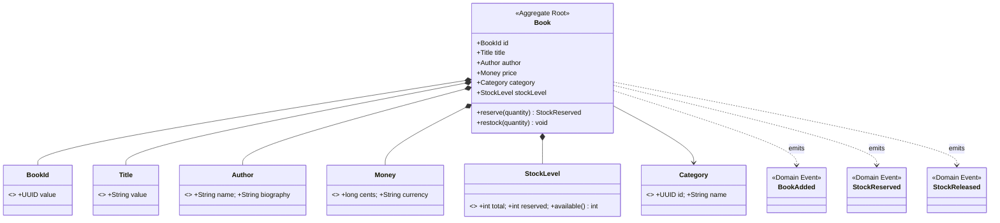

# catalog — Infrastructure 集成文档

## 服务定位

`catalog` 是书籍目录领域的边界上下文，负责书籍管理与库存控制。

**对外提供：**
- REST API（书籍查询、库存预留）
- Kafka 事件（`StockReserved`、`StockReleased`）

---

## Domain Model



---

## Infrastructure 集成总览

| 中间件 | 用途 | 必须 |
|---|---|---|
| PostgreSQL | 书籍/库存数据持久化（写模型） | ✅ |
| Redis | 书籍列表/详情热点缓存 | ✅ |
| Kafka + Schema Registry | 发布 Stock 事件（StockReserved、StockReleased） | ✅ |
| Debezium Connect | Outbox Relay（库存事件可靠投递） | ✅ |
| SigNoz / OTel | Traces + Metrics + Logs | ✅ |
| ElasticSearch | ❌ 不使用 | — |

---

## PostgreSQL

### 数据库信息

| 项目 | 值 |
|---|---|
| 数据库名 | `catalog` |
| 用户名 | `bookstore` |
| 密码 | `bookstore`（本地默认值；生产环境通过环境变量 `SPRING_DATASOURCE_PASSWORD` 覆盖） |
| 地址（本地） | `localhost:5432` |

数据库和用户由 `infrastructure/db/init.sql` 在容器首次启动时创建，**业务表由服务自己通过 Flyway 管理**。

### Flyway 迁移脚本

```
src/main/resources/db/migration/
├── V0100__catalog_schema.sql               # books、categories、stock 表
└── V0101__fix_currency_column_type.sql

# Seedwork 提供（通过 classpath:db/seedwork 加载）:
├── V0001__seedwork_outbox_events.sql       # Outbox 表（Debezium 读取）
├── V0002__seedwork_processed_events.sql    # 幂等消费去重表
└── V0003__seedwork_consumer_retry_events.sql  # 消费重试记录表
```

> **约定**：迁移脚本只做 DDL，不做数据初始化（测试数据用 `@Sql` 注解注入）。

### Spring 配置

```yaml
# src/main/resources/application.yml
spring:
  datasource:
    url: ${SPRING_DATASOURCE_URL:jdbc:postgresql://localhost:5432/catalog}
    username: ${SPRING_DATASOURCE_USERNAME:bookstore}
    password: ${SPRING_DATASOURCE_PASSWORD:bookstore}
  flyway:
    enabled: true
    locations: classpath:db/seedwork,classpath:db/migration
```

---

## Redis

### 用途

| 缓存键模式 | 内容 | TTL |
|---|---|---|
| `catalog:book:{bookId}` | 书籍详情（JSON） | 30 min |
| `catalog:books:page:{hash}` | 分页查询结果 | 5 min |
| `catalog:stock:{bookId}` | 库存可用量 | 1 min（高频读，短 TTL） |

> **缺货事件驱动失效**：`StockReserved` 发布后，适配器主动 `DEL catalog:stock:{bookId}`，下次读取时重新加载。

### Spring 配置

```yaml
spring:
  data:
    redis:
      host: ${SPRING_DATA_REDIS_HOST:localhost}
      port: ${SPRING_DATA_REDIS_PORT:6379}
```

### 缓存降级策略

Redis 不可用时服务**不降级为错误**，直接穿透查询 PostgreSQL（`@Cacheable` 自动 fallback）。
Redis 为纯缓存，不存储任何业务 Source of Truth 数据。

---

## Kafka + Schema Registry

### Topic 清单

| Topic | 方向 | Key | Value Schema |
|---|---|---|---|
| `bookstore.stock.reserved` | **发布** | `bookId`（UUID） | `com.example.events.v1.StockReserved` |
| `bookstore.stock.released` | **发布** | `bookId`（UUID） | `com.example.events.v1.StockReleased` |

### Spring Kafka 配置

```yaml
spring:
  kafka:
    bootstrap-servers: ${SPRING_KAFKA_BOOTSTRAP_SERVERS:localhost:9092}
    producer:
      key-serializer: org.apache.kafka.common.serialization.StringSerializer
      value-serializer: io.confluent.kafka.serializers.KafkaAvroSerializer
    properties:
      schema.registry.url: ${SCHEMA_REGISTRY_URL:http://localhost:8085}
```

> **Topic 创建由基础设施负责**：Topic 由 `shared-events/scripts/manage-kafka.sh` 在 `setup.sh` 中统一创建，**代码中不需要也不应声明 `@Bean NewTopic`**（Kafka 已设置 `auto.create.topics.enable=false`）。

---

## Debezium Connect（Outbox Relay）

catalog 通过 **Outbox 模式**保证库存事件的可靠投递（见 [ADR-005](../docs/architecture/ADR-005-outbox-pattern.md)）。

### Outbox 表

`outbox_event` 表由 seedwork 的 Flyway 脚本 `V0001__seedwork_outbox_events.sql` 创建，通过 `classpath:db/seedwork` 加载。该 DDL 由 seedwork 统一管理，**服务自身的迁移脚本中不重复定义**。

### Debezium Connector

配置文件位于 `infrastructure/debezium/connectors/catalog-outbox-connector.json`，首次启动后注册一次：

```bash
curl -X POST http://localhost:8084/connectors \
  -H "Content-Type: application/json" \
  -d @../infrastructure/debezium/connectors/catalog-outbox-connector.json
```

Debezium 读取 PostgreSQL WAL → 经 Outbox Event Router SMT 路由 → 写入对应 Kafka Topic。

---

## ElasticSearch

**catalog 不使用 ElasticSearch。** 书籍列表查询由 PostgreSQL + Redis 缓存承担，不需要全文搜索读模型。

---

## SigNoz / OpenTelemetry

### 接入方式

通过 **OTel Java Agent**（`-javaagent`）自动注入，无需代码改动：

```yaml
# JVM 启动参数（本地开发）
JAVA_TOOL_OPTIONS: >
  -javaagent:/path/to/opentelemetry-javaagent.jar

# 环境变量
OTEL_SERVICE_NAME: catalog
OTEL_EXPORTER_OTLP_ENDPOINT: http://localhost:4317
OTEL_EXPORTER_OTLP_PROTOCOL: grpc
```

### 自动埋点覆盖范围

| 信号 | 自动覆盖内容 |
|---|---|
| **Traces** | Spring MVC HTTP 请求、JDBC SQL、Kafka produce/consume、Redis 命令 |
| **Metrics** | JVM 堆/GC、HTTP 请求率/延迟、HikariCP 连接池、Kafka consumer lag |
| **Logs** | Logback 日志自动注入 `trace_id`、`span_id`（与 Trace 关联） |

### Span 命名约定

```
catalog.book.list-books
catalog.book.get-book
catalog.stock.reserve
catalog.stock.release
```

---

## Istio / Kubernetes

> 以下为 K8s 部署时的配置说明。

### 服务端口

| 端口 | 说明 |
|---|---|
| `8081` | REST API（Ingress Gateway 路由入口） |
| `8080` | Actuator（内部健康检查、Prometheus 指标，不对外暴露） |

### Helm Chart 文件（`helm/templates/`）

| 文件 | 内容 |
|---|---|
| `deployment.yaml` | 单副本（本地）/ HPA 托管（prod） |
| `service.yaml` | ClusterIP，端口 8081 |
| `hpa.yaml` | CPU > 70% 触发扩容，最大 3 副本 |
| `networkpolicy.yaml` | 放行：Ingress Gateway → 8081；Egress → PostgreSQL:5432、Redis:6379、Kafka:29092、Schema Registry:8081 |
| `virtual.yaml` | 路由到 catalog，超时 5s，重试 3 次（5xx 时） |
| `destination-rule.yaml` | 熔断器：连续 5 次 5xx 后驱逐实例，30s 恢复 |
| `configmap.yaml` | 非敏感配置（`OTEL_SERVICE_NAME` 等） |
| `serviceaccount.yaml` | 独立 ServiceAccount |

### VirtualService 路由规则

```
bookstore.local/api/v1/books*           → catalog:8081
bookstore.local/api/v1/books/{id}/stock → catalog:8081（内部服务间调用）
```

---

## 本地启动

```bash
# 1. 启动基础设施（自动完成 Topic 创建、Schema 注册、Debezium Connector 注册）
cd ../infrastructure && ./setup.sh && cd -

# 2. 确认 shared-events SDK 已发布到 mavenLocal
cd ../shared-events && ./gradlew publishToMavenLocal && cd -

# 3. 启动服务
./gradlew bootRun
```

服务启动后可访问：
- REST API：`http://localhost:8081/api/v1/books`
- 健康检查：`http://localhost:8081/actuator/health`
