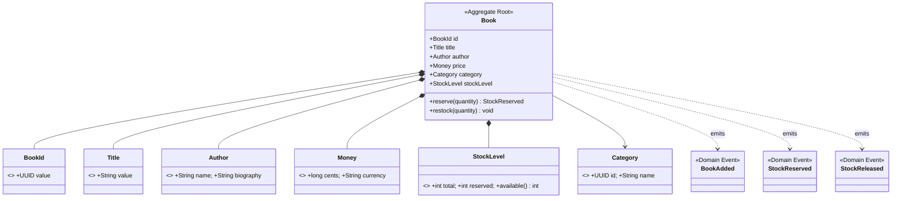

# catalog — Infrastructure Integration Guide

## Service Overview

`catalog` is the bounded context for the book catalog domain, responsible for book management and stock control.

**Provides:**
- REST API (book queries, stock reservation)
- Kafka events (`StockReserved`, `StockReleased`)

---

## Domain Model



---

## Infrastructure Integration Summary

| Middleware | Purpose | Required |
|---|---|---|
| PostgreSQL | Book/stock data persistence (write model) | Yes |
| Redis | Hot cache for book list / detail | Yes |
| Kafka + Schema Registry | Publish Stock events (StockReserved, StockReleased) | Yes |
| Debezium Connect | Outbox Relay (reliable stock event delivery) | Yes |
| SigNoz / OTel | Traces + Metrics + Logs | Yes |
| ElasticSearch | Not used | — |

---

## PostgreSQL

### Database Details

| Property | Value |
|---|---|
| Database name | `catalog` |
| Username | `bookstore` |
| Password | `bookstore` (local default; override in production via env var `SPRING_DATASOURCE_PASSWORD`) |
| Address (local) | `localhost:5432` |

The database and user are created by `infrastructure/db/init.sql` on the first container start. **Business tables are managed by the service itself via Flyway.**

### Flyway Migration Scripts

```
src/main/resources/db/migration/
├── V0100__catalog_schema.sql               # books, categories, stock tables
└── V0101__fix_currency_column_type.sql

# Provided by seedwork (loaded via classpath:db/seedwork):
├── V0001__seedwork_outbox_events.sql       # Outbox table (read by Debezium)
├── V0002__seedwork_processed_events.sql    # Idempotent consumer deduplication table
└── V0003__seedwork_consumer_retry_events.sql  # Consumer retry records table
```

> **Convention**: Migration scripts contain DDL only — no data seeding. Test data is injected via the `@Sql` annotation.

### Spring Configuration

```yaml
# src/main/resources/application.yml
spring:
  datasource:
    url: ${SPRING_DATASOURCE_URL:jdbc:postgresql://localhost:5432/catalog}
    username: ${SPRING_DATASOURCE_USERNAME:bookstore}
    password: ${SPRING_DATASOURCE_PASSWORD:bookstore}
  flyway:
    enabled: true
    locations: classpath:db/seedwork,classpath:db/migration
```

---

## Redis

### Cache Key Reference

| Key Pattern | Content | TTL |
|---|---|---|
| `catalog:book:{bookId}` | Book detail (JSON) | 30 min |
| `catalog:books:page:{hash}` | Paginated query result | 5 min |
| `catalog:stock:{bookId}` | Available stock quantity | 1 min (high-read, short TTL) |

> **Event-driven cache invalidation**: After `StockReserved` is published, the adapter actively calls `DEL catalog:stock:{bookId}` so that the next read reloads from the database.

### Spring Configuration

```yaml
spring:
  data:
    redis:
      host: ${SPRING_DATA_REDIS_HOST:localhost}
      port: ${SPRING_DATA_REDIS_PORT:6379}
```

### Cache Degradation Strategy

When Redis is unavailable the service **does not fail**; queries fall through to PostgreSQL automatically (`@Cacheable` fallback). Redis is a pure cache — no business source-of-truth data is stored there.

---

## Kafka + Schema Registry

### Topic List

| Topic | Direction | Key | Value Schema |
|---|---|---|---|
| `bookstore.stock.reserved` | **Publish** | `bookId` (UUID) | `com.example.events.v1.StockReserved` |
| `bookstore.stock.released` | **Publish** | `bookId` (UUID) | `com.example.events.v1.StockReleased` |

### Spring Kafka Configuration

```yaml
spring:
  kafka:
    bootstrap-servers: ${SPRING_KAFKA_BOOTSTRAP_SERVERS:localhost:9092}
    producer:
      key-serializer: org.apache.kafka.common.serialization.StringSerializer
      value-serializer: io.confluent.kafka.serializers.KafkaAvroSerializer
    properties:
      schema.registry.url: ${SCHEMA_REGISTRY_URL:http://localhost:8085}
```

> **Topics are created by infrastructure**: Topics are created by `shared-events/scripts/manage-kafka.sh` inside `setup.sh`. **Do not declare `@Bean NewTopic` in code** — Kafka is configured with `auto.create.topics.enable=false`.

---

## Debezium Connect (Outbox Relay)

`catalog` uses the **Outbox Pattern** to guarantee reliable delivery of stock events (see [ADR-005](../docs/architecture/ADR-005-outbox-pattern.md)).

### Outbox Table

The `outbox_event` table is created by seedwork's Flyway script `V0001__seedwork_outbox_events.sql`, loaded via `classpath:db/seedwork`. The DDL is managed centrally by seedwork — **it must not be redefined in the service's own migration scripts**.

### Debezium Connector

The connector configuration lives at `infrastructure/debezium/connectors/catalog-outbox-connector.json`. Register it once after first startup:

```bash
curl -X POST http://localhost:8084/connectors \
  -H "Content-Type: application/json" \
  -d @../infrastructure/debezium/connectors/catalog-outbox-connector.json
```

Debezium reads the PostgreSQL WAL, routes events through the Outbox Event Router SMT, and writes them to the corresponding Kafka topics.

---

## ElasticSearch

**catalog does not use ElasticSearch.** Book list queries are served by PostgreSQL with a Redis cache; full-text search read models are not required.

---

## SigNoz / OpenTelemetry

### Instrumentation

Instrumentation is injected automatically via the **OTel Java Agent** (`-javaagent`) — no code changes required:

```yaml
# JVM startup options (local development)
JAVA_TOOL_OPTIONS: >
  -javaagent:/path/to/opentelemetry-javaagent.jar

# Environment variables
OTEL_SERVICE_NAME: catalog
OTEL_EXPORTER_OTLP_ENDPOINT: http://localhost:4317
OTEL_EXPORTER_OTLP_PROTOCOL: grpc
```

### Auto-Instrumentation Coverage

| Signal | Automatically covered |
|---|---|
| **Traces** | Spring MVC HTTP requests, JDBC SQL, Kafka produce, Redis commands |
| **Metrics** | JVM heap/GC, HTTP request rate/latency, HikariCP connection pool, Kafka producer metrics |
| **Logs** | Logback logs automatically enriched with `trace_id` and `span_id` (linked to traces) |

### Span Naming Convention

```
catalog.book.list-books
catalog.book.get-book
catalog.stock.reserve
catalog.stock.release
```

---

## Istio / Kubernetes

> The following describes configuration for Kubernetes deployments.

### Service Ports

| Port | Description |
|---|---|
| `8081` | REST API (Ingress Gateway entry point) |
| `8080` | Actuator (internal health checks and Prometheus metrics; not exposed externally) |

### Helm Chart Files (`helm/templates/`)

| File | Content |
|---|---|
| `deployment.yaml` | Single replica (local) / HPA-managed (prod) |
| `service.yaml` | ClusterIP, port 8081 |
| `hpa.yaml` | Scale out when CPU > 70%, max 3 replicas |
| `networkpolicy.yaml` | Allow: Ingress Gateway → 8081; Egress → PostgreSQL:5432, Redis:6379, Kafka:29092, Schema Registry:8081 |
| `virtual.yaml` | Route to catalog, 5 s timeout, 3 retries on 5xx |
| `destination-rule.yaml` | Circuit breaker: eject instance after 5 consecutive 5xx errors, recover after 30 s |
| `configmap.yaml` | Non-sensitive configuration (`OTEL_SERVICE_NAME`, etc.) |
| `serviceaccount.yaml` | Dedicated ServiceAccount |

### VirtualService Routing Rules

```
bookstore.local/api/v1/books*           → catalog:8081
bookstore.local/api/v1/books/{id}/stock → catalog:8081  (inter-service calls)
```

---

## Local Startup

```bash
# 1. Start infrastructure (creates topics, registers schemas, registers Debezium connector)
cd ../infrastructure && ./setup.sh && cd -

# 2. Ensure the shared-events SDK is published to mavenLocal
cd ../shared-events && ./gradlew publishToMavenLocal && cd -

# 3. Start the service
./gradlew bootRun
```

Once the service is running:
- REST API: `http://localhost:8081/api/v1/books`
- Health check: `http://localhost:8081/actuator/health`
