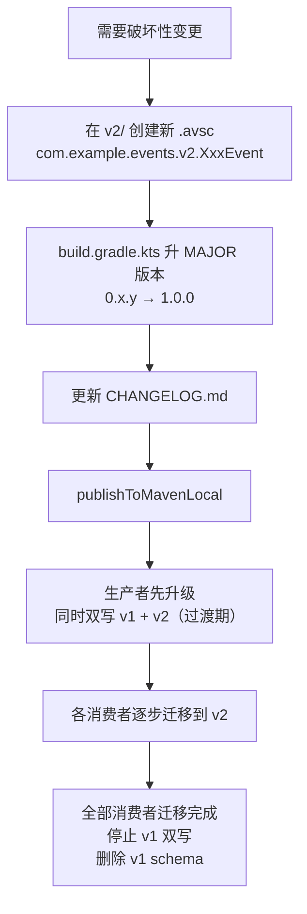

# ADR-008: shared-events SDK 版本策略

- **Status**: Accepted
- **Date**: 2026-03-04
- **Deciders**: Architecture Team

---

## Context

`shared-events` 作为所有跨服务 Kafka 事件的**唯一权威来源**，其变更会直接影响所有消费该 SDK 的微服务。各服务为独立 Gradle 项目，通过 `mavenLocal()` 依赖 SDK，因此需要明确：

1. **如何标识版本**：消费方如何知道自己依赖的是哪个版本的 SDK？
2. **如何记录变更**：新增事件、新增字段、破坏性变更——消费团队如何感知？
3. **破坏性变更如何处理**：避免单次变更同时破坏多个消费者？
4. **本地开发流程**：开发者修改 schema 后，其他服务如何取得最新 SDK？

---

## Decision

### 版本号规范

采用**语义化版本**（[SemVer](https://semver.org/lang/zh-CN/)），Demo 阶段以 `0.x.y` 起步：

| 变更类型 | 版本升级 | 示例 |
|---|---|---|
| 新增事件（无破坏性） | MINOR 升级 | `0.1.0` → `0.2.0` |
| 新增字段（有 `default`，BACKWARD 兼容）| PATCH 升级 | `0.1.0` → `0.1.1` |
| 删除/改名必填字段（破坏性）| MAJOR 升级 + 新命名空间 | `0.x.y` → `1.0.0` |
| 仅文档/注释/工具修改 | PATCH 升级 | `0.1.0` → `0.1.1` |

> Demo 阶段保持 `0.x.y`，破坏性变更时才升至 `1.0.0`。

### CHANGELOG.md 为强制产物

**每次修改 `.avsc` 文件时**，必须同步更新 `CHANGELOG.md`。格式参考 [Keep a Changelog](https://keepachangelog.com/zh-CN/1.0.0/)：

```markdown
## [0.2.0] - 2026-xx-xx

### Added
- **PaymentCompleted**：支付完成时发布，生产者 payment，消费者 order

### Changed
- **OrderCancelled**：新增 `cancelledBy` 字段（可选，有 default=""），记录取消操作人
```

### 破坏性变更处理规则

删除必填字段、修改字段类型/名称，属于对消费者的**破坏性变更**，必须遵循以下流程：



**v1 和 v2 必须共存至所有消费者完成迁移。**

### 本地开发发布流程

各服务独立，修改 schema 后的标准操作：

```bash
# 1. 在 shared-events/ 目录修改 .avsc 文件
# 2. 更新 build.gradle.kts 中的 version
# 3. 更新 CHANGELOG.md
# 4. （可选）检查本地 Schema Registry 兼容性
./schema-registry/register-schemas.sh --check-only
# 5. 构建并发布到 mavenLocal
./gradlew publishToMavenLocal
# 6. 各消费服务更新 build.gradle.kts 中的版本号后重新构建
```

---

## Consequences

### Positive

- **版本可追溯**：`CHANGELOG.md` 提供完整的变更历史，消费团队可快速了解升级内容
- **破坏性变更可控**：命名空间隔离（v1/v2）+ MAJOR 版本号变更，消费者不会被静默升级破坏
- **本地开发友好**：`mavenLocal()` 无需任何外部服务，publish 命令简单
- **兼容性前置**：`--check-only` 脚本让开发者在本地即可发现 schema 不兼容问题

### Negative

- **手动发布**：Demo 阶段没有 CI/CD，开发者需要记住在修改 schema 后手动执行 `publishToMavenLocal`
- **版本同步负担**：各服务 `build.gradle.kts` 中的版本号需要手动更新，容易遗漏

### 演进路径（生产阶段参考）

- 接入私有 Maven 仓库（Nexus / GitHub Packages），`publish` 只需推送到远程仓库
- 各服务通过版本坐标依赖（`com.example:shared-events:x.y.z`），逻辑不变
- CHANGELOG.md 和版本规则保持不变

---

## 相关文档

- [ADR-003 — Event Schema Ownership](ADR-003-event-schema-ownership.md)
- [shared-events README](../../shared-events/README.md)
- [shared-events CHANGELOG](../../shared-events/CHANGELOG.md)
