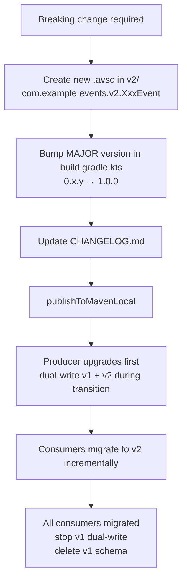

# ADR-008: shared-events SDK Versioning Strategy

- **Status**: Accepted
- **Date**: 2026-03-04
- **Deciders**: Architecture Team

---

## Context

`shared-events` is the **single source of truth** for all cross-service Kafka events; changes to it directly affect every microservice that depends on the SDK. Each service is an independent Gradle project that references the SDK via `mavenLocal()`. We need to define:

1. **How to identify versions**: how does a consumer know which version of the SDK it depends on?
2. **How to record changes**: new events, new fields, breaking changes — how do consuming teams stay informed?
3. **How to handle breaking changes**: how do we avoid a single change simultaneously breaking multiple consumers?
4. **Local development workflow**: after a developer modifies a schema, how do other services get the latest SDK?

---

## Decision

### Versioning Convention

Use **Semantic Versioning** ([SemVer](https://semver.org/)), starting at `0.x.y` during the demo phase:

| Change Type | Version Bump | Example |
|---|---|---|
| New event (non-breaking) | MINOR bump | `0.1.0` → `0.2.0` |
| New field (with `default`, BACKWARD-compatible) | PATCH bump | `0.1.0` → `0.1.1` |
| Delete/rename a required field (breaking) | MAJOR bump + new namespace | `0.x.y` → `1.0.0` |
| Documentation/comment/tooling changes only | PATCH bump | `0.1.0` → `0.1.1` |

> During the demo phase, stay at `0.x.y`; only advance to `1.0.0` for breaking changes.

### CHANGELOG.md is a Required Artifact

**Every time a `.avsc` file is modified**, `CHANGELOG.md` must be updated in the same commit. Format follows [Keep a Changelog](https://keepachangelog.com/en/1.0.0/):

```markdown
## [0.2.0] - 2026-xx-xx

### Added
- **PaymentCompleted**: published when payment completes; producer: payment, consumer: order

### Changed
- **OrderCancelled**: added optional `cancelledBy` field (default="") to record who initiated the cancellation
```

### Breaking Change Process

Removing a required field or changing a field's type or name is a **breaking change** for consumers and must follow this process:



**v1 and v2 must coexist until all consumers have completed migration.**

### Local Development Publish Workflow

Each service is independent. The standard workflow after modifying a schema:

```bash
# 1. Modify .avsc files in the shared-events/ directory
# 2. Update the version in build.gradle.kts
# 3. Update CHANGELOG.md
# 4. (Optional) Check Schema Registry compatibility locally
./schema-registry/register-schemas.sh --check-only
# 5. Build and publish to mavenLocal
./gradlew publishToMavenLocal
# 6. Each consuming service updates the version in its build.gradle.kts and rebuilds
```

---

## Consequences

### Positive

- **Traceable versions**: `CHANGELOG.md` provides a complete change history; consuming teams can quickly understand what an upgrade includes
- **Controlled breaking changes**: namespace isolation (v1/v2) + MAJOR version bump ensures consumers are not silently broken by upgrades
- **Local-dev friendly**: `mavenLocal()` requires no external services; the publish command is simple
- **Upfront compatibility checking**: the `--check-only` script lets developers catch schema incompatibilities locally before committing

### Negative

- **Manual publishing**: during the demo phase there is no CI/CD; developers must remember to run `publishToMavenLocal` after modifying schemas
- **Version sync overhead**: version numbers in each service's `build.gradle.kts` must be updated manually, which is easy to forget

### Evolution Path (Production Reference)

- Publish to a private Maven repository (Nexus / GitHub Packages); `publish` only requires pushing to the remote repository
- Services depend via version coordinates (`com.example:shared-events:x.y.z`); the logic is unchanged
- `CHANGELOG.md` and versioning rules remain the same

---

## Related Documents

- [ADR-003 — Event Schema Ownership](ADR-003-event-schema-ownership.md)
- [shared-events README](../../../shared-events/README.md)
- [shared-events CHANGELOG](../../../shared-events/CHANGELOG.md)
