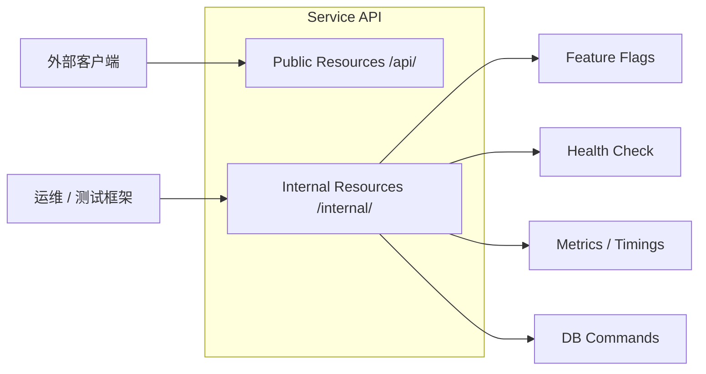
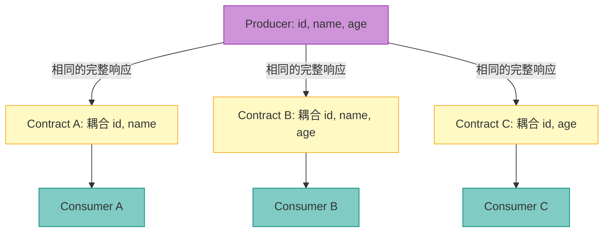
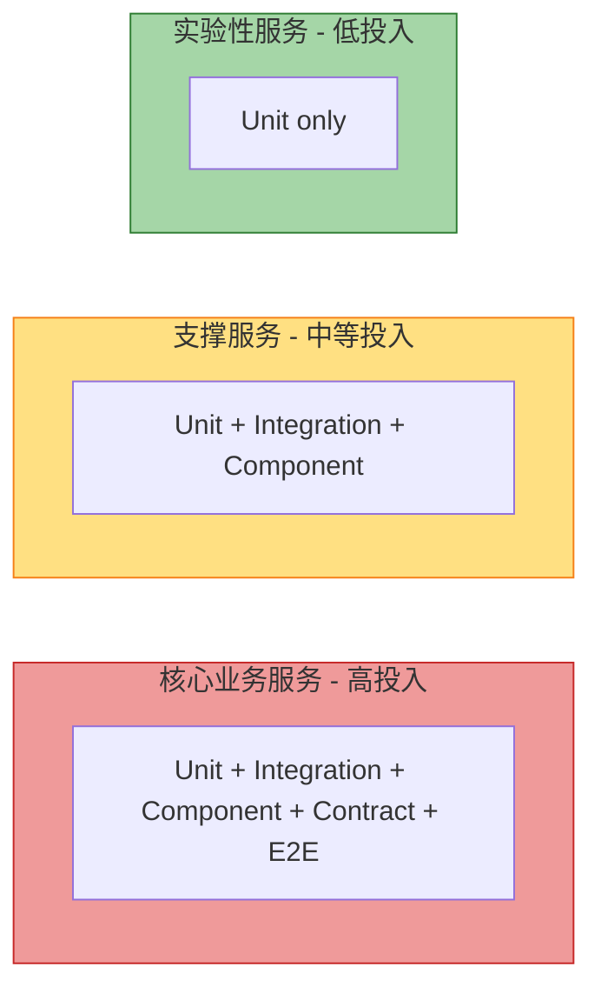
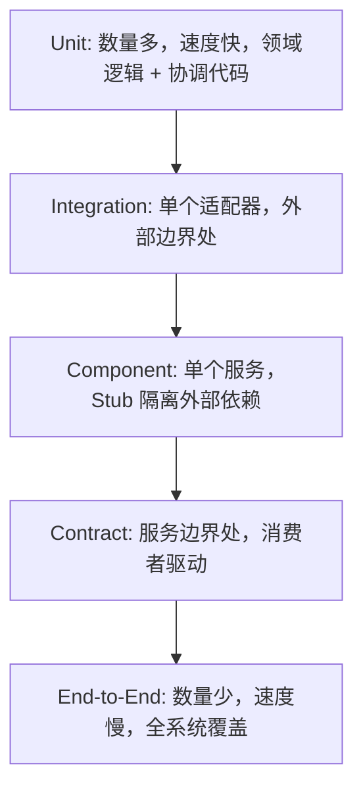

# 微服务架构的测试策略

> 来源：Toby Clemson（ThoughtWorks），发表于 martinfowler.com — 2014 年 11 月 18 日
> 原文：25 页 Infodeck。本文档是原版幻灯片及所有图表的完整中文转录版。

---

## 1. 引言

近年来，基于服务的架构逐渐向更小、更专注的"微"服务转变。这种方式带来了诸多优势：可以独立部署、扩展和维护每个组件，并允许多个团队并行开发。

然而，正如大多数架构决策一样，这种方式也存在权衡。适用于单体进程内应用的测试策略，在微服务场景下需要重新审视。

本文档讨论以下两个核心问题：
- 多个可独立部署组件带来的额外测试复杂性。
- 如何让测试和应用程序帮助多个团队各自守护好自己负责的服务。

---

## 2. 微服务是什么及其内部结构

### 2.1 内部模块结构

微服务通常具有相似的内部结构，包含以下部分或全部层次。测试策略应覆盖**每一层**以及**层与层之间**的交互，同时保持轻量。

> Gateways 和 HTTP Client 是**纵向侧栏**，贯穿 Service Layer + Domain + Repositories 的整个高度——它们与领域层栈**并列**，而非从属于某一层。

**各模块说明：**

| 模块 | 颜色 | 所属层 | 职责 |
|---|---|---|---|
| Resources | 绿色（Protocol） | 顶层 | 映射 HTTP 请求 ↔ 领域对象；轻量校验层；根据业务事务结果返回协议响应 |
| Service Layer | 青色（Domain） | | 协调领域对象以完成一个业务事务 |
| Domain | 青色（Domain） | 核心 | 核心业务逻辑；服务中最丰富的部分 |
| Gateways | 紫色（External） | 侧栏 | 封装与外部服务/API 的消息传递 |
| HTTP Client | 紫色（External） | 侧栏 | 向其他微服务发起出站 HTTP 调用 |
| Repositories | 青色（Domain） | | 抽象领域对象的持久化操作 |
| Data Mappers / ORM | 粉色（Persistence） | 底层 | 映射领域对象 ↔ 数据库表示 |

### 2.2 服务通过网络互联并使用外部数据存储

微服务通过在各相关模块之间传递消息来处理请求并形成响应。网络分区的存在影响了测试风格的选择——集成模块的测试可能因团队无法控制的原因而失败。

> **本页图例新增：** Logical Boundary（内层虚线，将纯领域代码与集成代码分隔开）和 Connection（模块间的箭头连线）。

### 2.3 多个服务协作组成一个系统

在较大的系统中，多个团队分别负责不同的**限界上下文（Bounded Context）**。对**外部服务**的测试关注点与内部服务不同——对其接口稳定性和可用性能做的保证更少。

---

## 3. 单元测试（Unit Testing）

### 3.1 两种风格

服务通常由**丰富的领域逻辑**和围绕它的**管道与协调代码**构成。两种单元测试风格各有其适用场景。

| 风格 | 标记 | 适用层 | 原因 |
|---|---|---|---|
| **社交型（Sociable）** | 实心红色方块 | Domain | 逻辑高度依赖状态；使用真实协作对象才能体现价值 |
| **孤立型（Solitary）** | 虚线粉色方块 | Resources、Service Layer、Repositories | 协调/管道代码；用 Test Double 可保持测试快速且专注 |
| *（无标记）* | — | Gateways、HTTP Client、Data Mappers/ORM | 由集成测试覆盖 |

**Domain 层为何用 Sociable？**
领域逻辑通常体现为复杂计算和状态转换的集合。由于这类逻辑高度依赖状态，隔离单元几乎没有价值。应尽可能使用真实的领域对象作为被测单元的所有协作者。

**协调代码为何用 Solitary？**
Resources、Service Layer、Repositories 是协调/管道代码，职责是委托和映射。使用 Test Double 可以让测试快速且专注。

### 3.2 单元测试的局限性

单元测试无法保证系统整体行为的正确性。各模块都在隔离状态下被测试，但缺少以下覆盖：
- 模块如何**协同工作**以构成完整服务。
- 与**远程依赖**（外部数据存储、其他服务）之间的交互。

> 图中仅在 Resources、Service Layer、Domain、Repositories 上标注了 Unit Tested（红色方块）。Gateways、HTTP Client、Data Mappers/ORM 和 External Datastore 均未被覆盖。

要验证每个模块能否正确地与其协作者交互，**需要粒度更粗的测试**。

---

## 4. 集成测试（Integration Testing）

> **"集成测试验证组件之间的通信路径和交互，以发现接口缺陷。"**

### 4.1 定义

集成测试将多个模块组合在一起，作为**子系统**进行测试，以验证它们能否按预期协作完成更大的业务功能。它通过子系统的通信路径来检查每个模块对如何与其他模块交互的假设是否正确。

与单元测试不同：即使单元测试使用了真实的协作者，其目标仍然是测试被测单元本身的行为，而非整个子系统。

在微服务架构中，集成测试主要用于验证**集成代码层**（Repositories、Gateways、HTTP Client）与其所集成的**外部组件**（数据存储、缓存、其他微服务）之间的交互。

### 4.2 集成测试边界

> 黄色虚线**集成测试边界**包裹 Data Mappers/ORM 层**及**其与 External Datastore 的连接——即覆盖集成点的**两侧**。Gateways/HTTP Client 及其外部连接处存在独立的边界。

**关键建议：**
- 此类测试在重构集成模块时能提供快速反馈。
- 但它们有**不止一个失败原因**——外部组件不可用或破坏了契约都会导致失败。
- 只需编写**少量**集成测试，覆盖通信边界即可。
- 可以考虑在外部服务中断时让构建失败，避免阻塞开发流程。

---

## 5. 组件测试（Component Testing）

> **"组件测试将被测软件的范围限制在系统的某一部分，通过内部代码接口操控系统，并使用 Test Double 将被测代码与其他组件隔离。"**

没有组件测试，我们就无法确信微服务**作为整体**满足了业务需求。端到端测试虽然也能实现这一点，但更多的隔离意味着更快、更可复现的反馈。

### 5.1 进程内组件测试（In-Process）

通过**内部接口**与微服务通信——例如 JVM 上的 Spring `MockMvc`，或 .NET 上的 `plasma`。外部依赖替换为**在同一进程内的内存 Stub**。

> 橙色/黄色虚线**组件测试边界**包围整个服务。外部服务 Stub 在内存中运行，位于边界**之内**。测试框架通过内部 Shim 通信（非真实 HTTP）。

**权衡：** 速度最快，最简单。无真实网络调用。与真实部署相比，保真度略低。

### 5.2 内部资源（Internal Resources）

将内部控制暴露为独立端点，可以带来额外的测试便利（监控、维护、调试）：

这些端点可以要求独立认证，或在网络层加以限制。

### 5.3 进程外组件测试（Out-of-Process）

对**完整部署产物**进行真实 HTTP 测试。复杂的 Stub 逻辑转移到测试框架中——外部服务由 **Stub 服务器**替代（如 mountebank、WireMock）。

> 红色虚线**组件测试边界**包含已部署的服务及其外部 Stub。Stub 在服务进程之外但在测试边界之内运行。External Datastore 是真实实例（如 Testcontainers）。

**权衡：** 更高保真度（真实网络、真实产物）。搭建更慢、更复杂。

**Stub 工具示例：** mountebank、WireMock、moco——支持动态编程、固定数据以及录制回放三种 Stub 模式。

---

## 6. 契约测试（Contract Testing）

> **"集成契约测试是对外部服务边界处的测试，用于验证该服务满足消费方服务所期望的契约。"**

### 6.1 为何需要契约测试

将单元、集成、组件测试组合使用后，每个服务内部的覆盖率已经很高。但仍然没有测试能确保：
- 外部依赖满足本微服务的期望。
- 多个微服务能够正确协作，提供有商业价值的功能。

> 本页展示了一个多服务图，叠加了 Unit、Integration、Component 三类测试边界——并标出了**服务与服务之间的边界**这一剩余盲区，正是契约测试要解决的问题。

### 6.2 消费者驱动的契约（Consumer-Driven Contracts）

> **重要：** 三个消费者收到的是**相同的完整 JSON 响应** `{"id": 5, "name": "James", "age": 24}`。区别在于**每个消费者所耦合的字段子集**——Contract A/B/C 代表不同的字段依赖关系。所有消费者契约的并集，就是 Producer 必须履行的完整服务契约。

**工作机制：**
1. 每个**消费者**编写测试，精确表达它对 Producer 的字段/Schema 依赖。
2. 消费者契约测试套件被**打包并在 Producer 的构建流水线中运行**。
3. 若 Producer 的变更破坏了任何消费者的契约，构建立即失败。
4. 这**不是**端到端测试——它只验证边界处的输入/输出 Schema 是否包含消费者所需的字段。

---

## 7. 端到端测试（End-to-End Testing）

> **"端到端测试验证系统满足外部需求并达成其目标，从头到尾测试整个系统。"**

### 7.1 端到端测试边界

系统被视为**黑盒**，通过公开接口（GUI、REST API）驱动。团队无法控制的外部服务通常在系统边界处被**打桩（Stub）**。

> 大型粉色虚线**端到端测试边界**仅包围团队自己拥有的服务。由其他团队管理的外部服务在边界外被打桩。连线上的 `{"..."}` 标签表示服务间通信的 JSON 消息。

**端到端测试在微服务中的价值：**
- 覆盖其他测试类型无法触达的盲区（消息路由、系统级配置）。
- 确保在大规模架构调整（服务拆分/合并）后，业务价值依然完整。

### 7.2 管理端到端测试复杂性的指南

端到端测试涉及的活动部件更多，风险、不稳定性和维护成本（系统异步、服务间后端进程异步）也更高。

**关于第 4 条——基础设施即代码：**
"雪花环境"（Snowflake Environment）是不确定性的来源之一，尤其是当它被用于不止端到端测试时。每次端到端套件执行都**构建全新的环境**，既能提升可靠性，也能顺带验证部署逻辑。

---

## 8. 总结与测试金字塔

### 8.1 微服务架构提供了更多测试选项

将系统拆分为小型、边界清晰的服务，暴露了以前隐藏的边界。这些边界为测试类型和测试力度的选择提供了灵活性：

### 8.2 测试金字塔

### 8.3 总结——所有测试类型叠加图

> 总结图将五种测试类型叠加在同一张多服务视图上：
> - **红色方块** = 单元测试覆盖的模块
> - **黄色虚线** = 集成测试边界（紧密包裹每个适配器及其外部组件）
> - **橙色/橙红色虚线** = 组件测试边界（整个服务）
> - **黄色斜纹** = 契约测试边界（服务与服务之间的接口处）
> - *端到端测试边界将包围整个系统*

### 8.4 测试类型速查表

| 测试类型 | 范围 | 验证内容 | JVM 工具 | 速度 |
|---|---|---|---|---|
| **Unit（Sociable）** | 类 + 真实领域协作者 | 领域逻辑正确性 | JUnit 5 | ⚡⚡⚡⚡⚡ |
| **Unit（Solitary）** | 类 + Test Double | 协调/映射逻辑 | JUnit 5 + Mockito | ⚡⚡⚡⚡⚡ |
| **Integration** | 模块 + 真实外部适配器 | 到 DB/缓存/消息队列的通信路径 | @DataJpaTest + Testcontainers | ⚡⚡⚡ |
| **Component（进程内）** | 整个服务 + 内存 Stub | 服务在隔离环境中满足业务需求 | SpringBootTest + MockMvc | ⚡⚡⚡⚡ |
| **Component（进程外）** | 部署产物 + Stub 服务器 | 服务作为真实产物能正确运行 | Testcontainers + WireMock | ⚡⚡ |
| **Contract** | 服务 API 边界 | Producer 满足消费者期望 | Pact / Spring Cloud Contract | ⚡⚡⚡⚡ |
| **End-to-End** | 整个系统 | 业务目标端到端达成 | REST-assured + Docker Compose | ⚡ |

### 8.5 层次 × 测试类型覆盖矩阵

> 根据原版幻灯片更正：Gateways、HTTP Client、Data Mappers/ORM **无单元测试标记**，由集成测试覆盖。

| 层次 | Unit Solitary | Unit Sociable | Integration | Component | Contract | E2E |
|---|:---:|:---:|:---:|:---:|:---:|:---:|
| Resources | ✓ | | | ✓ | | ✓ |
| Service Layer | ✓ | | | ✓ | | ✓ |
| Domain | | ✓ | | ✓ | | ✓ |
| Gateways | | | ✓ | stub | ✓ | ✓ |
| HTTP Client | | | ✓ | stub | ✓ | ✓ |
| Repositories | ✓ | | ✓ | stub | — | ✓ |
| Data Mappers / ORM | | | ✓ | stub | — | ✓ |
