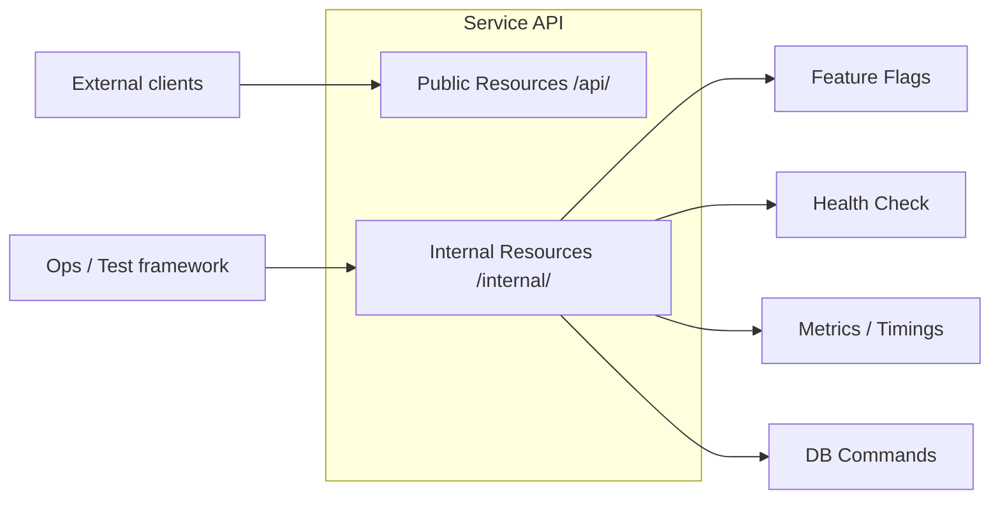
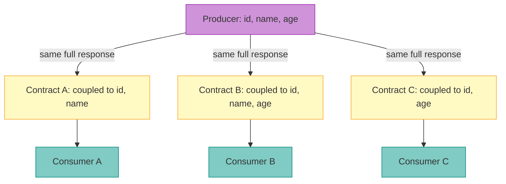
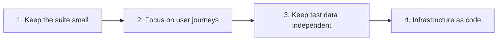
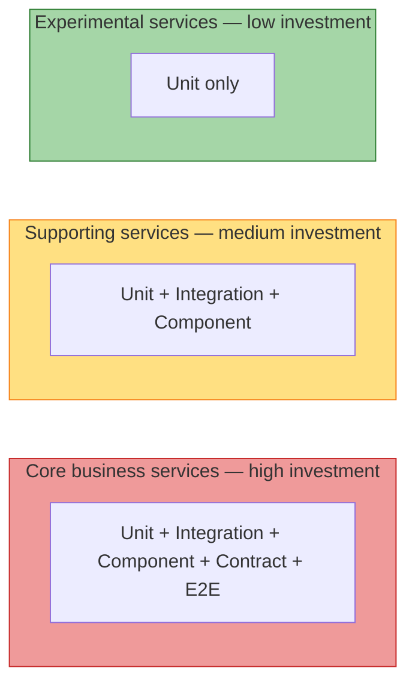
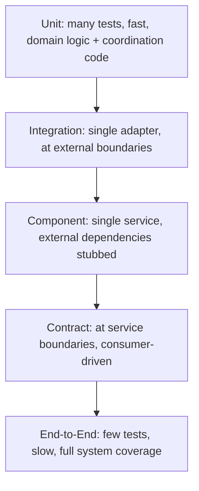

# Testing Strategies in a Microservice Architecture

> Source: Toby Clemson (ThoughtWorks), published on martinfowler.com — 18 November 2014
> Original: 25-slide Infodeck. This document is a complete English transcription of the original slides and all diagrams.

---

## 1. Introduction

In recent years, service-based architectures have evolved towards smaller, more focused "micro" services. This approach offers significant advantages: each component can be deployed, scaled, and maintained independently, and multiple teams can develop in parallel.

However, as with most architectural decisions, there are trade-offs. Testing strategies that work well for in-process monolithic applications need to be revisited in the context of microservices.

This document addresses two core questions:
- The additional testing complexity introduced by multiple independently deployable components.
- How tests and applications can help multiple teams each protect the services they own.

---

## 2. What Microservices Are and Their Internal Structure

### 2.1 Internal Module Structure

Microservices typically share a similar internal structure, containing some or all of the following layers. A testing strategy should cover **every layer** as well as the **interactions between layers**, while remaining lightweight.

> Gateways and HTTP Client are **vertical sidebars** spanning the full height of the Service Layer + Domain + Repositories stack — they sit **alongside** the domain layer stack, not subordinate to any single layer.

**Module descriptions:**

| Module | Colour | Layer | Responsibility |
|---|---|---|---|
| Resources | Green (Protocol) | Top | Maps HTTP requests ↔ domain objects; lightweight validation; returns protocol responses based on business transaction outcomes |
| Service Layer | Cyan (Domain) | | Coordinates domain objects to complete a business transaction |
| Domain | Cyan (Domain) | Core | Core business logic; the richest part of the service |
| Gateways | Purple (External) | Sidebar | Encapsulates messaging with external services/APIs |
| HTTP Client | Purple (External) | Sidebar | Makes outbound HTTP calls to other microservices |
| Repositories | Cyan (Domain) | | Abstracts persistence operations for domain objects |
| Data Mappers / ORM | Pink (Persistence) | Bottom | Maps domain objects ↔ database representations |

### 2.2 Services Are Connected via Networks and Use External Data Stores

Microservices process requests and form responses by passing messages between relevant modules. The presence of network partitions influences the choice of testing style — tests of integrated modules may fail for reasons outside the team's control.

> **New in this diagram:** Logical Boundary (inner dashed line, separating pure domain code from integration code) and Connection (arrows between modules).

### 2.3 Multiple Services Collaborate to Form a System

In larger systems, multiple teams are each responsible for different **Bounded Contexts**. The testing concerns for **external services** differ from those for internal services — fewer guarantees can be made about their interface stability and availability.

---

## 3. Unit Testing

### 3.1 Two Styles

A service typically consists of **rich domain logic** and the **plumbing and coordination code** that surrounds it. Two unit testing styles are each suited to different scenarios.

| Style | Marker | Layer | Rationale |
|---|---|---|---|
| **Sociable** | Solid red square | Domain | Logic is highly state-dependent; using real collaborators provides more value |
| **Solitary** | Dashed pink square | Resources, Service Layer, Repositories | Coordination/plumbing code; Test Doubles keep tests fast and focused |
| *(no marker)* | — | Gateways, HTTP Client, Data Mappers/ORM | Covered by integration tests |

**Why use Sociable for the Domain layer?**
Domain logic typically manifests as complex calculations and state transitions. Because this logic is highly state-dependent, isolating units provides little value. Use real domain objects as collaborators for the unit under test wherever possible.

**Why use Solitary for coordination code?**
Resources, Service Layer, and Repositories are coordination/plumbing code whose job is delegation and mapping. Test Doubles keep these tests fast and focused.

### 3.2 Limitations of Unit Tests

Unit tests cannot guarantee the correctness of overall system behaviour. Every module is tested in isolation, so the following are not covered:
- How modules **work together** to form a complete service.
- Interactions with **remote dependencies** (external data stores, other services).

> The diagram marks only Resources, Service Layer, Domain, and Repositories as Unit Tested (red squares). Gateways, HTTP Client, Data Mappers/ORM, and External Datastore are all uncovered.

To verify that each module can interact correctly with its collaborators, **coarser-grained tests are needed**.

---

## 4. Integration Testing

> **"Integration tests verify the communication paths and interactions between components to expose interface defects."**

### 4.1 Definition

Integration tests combine multiple modules and test them as a **subsystem** to verify that they can collaborate as expected to deliver a larger business capability. They exercise the subsystem's communication paths to check whether each module's assumptions about how to interact with others are correct.

Unlike unit tests: even when a unit test uses real collaborators, its goal is still to test the behaviour of the unit under test, not the entire subsystem.

In a microservice architecture, integration tests are primarily used to verify the interactions between the **integration code layers** (Repositories, Gateways, HTTP Client) and the **external components** they integrate with (data stores, caches, other microservices).

### 4.2 Integration Test Boundaries

> The yellow dashed **integration test boundary** wraps the Data Mappers/ORM layer **and** its connection to the External Datastore — covering **both sides** of the integration point. Gateways/HTTP Client and their external connections each have their own independent boundary.

**Key recommendations:**
- These tests provide fast feedback when refactoring integration modules.
- However, they have **more than one reason to fail** — an unavailable external component or a broken contract will both cause failures.
- Write only a **small number** of integration tests, covering the communication boundary.
- Consider failing the build when an external service is unavailable, rather than blocking the entire development workflow.

---

## 5. Component Testing

> **"Component testing limits the scope of the exercised software to a portion of the system under test, manipulating the system through internal code interfaces and using test doubles to isolate the code under test from other components."**

Without component tests, there is no way to be confident that a microservice **as a whole** meets its business requirements. End-to-end tests can also provide this assurance, but greater isolation means faster and more reproducible feedback.

### 5.1 In-Process Component Testing

Communicates with the microservice through **internal interfaces** — for example, Spring `MockMvc` on the JVM, or `plasma` on .NET. External dependencies are replaced by **in-memory stubs running in the same process**.

> The orange/yellow dashed **component test boundary** surrounds the entire service. External service stubs run in memory, inside the boundary. The test framework communicates via an internal shim (not real HTTP).

**Trade-off:** Fastest and simplest. No real network calls. Slightly lower fidelity compared to a real deployment.

### 5.2 Internal Resources

Exposing internal controls as dedicated endpoints provides additional test convenience (monitoring, maintenance, debugging):

These endpoints can require separate authentication or be restricted at the network layer.

### 5.3 Out-of-Process Component Testing

Performs real HTTP tests against the **fully deployed artifact**. Complex stub logic is shifted to the test framework — external services are replaced by **stub servers** (e.g., mountebank, WireMock).

> The red dashed **component test boundary** contains the deployed service and its external stubs. Stubs run outside the service process but inside the test boundary. The External Datastore is a real instance (e.g., Testcontainers).

**Trade-off:** Higher fidelity (real network, real artifact). Slower and more complex to set up.

**Example stub tools:** mountebank, WireMock, moco — supporting dynamic programming, static data, and record-and-replay stub modes.

---

## 6. Contract Testing

> **"An integration contract test is a test at the boundary of an external service, verifying that it meets the contract expected by a consuming service."**

### 6.1 Why Contract Testing Is Needed

After combining unit, integration, and component tests, coverage within each service is high. But there is still no test that ensures:
- External dependencies meet this microservice's expectations.
- Multiple microservices can collaborate correctly to deliver business value.

> This slide shows a multi-service diagram overlaid with Unit, Integration, and Component test boundaries — and highlights the **boundaries between services** as the remaining gap that contract testing addresses.

### 6.2 Consumer-Driven Contracts

> **Important:** All three consumers receive the **same complete JSON response** `{"id": 5, "name": "James", "age": 24}`. The difference lies in the **subset of fields each consumer is coupled to** — Contracts A, B, and C represent different field dependencies. The union of all consumer contracts is the complete service contract the Producer must honour.

**How it works:**
1. Each **consumer** writes tests that precisely express its field/schema dependencies on the Producer.
2. The consumer contract test suite is **packaged and run in the Producer's build pipeline**.
3. If a Producer change breaks any consumer's contract, the build fails immediately.
4. This is **not** end-to-end testing — it only verifies that the input/output schema at the boundary contains the fields the consumer requires.

---

## 7. End-to-End Testing

> **"End-to-end tests verify that a system meets external requirements and achieves its goals, testing the entire system from end to end."**

### 7.1 End-to-End Test Boundaries

The system is treated as a **black box**, driven through public interfaces (GUI, REST API). External services outside the team's control are typically **stubbed** at the system boundary.

> The large pink dashed **end-to-end test boundary** only surrounds services owned by the team. External services managed by other teams are stubbed outside the boundary. The `{"..."}` labels on connections represent JSON messages exchanged between services.

**The value of end-to-end tests in microservices:**
- Covers gaps that other test types cannot reach (message routing, system-level configuration).
- Ensures that business value remains intact after large-scale architectural changes (service splits/merges).

### 7.2 Guidelines for Managing End-to-End Test Complexity

End-to-end tests involve more moving parts, and carry higher risk, flakiness, and maintenance cost (due to system-level and inter-service backend asynchrony).

**On point 4 — Infrastructure as Code:**
"Snowflake environments" are a source of non-determinism, especially when they are used for more than just end-to-end testing. **Build a fresh environment for every end-to-end suite execution** — this both improves reliability and validates your deployment logic as a side effect.

---

## 8. Summary and the Test Pyramid

### 8.1 Microservice Architecture Provides More Testing Options

Decomposing a system into small, clearly bounded services exposes boundaries that were previously hidden. These boundaries provide flexibility in choosing which test types to use and how much to invest in each:

### 8.2 The Test Pyramid

### 8.3 Summary — All Test Types Overlaid

> The summary diagram overlays all five test types on a single multi-service view:
> - **Red squares** = modules covered by unit tests
> - **Yellow dashed lines** = integration test boundaries (tightly wrapping each adapter and its external component)
> - **Orange/orange-red dashed lines** = component test boundaries (entire service)
> - **Yellow hatching** = contract test boundaries (at the interface between services)
> - *The end-to-end test boundary would surround the entire system*

### 8.4 Quick Reference: Test Type Comparison

| Test type | Scope | What it verifies | JVM tooling | Speed |
|---|---|---|---|---|
| **Unit (Sociable)** | Class + real domain collaborators | Domain logic correctness | JUnit 5 | Fast |
| **Unit (Solitary)** | Class + Test Double | Coordination/mapping logic | JUnit 5 + Mockito | Fast |
| **Integration** | Module + real external adapter | Communication path to DB/cache/message queue | @DataJpaTest + Testcontainers | Medium |
| **Component (in-process)** | Entire service + in-memory stubs | Service meets business requirements in isolation | SpringBootTest + MockMvc | Medium-fast |
| **Component (out-of-process)** | Deployed artifact + stub server | Service works correctly as a real artifact | Testcontainers + WireMock | Slow |
| **Contract** | Service API boundary | Producer meets consumer expectations | Pact / Spring Cloud Contract | Medium-fast |
| **End-to-End** | Entire system | Business goals achieved end to end | REST-assured + Docker Compose | Slowest |

### 8.5 Layer × Test Type Coverage Matrix

> Corrected per the original slides: Gateways, HTTP Client, and Data Mappers/ORM carry **no unit test markers** and are covered by integration tests.

| Layer | Unit Solitary | Unit Sociable | Integration | Component | Contract | E2E |
|---|:---:|:---:|:---:|:---:|:---:|:---:|
| Resources | ✓ | | | ✓ | | ✓ |
| Service Layer | ✓ | | | ✓ | | ✓ |
| Domain | | ✓ | | ✓ | | ✓ |
| Gateways | | | ✓ | stub | ✓ | ✓ |
| HTTP Client | | | ✓ | stub | ✓ | ✓ |
| Repositories | ✓ | | ✓ | stub | — | ✓ |
| Data Mappers / ORM | | | ✓ | stub | — | ✓ |
