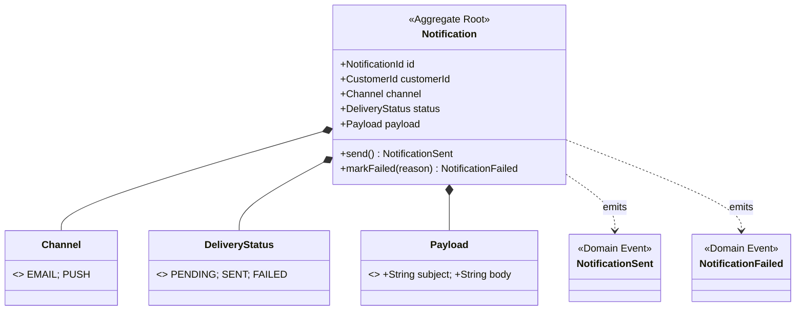

# notification — Infrastructure 集成文档

## 服务定位

`notification` 是通知领域的边界上下文，**纯事件驱动**，无对外 REST 写入入口。监听订单事件，生成并记录通知（Demo 阶段通过日志模拟发送邮件，无真实 SMTP）。

**消费：**
- Kafka 事件（`OrderPlaced`、`OrderConfirmed`、`OrderCancelled`、`OrderShipped`）

**对外提供：**
- REST API（查询通知记录，只读）

---

## Domain Model



---

## Infrastructure 集成总览

| 中间件 | 用途 | 必须 |
|---|---|---|
| PostgreSQL | 通知记录持久化 | ✅ |
| Kafka + Schema Registry | 消费 Order 事件 | ✅ |
| SigNoz / OTel | Traces + Metrics + Logs | ✅ |
| Redis | ❌ 不使用 | — |
| Debezium Connect | ❌ 不使用（无 Outbox，不发布跨服务事件） | — |
| ElasticSearch | ❌ 不使用 | — |

> **为什么不需要 Outbox？** notification **只消费**事件，不跨服务发布事件，因此不需要 Outbox 模式。通知记录只走 PostgreSQL 即可。

---

## PostgreSQL

### 数据库信息

| 项目 | 值 |
|---|---|
| 数据库名 | `notification` |
| 用户名 | `bookstore` |
| 密码 | `${SPRING_DATASOURCE_PASSWORD:bookstore}` |
| 地址（本地） | `localhost:5432` |

### Flyway 迁移脚本

```
src/main/resources/db/migration/
├── V0100__notification_schema.sql          # notification 表
└── V0101__add_notification_timestamps.sql

# Seedwork 提供（通过 classpath:db/seedwork 加载）:
├── V0001__seedwork_outbox_events.sql
├── V0002__seedwork_processed_events.sql    # 幂等去重表（由 seedwork 管理）
└── V0003__seedwork_consumer_retry_events.sql
```

### 幂等去重表

幂等去重由 seedwork 的 `IdempotentKafkaListener` / `ProcessedEventStore` 统一处理，`processed_event` 表由 seedwork `V0002__seedwork_processed_events.sql` 创建。服务层无需自行实现。

### Spring 配置

```yaml
spring:
  datasource:
    url: ${SPRING_DATASOURCE_URL:jdbc:postgresql://localhost:5432/notification}
    username: ${SPRING_DATASOURCE_USERNAME:bookstore}
    password: ${SPRING_DATASOURCE_PASSWORD:bookstore}
  flyway:
    enabled: true
    locations: classpath:db/seedwork,classpath:db/migration
```

---

## Kafka + Schema Registry

### 消费 Topic 清单

| Topic | 触发动作 | 通知内容 |
|---|---|---|
| `bookstore.order.placed` | 创建"订单已收到"通知 | 发送订单确认邮件（日志模拟） |
| `bookstore.order.confirmed` | 创建"订单已确认"通知 | 通知用户开始备货 |
| `bookstore.order.cancelled` | 创建"订单已取消"通知 | 告知用户取消原因 |
| `bookstore.order.shipped` | 创建"订单已发货"通知 | 包含快递单号 |

### Consumer Group

| Consumer Group | 消费 Topic | 说明 |
|---|---|---|
| `notification.order-events` | `bookstore.order.*`（全部 4 个） | 一个 Consumer Group 订阅所有 Order 事件 |

### Spring Kafka 配置

```yaml
spring:
  kafka:
    bootstrap-servers: ${SPRING_KAFKA_BOOTSTRAP_SERVERS:localhost:9092}
    consumer:
      group-id: ${SPRING_KAFKA_CONSUMER_GROUP_ID:notification.order-events}
      key-deserializer: org.apache.kafka.common.serialization.StringDeserializer
      value-deserializer: io.confluent.kafka.serializers.KafkaAvroDeserializer
      auto-offset-reset: earliest
      # 手动提交 Offset（保证处理完成后才提交，避免消息丢失）
      enable-auto-commit: false
    listener:
      ack-mode: MANUAL_IMMEDIATE
    properties:
      schema.registry.url: ${SCHEMA_REGISTRY_URL:http://localhost:8085}
      specific.avro.reader: true
      auto.register.schemas: false   # Schema 由 shared-events/manage-kafka.sh 预注册
```

> **为什么手动提交 Offset？** 自动提交可能在 DB 写入失败后已提交 Offset，导致消息丢失。手动提交保证"处理成功 + DB 写入 + Offset 提交"的顺序正确性。

### 无需声明 Topic

notification **不创建**任何 Topic，只消费事件。Topic 统一由 `shared-events/scripts/manage-kafka.sh` 预创建（`setup.sh` 自动执行）。

### Kafka 消费者结构

```
interfaces/messaging/consumer/
├── OrderEventConsumer.java        # 入口 — 单一 @KafkaListener，监听所有 Order Topic
├── OrderPlacedHandler.java        # 处理 OrderPlaced 事件
├── OrderConfirmedHandler.java     # 处理 OrderConfirmed 事件
├── OrderShippedHandler.java       # 处理 OrderShipped 事件
└── OrderCancelledHandler.java     # 处理 OrderCancelled 事件
```

`OrderEventConsumer` 是唯一的 Kafka 入口，根据消息类型分发至对应的 Handler。幂等去重由 seedwork 的 `IdempotentKafkaListener` 统一处理，各 Handler 只关注业务逻辑。

---

## Application Ports（出站端口）

| 端口接口 | 实现适配器 | 位置 |
|---|---|---|
| `NotificationRepository` | `NotificationPersistenceAdapter` | `infrastructure/repository/jpa/` |
| `EmailSender` | `LogEmailAdapter` | `infrastructure/client/email/` |
| `CustomerClient` | `StubCustomerClient` | `infrastructure/client/customer/` |

> `CustomerClient` 用于获取客户联系信息（邮箱地址等），Demo 阶段由 `StubCustomerClient` 返回固定测试数据，无需调用真实的 Customer 服务。

---

## Debezium Connect

**notification 不使用 Debezium。**

此服务只消费事件，不向其他服务发布事件，不需要 Outbox 模式，因此无 Debezium Connector。

---

## 邮件发送（Demo 模拟）

Demo 阶段不使用真实 SMTP，邮件发送通过日志模拟：

```java
// infrastructure/client/email/LogEmailAdapter.java
@Component
@ConditionalOnProperty(name = "notification.email.log-only", havingValue = "true")
public class LogEmailAdapter implements EmailSender {
    private static final Logger log = LoggerFactory.getLogger(LogEmailAdapter.class);

    @Override
    public void send(String to, String subject, String body) {
        log.info("[EMAIL SIMULATION] To={}, Subject={}, Body={}", to, subject, body);
    }
}
```

```yaml
# application.yml
notification:
  email:
    log-only: true   # true = 日志模拟；false = 真实 SMTP（仅 prod 使用）
```

---

## SigNoz / OpenTelemetry

```yaml
OTEL_SERVICE_NAME: notification
OTEL_EXPORTER_OTLP_ENDPOINT: http://localhost:4317
OTEL_EXPORTER_OTLP_PROTOCOL: grpc
```

### 自动埋点覆盖范围

| 信号 | 自动覆盖内容 |
|---|---|
| **Traces** | Kafka 消费（含 `traceparent` 传播，与 order 的 Trace 链路连通）、JDBC SQL |
| **Metrics** | JVM 堆/GC、Kafka consumer lag（监控通知是否积压）、HikariCP |
| **Logs** | 注入 `trace_id`、`span_id` |

### Trace 传播

Debezium 发布的 Kafka 消息头中包含 `traceparent`，notification 的 OTel Agent 自动提取并创建**子 Span**，使得整条链路可追溯：

```
Customer → order (HTTP) → PostgreSQL (Outbox) → Debezium → Kafka
  → notification (Kafka Consumer) → PostgreSQL (通知记录)
                                          → LogEmailAdapter
```

SigNoz 中可查看跨服务的完整 Trace。

### Span 命名约定

```
notification.notification.handle-order-placed
notification.notification.handle-order-confirmed
notification.notification.handle-order-cancelled
notification.notification.handle-order-shipped
notification.notification.get-notifications
```

---

## Istio / Kubernetes

### 服务端口

| 端口 | 说明 |
|---|---|
| `8083` | REST API（只读：查询通知记录） |
| `8080` | Actuator（内部） |

### Helm Chart 文件（`helm/templates/`）

| 文件 | 内容 |
|---|---|
| `deployment.yaml` | 单副本（通知服务无状态，可按 Kafka Consumer Group 语义扩容） |
| `service.yaml` | ClusterIP，端口 8083 |
| `hpa.yaml` | CPU > 70% 触发扩容，最大 3 副本（多实例时 Kafka 自动分配 Partition） |
| `networkpolicy.yaml` | 放行：Ingress Gateway → 8083；Egress → PostgreSQL:5432、Kafka:29092、Schema Registry:8081 |
| `virtual.yaml` | 路由到 notification，超时 5s |
| `destination-rule.yaml` | 熔断器配置 |
| `configmap.yaml` | 含 `NOTIFICATION_EMAIL_LOG_ONLY=true` |
| `serviceaccount.yaml` | 独立 ServiceAccount |

### VirtualService 路由规则

```
bookstore.local/api/v1/notifications*  → notification:8083（只读查询）
```

---

## 本地启动

```bash
# 1. 启动基础设施（自动完成 Topic 创建、Schema 注册）
cd ../infrastructure && ./setup.sh && cd -

# 2. 确认 shared-events SDK 已发布
cd ../shared-events && ./gradlew publishToMavenLocal && cd -

# 3. 启动服务
./gradlew bootRun
```

> **启动顺序依赖**：order（及其 Debezium Connector）需先启动并成功发布消息，notification 才会有数据可消费。

服务启动后可访问：
- 查询通知：`GET http://localhost:8083/api/v1/notifications?customerId={id}`
- 健康检查：`http://localhost:8083/actuator/health`
