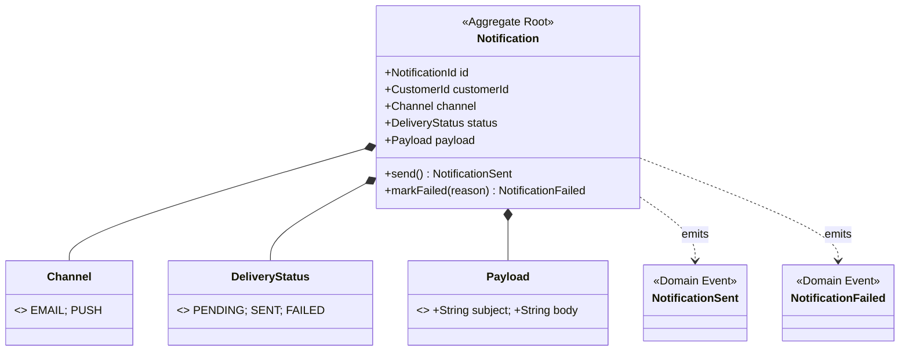

# notification — Infrastructure Integration Guide

## Service Overview

`notification` is the bounded context for the notification domain. It is **purely event-driven** with no inbound REST write endpoints. It listens to order events, generates notifications, and records them (email sending is simulated via logging in this demo — no real SMTP is used).

**Consumes:**
- Kafka events (`OrderPlaced`, `OrderConfirmed`, `OrderCancelled`, `OrderShipped`)

**Exposes:**
- REST API (query notification records, read-only)

---

## Domain Model



---

## Infrastructure Overview

| Middleware | Purpose | Required |
|---|---|---|
| PostgreSQL | Notification record persistence | ✅ |
| Kafka + Schema Registry | Consume Order events | ✅ |
| SigNoz / OTel | Traces + Metrics + Logs | ✅ |
| Redis | Not used | — |
| Debezium Connect | Not used (no Outbox, no cross-service event publishing) | — |
| ElasticSearch | Not used | — |

> **Why no Outbox?** notification **only consumes** events and never publishes cross-service events, so the Outbox pattern is not needed. Notification records are written directly to PostgreSQL.

---

## PostgreSQL

### Database Info

| Property | Value |
|---|---|
| Database name | `notification` |
| Username | `bookstore` |
| Password | `${SPRING_DATASOURCE_PASSWORD:bookstore}` |
| Address (local) | `localhost:5432` |

### Flyway Migration Scripts

```
src/main/resources/db/migration/
├── V0100__notification_schema.sql          # notification table
└── V0101__add_notification_timestamps.sql

# Provided by Seedwork (loaded via classpath:db/seedwork):
├── V0001__seedwork_outbox_events.sql
├── V0002__seedwork_processed_events.sql    # idempotency deduplication table (managed by seedwork)
└── V0003__seedwork_consumer_retry_events.sql
```

### Idempotency Deduplication Table

Idempotency deduplication is handled centrally by seedwork's `IdempotentKafkaListener` / `ProcessedEventStore`. The `processed_event` table is created by seedwork's `V0002__seedwork_processed_events.sql`. No service-level implementation is required.

### Spring Configuration

```yaml
spring:
  datasource:
    url: ${SPRING_DATASOURCE_URL:jdbc:postgresql://localhost:5432/notification}
    username: ${SPRING_DATASOURCE_USERNAME:bookstore}
    password: ${SPRING_DATASOURCE_PASSWORD:bookstore}
  flyway:
    enabled: true
    locations: classpath:db/seedwork,classpath:db/migration
```

---

## Kafka + Schema Registry

### Consumed Topics

| Topic | Action | Notification Content |
|---|---|---|
| `bookstore.order.placed` | Create "order received" notification | Send order confirmation email (log simulation) |
| `bookstore.order.confirmed` | Create "order confirmed" notification | Notify customer that fulfillment has started |
| `bookstore.order.cancelled` | Create "order cancelled" notification | Inform customer of the cancellation reason |
| `bookstore.order.shipped` | Create "order shipped" notification | Include tracking number |

### Consumer Group

| Consumer Group | Topics Consumed | Description |
|---|---|---|
| `notification.order-events` | `bookstore.order.*` (all 4) | A single consumer group subscribes to all Order events |

### Spring Kafka Configuration

```yaml
spring:
  kafka:
    bootstrap-servers: ${SPRING_KAFKA_BOOTSTRAP_SERVERS:localhost:9092}
    consumer:
      group-id: ${SPRING_KAFKA_CONSUMER_GROUP_ID:notification.order-events}
      key-deserializer: org.apache.kafka.common.serialization.StringDeserializer
      value-deserializer: io.confluent.kafka.serializers.KafkaAvroDeserializer
      auto-offset-reset: earliest
      # Manual offset commit — ensures offset is committed only after successful processing
      enable-auto-commit: false
    listener:
      ack-mode: MANUAL_IMMEDIATE
    properties:
      schema.registry.url: ${SCHEMA_REGISTRY_URL:http://localhost:8085}
      specific.avro.reader: true
      auto.register.schemas: false   # Schemas are pre-registered by shared-events/manage-kafka.sh
```

> **Why manual offset commit?** Auto-commit may commit the offset even if the DB write fails, causing message loss. Manual commit ensures the correct order: "processing success + DB write + offset commit".

### No Topic Declarations Needed

notification does **not** create any topics — it only consumes events. All topics are pre-created by `shared-events/scripts/manage-kafka.sh` (executed automatically by `setup.sh`).

### Kafka Consumer Structure

```
interfaces/messaging/consumer/
├── OrderEventConsumer.java        # Entry point — single @KafkaListener for all Order topics
├── OrderPlacedHandler.java        # Handles OrderPlaced event
├── OrderConfirmedHandler.java     # Handles OrderConfirmed event
├── OrderShippedHandler.java       # Handles OrderShipped event
└── OrderCancelledHandler.java     # Handles OrderCancelled event
```

`OrderEventConsumer` is the sole Kafka entry point. It dispatches to the appropriate handler based on the message type. Idempotency deduplication is handled transparently by seedwork's `IdempotentKafkaListener` — each handler focuses exclusively on business logic.

---

## Application Ports (Outbound)

| Port Interface | Adapter Implementation | Location |
|---|---|---|
| `NotificationRepository` | `NotificationPersistenceAdapter` | `infrastructure/repository/jpa/` |
| `EmailSender` | `LogEmailAdapter` | `infrastructure/client/email/` |
| `CustomerClient` | `StubCustomerClient` | `infrastructure/client/customer/` |

> `CustomerClient` is used to retrieve customer contact information (e.g., email address). In the demo, `StubCustomerClient` returns fixed test data without calling a real Customer service.

---

## Debezium Connect

**notification does not use Debezium.**

This service only consumes events and never publishes events to other services. Since the Outbox pattern is not needed, there is no Debezium connector for this service.

---

## Email Sending (Demo Simulation)

No real SMTP is used in the demo. Email sending is simulated via logging:

```java
// infrastructure/client/email/LogEmailAdapter.java
@Component
@ConditionalOnProperty(name = "notification.email.log-only", havingValue = "true")
public class LogEmailAdapter implements EmailSender {
    private static final Logger log = LoggerFactory.getLogger(LogEmailAdapter.class);

    @Override
    public void send(String to, String subject, String body) {
        log.info("[EMAIL SIMULATION] To={}, Subject={}, Body={}", to, subject, body);
    }
}
```

```yaml
# application.yml
notification:
  email:
    log-only: true   # true = log simulation; false = real SMTP (production only)
```

---

## SigNoz / OpenTelemetry

```yaml
OTEL_SERVICE_NAME: notification
OTEL_EXPORTER_OTLP_ENDPOINT: http://localhost:4317
OTEL_EXPORTER_OTLP_PROTOCOL: grpc
```

### Auto-Instrumentation Coverage

| Signal | Coverage |
|---|---|
| **Traces** | Kafka consumption (with `traceparent` propagation, connects to the order service trace chain), JDBC SQL |
| **Metrics** | JVM heap/GC, Kafka consumer lag (monitor notification backlog), HikariCP |
| **Logs** | `trace_id` and `span_id` injected |

### Trace Propagation

Kafka messages published by Debezium include a `traceparent` header. The notification service's OTel agent automatically extracts it and creates a **child span**, making the full trace chain observable end-to-end:

```
Customer → order (HTTP) → PostgreSQL (Outbox) → Debezium → Kafka
  → notification (Kafka Consumer) → PostgreSQL (notification record)
                                          → LogEmailAdapter
```

The complete cross-service trace is visible in SigNoz.

### Span Naming Convention

```
notification.notification.handle-order-placed
notification.notification.handle-order-confirmed
notification.notification.handle-order-cancelled
notification.notification.handle-order-shipped
notification.notification.get-notifications
```

---

## Istio / Kubernetes

### Service Ports

| Port | Description |
|---|---|
| `8083` | REST API (read-only: query notification records) |
| `8080` | Actuator (internal) |

### Helm Chart Files (`helm/templates/`)

| File | Contents |
|---|---|
| `deployment.yaml` | Single replica (stateless; can scale by Kafka consumer group partition assignment) |
| `service.yaml` | ClusterIP, port 8083 |
| `hpa.yaml` | Scale out at CPU > 70%, max 3 replicas (Kafka automatically redistributes partitions across instances) |
| `networkpolicy.yaml` | Allow: Ingress Gateway → 8083; Egress → PostgreSQL:5432, Kafka:29092, Schema Registry:8081 |
| `virtual.yaml` | Route to notification, 5s timeout |
| `destination-rule.yaml` | Circuit breaker configuration |
| `configmap.yaml` | Includes `NOTIFICATION_EMAIL_LOG_ONLY=true` |
| `serviceaccount.yaml` | Dedicated ServiceAccount |

### VirtualService Routing Rules

```
bookstore.local/api/v1/notifications*  → notification:8083 (read-only queries)
```

---

## Local Startup

```bash
# 1. Start infrastructure (topic creation and schema registration happen automatically)
cd ../infrastructure && ./setup.sh && cd -

# 2. Ensure the shared-events SDK is published to mavenLocal
cd ../shared-events && ./gradlew publishToMavenLocal && cd -

# 3. Start the service
./gradlew bootRun
```

> **Startup dependency**: the `order` service (and its Debezium connector) must be started first and have published messages before `notification` has any events to consume.

Once started, the service is accessible at:
- Query notifications: `GET http://localhost:8083/api/v1/notifications?customerId={id}`
- Health check: `http://localhost:8083/actuator/health`
