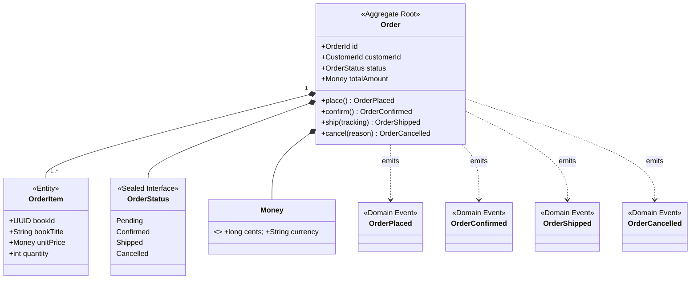

# order — Infrastructure 集成文档

## 服务定位

`order` 是订单管理领域的边界上下文，采用 CQRS 模式：写模型基于 PostgreSQL，读模型基于 ElasticSearch（见 [ADR-002](../docs/architecture/ADR-002-cqrs-scope-order.md)）。

**对外提供：**
- REST API（下单、取消、查询订单）
- Kafka 事件（`OrderPlaced`、`OrderConfirmed`、`OrderCancelled`、`OrderShipped`）

**消费：**
- Kafka 事件（`bookstore.order.*` → 由 `OrderReadModelProjector` 投影到 ElasticSearch）

---

## Domain Model



> **Snapshot pattern**: `OrderItem` stores a snapshot of book title and price at order time — not a live FK to `catalog`. Order history remains accurate even when catalog data changes later.

> **OrderPricingService**（领域服务）：跨 `OrderItem` 的折扣计算逻辑，保持 `Order` 聚合的内聚性。

---

## Infrastructure 集成总览

| 中间件 | 用途 | 必须 |
|---|---|---|
| PostgreSQL | 订单聚合写模型 + Outbox 表 | ✅ |
| Kafka + Schema Registry | 发布 Order 事件；消费 Order 事件（读模型投影） | ✅ |
| Debezium Connect | Outbox Relay（订单事件可靠投递） | ✅ |
| ElasticSearch | 订单查询读模型（CQRS 读侧） | ✅ |
| SigNoz / OTel | Traces + Metrics + Logs | ✅ |
| Redis | ❌ 不使用 | — |

---

## PostgreSQL

### 数据库信息

| 项目 | 值 |
|---|---|
| 数据库名 | `order` |
| 用户名 | `bookstore` |
| 密码 | `bookstore`（默认；生产环境通过 `SPRING_DATASOURCE_PASSWORD` 环境变量覆盖） |
| 地址（本地） | `localhost:5432` |

### Flyway 迁移脚本

```
src/main/resources/db/migration/
├── V0100__order_schema.sql              # order_aggregate、order_item 表
└── V0101__fix_currency_column_type.sql

# Seedwork 提供（通过 classpath:db/seedwork 加载）:
├── V0001__seedwork_outbox_events.sql
├── V0002__seedwork_processed_events.sql
└── V0003__seedwork_consumer_retry_events.sql
```

### Spring 配置

```yaml
spring:
  datasource:
    url: ${SPRING_DATASOURCE_URL:jdbc:postgresql://localhost:5432/order}
    username: ${SPRING_DATASOURCE_USERNAME:bookstore}
    password: ${SPRING_DATASOURCE_PASSWORD:bookstore}
  flyway:
    enabled: true
    locations: classpath:db/seedwork,classpath:db/migration
  elasticsearch:
    uris: ${SPRING_ELASTICSEARCH_URIS:http://localhost:9200}
  kafka:
    bootstrap-servers: ${SPRING_KAFKA_BOOTSTRAP_SERVERS:localhost:9092}
    producer:
      key-serializer: org.apache.kafka.common.serialization.StringSerializer
      value-serializer: io.confluent.kafka.serializers.KafkaAvroSerializer
    consumer:
      group-id: ${SPRING_KAFKA_CONSUMER_GROUP_ID:order.read-model}
      key-deserializer: org.apache.kafka.common.serialization.StringDeserializer
      value-deserializer: io.confluent.kafka.serializers.KafkaAvroDeserializer
      auto-offset-reset: earliest
      enable-auto-commit: false
    listener:
      ack-mode: MANUAL_IMMEDIATE
    properties:
      schema.registry.url: ${SCHEMA_REGISTRY_URL:http://localhost:8085}
      specific.avro.reader: true
      auto.register.schemas: false
catalog:
  service:
    url: ${CATALOG_SERVICE_URL:http://localhost:8081}
outbox:
  relay:
    strategy: debezium
server:
  port: 8082
```

---

## Kafka + Schema Registry

### Topic 清单

| Topic | 方向 | Key | Value Schema |
|---|---|---|---|
| `bookstore.order.placed` | **发布** | `orderId`（UUID） | `com.example.events.v1.OrderPlaced` |
| `bookstore.order.confirmed` | **发布** | `orderId`（UUID） | `com.example.events.v1.OrderConfirmed` |
| `bookstore.order.cancelled` | **发布** | `orderId`（UUID） | `com.example.events.v1.OrderCancelled` |
| `bookstore.order.shipped` | **发布** | `orderId`（UUID） | `com.example.events.v1.OrderShipped` |
| `bookstore.stock.reserved` | **消费** | `bookId`（UUID） | `com.example.events.v1.StockReserved` |

> `bookstore.order.*` 事件通过 **Outbox + Debezium** 发布（非直接 `kafkaTemplate.send`），保证原子性。

### Consumer Group

| Consumer Group | 消费 Topic | 实现类 | 描述 |
|---|---|---|---|
| `order.read-model` | `bookstore.order.*`（全部） | `OrderReadModelProjector` | 将订单事件投影写入 ElasticSearch 读模型 |

> order 服务**只有一个** Consumer Group。`StockReserved` 当前未通过独立 Consumer Group 消费——订单确认流程由写模型侧处理，不依赖单独的消费者。

> **Topic 创建由基础设施负责**：Topic 由 `shared-events` Helm Chart 在部署时统一创建，**代码中不需要也不应声明 `@Bean NewTopic`**（Kafka 已设置 `auto.create.topics.enable=false`）。

---

## Debezium Connect（Outbox Relay）

order 是 Outbox 模式的**核心用户**（见 [ADR-005](../docs/architecture/ADR-005-outbox-pattern.md)）。

### Outbox 表

由 seedwork 的 `V0001__seedwork_outbox_events.sql` 创建（通过 `classpath:db/seedwork` 加载），不在服务自身的迁移脚本中定义。

### Debezium Connector

配置文件：`infrastructure/debezium/connectors/order-outbox-connector.json`

```bash
# 首次启动后注册（仅需执行一次）
curl -X POST http://localhost:8084/connectors \
  -H "Content-Type: application/json" \
  -d @../infrastructure/debezium/connectors/order-outbox-connector.json
```

**运转机制：**

```
PlaceOrderCommandHandler
  → orderRepository.save(order)           # AbstractAggregateRootEntity 携带领域事件
  → OutboxWriteListener (BEFORE_COMMIT)   # 在同一事务内原子写入 outbox 行
     ↓（异步，via Debezium CDC）
Debezium 读取 PostgreSQL WAL
  → Outbox Event Router SMT
  → aggregate_id → Kafka 消息 Key（保证 orderId 有序）
  → event_type   → 路由到 bookstore.order.placed
  → payload      → Avro 序列化，写入 Kafka
```

> CommandHandler **不**直接调用 EventDispatcher——事件发布是 seedwork 持久化流程的副作用，由 `OutboxWriteListener` 透明完成。

---

## ElasticSearch（CQRS 读模型）

order 使用 ElasticSearch 作为**订单查询的读模型**，与写模型（PostgreSQL）完全分离。

### 索引设计

| 索引名 | 文档结构 |
|---|---|
| `orders` | 订单快照，包含全量字段（orderId、customerId、status、items、totalCents、currency、timestamps） |

### 写入方式：Kafka Projector

`OrderReadModelProjector`（Consumer Group: `order.read-model`）消费所有 `bookstore.order.*` 事件，将订单状态投影到 ElasticSearch：

```
OrderPlaced    → 创建 ES 文档（status: PENDING）
OrderConfirmed → 更新 ES 文档（status: CONFIRMED）
OrderCancelled → 更新 ES 文档（status: CANCELLED）
OrderShipped   → 更新 ES 文档（status: SHIPPED，填入 trackingNumber）
```

### Spring Data ElasticSearch 配置

```yaml
spring:
  elasticsearch:
    uris: ${SPRING_ELASTICSEARCH_URIS:http://localhost:9200}
```

### 最终一致性特征

读模型**最终一致**，通常滞后写模型 < 500 ms（Outbox poll 间隔）。查询结果可能短暂不反映最新写操作，这是设计预期行为。

---

## SigNoz / OpenTelemetry

```yaml
OTEL_SERVICE_NAME: order
OTEL_EXPORTER_OTLP_ENDPOINT: http://localhost:4317
OTEL_EXPORTER_OTLP_PROTOCOL: grpc
```

### 自动埋点覆盖范围

| 信号 | 自动覆盖内容 |
|---|---|
| **Traces** | Spring MVC HTTP 请求、JDBC SQL、Kafka produce/consume、ElasticSearch 查询 |
| **Metrics** | JVM 堆/GC、HTTP 请求率/延迟、HikariCP、Kafka consumer lag、ES 索引延迟 |
| **Logs** | 注入 `trace_id`、`span_id`（与 Trace 关联） |

### Span 命名约定

```
order.order.place
order.order.confirm
order.order.cancel
order.order.ship
order.order.get-by-id
order.order.search
```

---

## Istio / Kubernetes

### 服务端口

| 端口 | 说明 |
|---|---|
| `8082` | REST API（Write + Read 同端口，由路径区分） |
| `8080` | Actuator（内部） |

### Helm Chart 文件（`helm/templates/`）

| 文件 | 内容 |
|---|---|
| `deployment.yaml` | 含 OTel Agent 的 JVM 启动参数 |
| `service.yaml` | ClusterIP，端口 8082 |
| `hpa.yaml` | CPU > 70% 触发扩容，最大 5 副本（比其他服务略高，因为 CQRS 两侧都在此） |
| `networkpolicy.yaml` | 放行：Ingress Gateway → 8082；Egress → PostgreSQL:5432、Kafka:29092、Schema Registry:8085、ElasticSearch:9200、catalog:8081 |
| `virtual.yaml` | 路由到 order，写端超时 10s（Outbox 事务），读端超时 5s |
| `destination-rule.yaml` | 熔断器：连续 5 次 5xx 后驱逐实例 |
| `configmap.yaml` | 非敏感配置，含 `CATALOG_SERVICE_URL` |
| `serviceaccount.yaml` | 独立 ServiceAccount |

### VirtualService 路由规则

```
bookstore.local/api/v1/orders   POST   → order:8082（写）
bookstore.local/api/v1/orders   GET    → order:8082（读，来自 ES）
bookstore.local/api/v1/orders/{id}     → order:8082（读，来自 ES）
```

---

## 本地启动

```bash
# 1. 启动基础设施（自动完成 Topic 创建、Schema 注册、Debezium Connector 注册）
cd ../infrastructure && ./setup.sh && cd -

# 2. 确认 shared-events SDK 已发布
cd ../shared-events && ./gradlew publishToMavenLocal && cd -

# 3. 启动服务
./gradlew bootRun
```

服务启动后可访问：
- 下单（写）：`POST http://localhost:8082/api/v1/orders`
- 查询（读）：`GET  http://localhost:8082/api/v1/orders/{id}`
- 健康检查：`http://localhost:8082/actuator/health`
