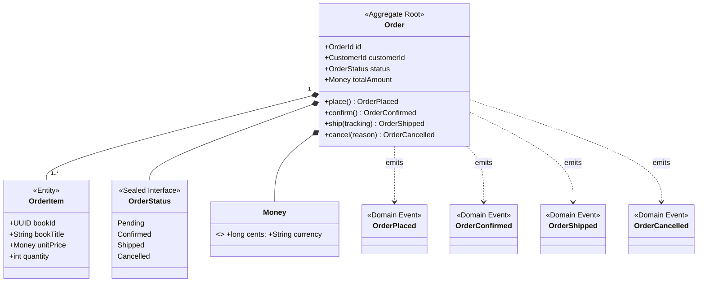

# order — Infrastructure Integration Guide

## Service Overview

`order` is the bounded context for order management, implementing CQRS: the write model is backed by PostgreSQL; the read model is backed by ElasticSearch (see [ADR-002](../docs/architecture/ADR-002-cqrs-scope-order.md)).

**Publishes:**
- REST API (place order, cancel order, query orders)
- Kafka events (`OrderPlaced`, `OrderConfirmed`, `OrderCancelled`, `OrderShipped`)

**Consumes:**
- Kafka events (`bookstore.order.*` → projected into ElasticSearch by `OrderReadModelProjector`)

---

## Domain Model



> **Snapshot pattern**: `OrderItem` stores a snapshot of book title and price at order time — not a live FK to `catalog`. Order history remains accurate even when catalog data changes later.

> **OrderPricingService** (domain service): encapsulates cross-`OrderItem` discount calculation logic, keeping the `Order` aggregate cohesive.

---

## Infrastructure Overview

| Middleware | Purpose | Required |
|---|---|---|
| PostgreSQL | Order aggregate write model + Outbox table | ✅ |
| Kafka + Schema Registry | Publish Order events; consume Order events (read-model projection) | ✅ |
| Debezium Connect | Outbox Relay (guaranteed event delivery) | ✅ |
| ElasticSearch | Order query read model (CQRS read side) | ✅ |
| SigNoz / OTel | Traces + Metrics + Logs | ✅ |
| Redis | Not used | — |

---

## PostgreSQL

### Database Details

| Property | Value |
|---|---|
| Database name | `order` |
| Username | `bookstore` |
| Password | `bookstore` (default; override in production via `SPRING_DATASOURCE_PASSWORD`) |
| Host (local) | `localhost:5432` |

### Flyway Migration Scripts

```
src/main/resources/db/migration/
├── V0100__order_schema.sql              # order_aggregate and order_item tables
└── V0101__fix_currency_column_type.sql

# Provided by seedwork (loaded via classpath:db/seedwork):
├── V0001__seedwork_outbox_events.sql
├── V0002__seedwork_processed_events.sql
└── V0003__seedwork_consumer_retry_events.sql
```

### Spring Configuration

```yaml
spring:
  datasource:
    url: ${SPRING_DATASOURCE_URL:jdbc:postgresql://localhost:5432/order}
    username: ${SPRING_DATASOURCE_USERNAME:bookstore}
    password: ${SPRING_DATASOURCE_PASSWORD:bookstore}
  flyway:
    enabled: true
    locations: classpath:db/seedwork,classpath:db/migration
  elasticsearch:
    uris: ${SPRING_ELASTICSEARCH_URIS:http://localhost:9200}
  kafka:
    bootstrap-servers: ${SPRING_KAFKA_BOOTSTRAP_SERVERS:localhost:9092}
    producer:
      key-serializer: org.apache.kafka.common.serialization.StringSerializer
      value-serializer: io.confluent.kafka.serializers.KafkaAvroSerializer
    consumer:
      group-id: ${SPRING_KAFKA_CONSUMER_GROUP_ID:order.read-model}
      key-deserializer: org.apache.kafka.common.serialization.StringDeserializer
      value-deserializer: io.confluent.kafka.serializers.KafkaAvroDeserializer
      auto-offset-reset: earliest
      enable-auto-commit: false
    listener:
      ack-mode: MANUAL_IMMEDIATE
    properties:
      schema.registry.url: ${SCHEMA_REGISTRY_URL:http://localhost:8085}
      specific.avro.reader: true
      auto.register.schemas: false
catalog:
  service:
    url: ${CATALOG_SERVICE_URL:http://localhost:8081}
outbox:
  relay:
    strategy: debezium
server:
  port: 8082
```

---

## Kafka + Schema Registry

### Topic List

| Topic | Direction | Key | Value Schema |
|---|---|---|---|
| `bookstore.order.placed` | **Publish** | `orderId` (UUID) | `com.example.events.v1.OrderPlaced` |
| `bookstore.order.confirmed` | **Publish** | `orderId` (UUID) | `com.example.events.v1.OrderConfirmed` |
| `bookstore.order.cancelled` | **Publish** | `orderId` (UUID) | `com.example.events.v1.OrderCancelled` |
| `bookstore.order.shipped` | **Publish** | `orderId` (UUID) | `com.example.events.v1.OrderShipped` |
| `bookstore.stock.reserved` | **Consume** | `bookId` (UUID) | `com.example.events.v1.StockReserved` |

> `bookstore.order.*` events are published via **Outbox + Debezium** (not direct `kafkaTemplate.send`), guaranteeing atomicity.

### Consumer Groups

| Consumer Group | Topics Consumed | Implementation | Description |
|---|---|---|---|
| `order.read-model` | `bookstore.order.*` (all) | `OrderReadModelProjector` | Projects order events into the ElasticSearch read model |

> The order service has **only one** consumer group. `StockReserved` is not consumed by a separate consumer group — order confirmation is handled on the write-model side without a dedicated consumer.

> **Topic creation is an infrastructure concern**: topics are created by the `shared-events` Helm Chart at deploy time. **No `@Bean NewTopic` should be declared in application code** (Kafka runs with `auto.create.topics.enable=false`).

---

## Debezium Connect (Outbox Relay)

`order` is the primary user of the Outbox pattern (see [ADR-005](../docs/architecture/ADR-005-outbox-pattern.md)).

### Outbox Table

Created by seedwork's `V0001__seedwork_outbox_events.sql` (loaded via `classpath:db/seedwork`). It is not defined in the service's own migration scripts.

### Debezium Connector

Configuration file: `infrastructure/debezium/connectors/order-outbox-connector.json`

```bash
# Register after first startup (only needs to be run once)
curl -X POST http://localhost:8084/connectors \
  -H "Content-Type: application/json" \
  -d @../infrastructure/debezium/connectors/order-outbox-connector.json
```

**How it works:**

```
PlaceOrderCommandHandler
  → orderRepository.save(order)           # AbstractAggregateRootEntity carries domain events
  → OutboxWriteListener (BEFORE_COMMIT)   # atomically writes the outbox row in the same transaction
     ↓ (async, via Debezium CDC)
Debezium reads PostgreSQL WAL
  → Outbox Event Router SMT
  → aggregate_id → Kafka message key (guarantees ordering by orderId)
  → event_type   → routes to bookstore.order.placed
  → payload      → Avro-serialized, written to Kafka
```

> CommandHandlers **never** call an EventDispatcher directly — event publishing is a side-effect of the seedwork persistence flow, transparently handled by `OutboxWriteListener`.

---

## ElasticSearch (CQRS Read Model)

`order` uses ElasticSearch as the **read model for order queries**, completely decoupled from the write model (PostgreSQL).

### Index Design

| Index | Document Structure |
|---|---|
| `orders` | Full order snapshot (orderId, customerId, status, items, totalCents, currency, timestamps) |

### Projection: Kafka Projector

`OrderReadModelProjector` (Consumer Group: `order.read-model`) consumes all `bookstore.order.*` events and projects order state into ElasticSearch:

```
OrderPlaced    → create ES document  (status: PENDING)
OrderConfirmed → update ES document  (status: CONFIRMED)
OrderCancelled → update ES document  (status: CANCELLED)
OrderShipped   → update ES document  (status: SHIPPED, populate trackingNumber)
```

### Spring Data ElasticSearch Configuration

```yaml
spring:
  elasticsearch:
    uris: ${SPRING_ELASTICSEARCH_URIS:http://localhost:9200}
```

### Eventual Consistency Characteristics

The read model is **eventually consistent**, typically lagging the write model by less than 500 ms (Outbox poll interval). Query results may briefly not reflect the latest writes — this is the expected and intended behavior.

---

## SigNoz / OpenTelemetry

```yaml
OTEL_SERVICE_NAME: order
OTEL_EXPORTER_OTLP_ENDPOINT: http://localhost:4317
OTEL_EXPORTER_OTLP_PROTOCOL: grpc
```

### Auto-Instrumentation Coverage

| Signal | Coverage |
|---|---|
| **Traces** | Spring MVC HTTP requests, JDBC SQL, Kafka produce/consume, ElasticSearch queries |
| **Metrics** | JVM heap/GC, HTTP request rate/latency, HikariCP, Kafka consumer lag, ES indexing latency |
| **Logs** | `trace_id` and `span_id` injected (correlated with Traces) |

### Span Naming Convention

```
order.order.place
order.order.confirm
order.order.cancel
order.order.ship
order.order.get-by-id
order.order.search
```

---

## Istio / Kubernetes

### Service Ports

| Port | Description |
|---|---|
| `8082` | REST API (write and read on the same port, distinguished by path) |
| `8080` | Actuator (internal) |

### Helm Chart Files (`helm/templates/`)

| File | Contents |
|---|---|
| `deployment.yaml` | JVM startup flags including the OTel Agent |
| `service.yaml` | ClusterIP, port 8082 |
| `hpa.yaml` | Scale out at CPU > 70%, max 5 replicas (higher than other services due to CQRS both sides here) |
| `networkpolicy.yaml` | Allow: Ingress Gateway → 8082; Egress → PostgreSQL:5432, Kafka:29092, Schema Registry:8085, ElasticSearch:9200, catalog:8081 |
| `virtual.yaml` | Route to order; write-side timeout 10s (Outbox transaction), read-side timeout 5s |
| `destination-rule.yaml` | Circuit breaker: eject instance after 5 consecutive 5xx errors |
| `configmap.yaml` | Non-sensitive config, including `CATALOG_SERVICE_URL` |
| `serviceaccount.yaml` | Dedicated ServiceAccount |

### VirtualService Routing Rules

```
bookstore.local/api/v1/orders   POST   → order:8082  (write)
bookstore.local/api/v1/orders   GET    → order:8082  (read, from ES)
bookstore.local/api/v1/orders/{id}     → order:8082  (read, from ES)
```

---

## Running Locally

```bash
# 1. Start infrastructure (automatically creates topics, registers schemas, registers Debezium connector)
cd ../infrastructure && ./setup.sh && cd -

# 2. Ensure the shared-events SDK is published to mavenLocal
cd ../shared-events && ./gradlew publishToMavenLocal && cd -

# 3. Start the service
./gradlew bootRun
```

Once the service is up:
- Place order (write): `POST http://localhost:8082/api/v1/orders`
- Query order (read):  `GET  http://localhost:8082/api/v1/orders/{id}`
- Health check:        `http://localhost:8082/actuator/health`
