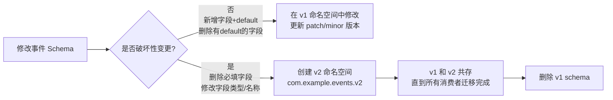

# shared-events — Avro Event Schema SDK

`shared-events` 是所有跨服务 Kafka 事件的**唯一权威来源**（Single Source of Truth）。

各微服务均为**独立项目**，通过 `mavenLocal()` 依赖本模块，无 Gradle multi-project 耦合。

---

## 定位与职责

```
事件契约的唯一权威来源（Single Source of Truth）
├── Schema 层
│   ├── .avsc 源文件（按版本命名空间组织，源文件是唯一权威）
│   └── Schema Registry 预注册脚本
├── Kafka 资源层 [NEW]
│   ├── topics.yaml（集中定义 Topic 属性、分区、副本）
│   ├── ACL 权限（在 topics.yaml 中定义 producers/consumers）
│   └── manage-kafka.sh（自动化创建 Topic 和 ACL）
├── SDK 层
│   ├── Avro SpecificRecord Java 类（构建时生成）
│   ├── KafkaResourceConstants.java（Topic 名称和 Service ID 常量）
│   └── 发布到 mavenLocal()（各服务唯一引用方式）
└── 文档层
    ├── 事件目录（字段说明、生产者/消费者矩阵）
    ├── 演进规则（BACKWARD 兼容性约束、v2 命名空间策略）
    └── CHANGELOG.md（版本变更记录）
```

**各微服务负责：**
- 声明 Kafka Topic、配置 `schema.registry.url`
- 在 `infrastructure/messaging/` 适配器层映射领域事件 ↔ Avro 消息
- 配置 Kafka 序列化器 / 反序列化器

> **严格禁止**：`shared-events` 中不能有业务逻辑、不能有 Spring Bean、不能有仓储代码。
> 它只是一个 **schema → 代码** 的转换器，输出纯 Avro `SpecificRecord` 类。

---

## 目录结构

```
shared-events/
├── src/
│   ├── main/
│   │   ├── avro/
│   │   │   └── com/example/events/
│   │   │       ├── v1/                       # 当前版本命名空间
│   │   │       │   ├── OrderPlaced.avsc
│   │   │       │   ├── OrderConfirmed.avsc
│   │   │       │   ├── OrderCancelled.avsc
│   │   │       │   ├── OrderShipped.avsc
│   │   │       │   ├── StockReserved.avsc
│   │   │       │   └── StockReleased.avsc
│   │   │       └── v2/                       # 破坏性变更时创建（当前为空占位）
│   │   ├── java/
│   │   │   └── com/example/events/
│   │   │       └── KafkaResourceConstants.java # 类型安全常量
│   │   └── resources/
│   │       └── kafka/
│   │           └── topics.yaml               # 集中化的 Topic 定义
├── scripts/
│   └── manage-kafka.sh                       # 一键同步 Topic 和 ACL 权限脚本
├── build/
│   └── generated-main-avro-java/             # 生成的 Java 类（不提交 Git）
├── CHANGELOG.md                              # 版本变更日志（每次变更必填）
├── build.gradle.kts
├── .gitignore
└── README.md
```

> 生成的 Java 类在 `build/generated-main-avro-java/` 目录，**不提交到 Git**，每次构建自动再生。

---

## 哪些事件属于 shared-events

**只放跨服务消费的事件**（至少有一个服务是消费者）：

| 事件 | 生产者 | 消费者 |
|---|---|---|
| `OrderPlaced` | order | notification |
| `OrderConfirmed` | order | notification |
| `OrderCancelled` | order | notification、catalog |
| `OrderShipped` | order | notification |
| `StockReserved` | catalog | order |
| `StockReleased` | catalog | —（当前无消费者；可供未来服务订阅）|

**不放在 shared-events 的事件**：仅在单个服务内部使用的应用事件（如 `order` 内部的 read-model projection 事件），这些直接用 Spring `ApplicationEvent` 或 plain record 即可。

---

## build.gradle.kts

```kotlin
plugins {
    `java-library`
    id("com.github.davidmc24.gradle.plugin.avro") version "1.9.1"
    `maven-publish`
}

group = "com.example"
version = "0.1.0"

dependencies {
    // Avro runtime（生成类的基类依赖）
    api("org.apache.avro:avro:1.11.3")
    // Confluent Avro Serializer（消费者/生产者使用，传递依赖给微服务）
    api("io.confluent:kafka-avro-serializer:7.6.0")
}

repositories {
    mavenCentral()
    // Confluent 包在独立 Maven 仓库
    maven { url = uri("https://packages.confluent.io/maven/") }
}

avro {
    isCreateSetters.set(false)            // 生成不可变风格（无 setter）
    fieldVisibility.set("PRIVATE")        // 字段私有，通过 get 方法访问
    isEnableDecimalLogicalType.set(true)  // 支持 decimal logical type
    outputCharacterEncoding.set("UTF-8")
}

publishing {
    publications {
        create<MavenPublication>("maven") {
            from(components["java"])
        }
    }
    repositories {
        // Demo 阶段发布到本地 Maven 仓库，各服务通过 mavenLocal() 引用
        mavenLocal()
    }
}
```

---

## SDK 版本策略

Demo 阶段以 `0.x.y` 起步，使用轻量语义版本（SemVer）：

| 变更类型 | 版本升级 | 示例 |
|---|---|---|
| 新增事件（无破坏性） | MINOR | `0.1.0` → `0.2.0` |
| 新增字段（有 `default`） | PATCH | `0.1.0` → `0.1.1` |
| 删除/改名字段（破坏性） | MAJOR + 新命名空间 | `0.x.y` → `1.0.0` |
| 仅文档/注释修改 | PATCH | `0.1.0` → `0.1.1` |

> **CHANGELOG.md 是每次 schema 变更的必填记录**，无论大小。

---

## 构建与发布（mavenLocal）

各微服务为独立 Gradle 项目，通过 `mavenLocal()` 依赖本 SDK。**修改 schema 后必须先发布，各服务才能使用新版本。**

```bash
# 1. 触发 Avro 代码生成（generateAvroJava 在 compileJava 前自动执行）
./gradlew generateAvroJava

# 2. 构建并发布到本地 Maven 仓库
./gradlew publishToMavenLocal

# 3. 一次性：生成 + 构建 + 发布
./gradlew build publishToMavenLocal
```

各微服务的 `build.gradle.kts` 中引用：

```kotlin
repositories {
    mavenLocal()   // 优先查找本地发布的 shared-events
    maven { url = uri("https://packages.confluent.io/maven/") }
    mavenCentral()
}

dependencies {
    implementation("com.example:shared-events:0.1.0")  // 跟随版本更新
}
```

> **注意**：当 `shared-events` 版本升级后，各服务 `build.gradle.kts` 中的版本号也需同步更新。

---

## Schema 定义规范

### Avsc 文件结构

```json
{
  "namespace": "com.example.events.v1",
  "type": "record",
  "name": "OrderPlaced",
  "doc": "事件含义的一句话描述，包含触发时机",
  "fields": [
    {
      "name": "eventId",
      "type": "string",
      "doc": "UUID，全局唯一事件标识，消费者用于幂等去重"
    },
    {
      "name": "occurredAt",
      "type": { "type": "long", "logicalType": "timestamp-millis" },
      "doc": "事件发生时间（UTC，毫秒时间戳）"
    }
  ]
}
```

**字段规范：**

| 规则 | 说明 |
|---|---|
| 每个事件必须有 `eventId`（string/UUID）| 消费者幂等去重的依据 |
| 每个事件必须有 `occurredAt`（timestamp-millis）| 事件溯源时间戳 |
| 所有字段必须写 `doc` | 消费团队的契约说明 |
| 新增字段必须提供 `default` | 保持 BACKWARD 兼容性 |
| 金额使用 `long`（分）+ `string`（货币码）| 避免浮点精度问题 |
| UUID 使用 `string` 类型 | Avro 无原生 UUID 类型 |
| 枚举使用 Avro `enum` 类型 | 配合 Schema Registry 做兼容性检查 |

### 示例：OrderPlaced.avsc

```json
{
  "namespace": "com.example.events.v1",
  "type": "record",
  "name": "OrderPlaced",
  "doc": "当客户成功下单且库存预留完成时发布",
  "fields": [
    {
      "name": "eventId",
      "type": "string",
      "doc": "UUID，用于消费者幂等去重"
    },
    {
      "name": "orderId",
      "type": "string",
      "doc": "订单 ID（UUID）"
    },
    {
      "name": "customerId",
      "type": "string",
      "doc": "客户 ID（UUID）"
    },
    {
      "name": "customerEmail",
      "type": "string",
      "doc": "下单时快照的客户邮箱，用于通知"
    },
    {
      "name": "items",
      "type": {
        "type": "array",
        "items": {
          "type": "record",
          "name": "OrderItem",
          "fields": [
            { "name": "bookId",         "type": "string", "doc": "书籍 ID（UUID）" },
            { "name": "bookTitle",      "type": "string", "doc": "下单时快照的书名" },
            { "name": "quantity",       "type": "int" },
            { "name": "unitPriceCents", "type": "long",   "doc": "下单时快照的单价（分）" }
          ]
        }
      }
    },
    {
      "name": "totalCents",
      "type": "long",
      "doc": "订单总金额（分）"
    },
    {
      "name": "currency",
      "type": "string",
      "default": "CNY",
      "doc": "货币码（ISO 4217）"
    },
    {
      "name": "occurredAt",
      "type": { "type": "long", "logicalType": "timestamp-millis" },
      "doc": "事件发生时间（UTC）"
    }
  ]
}
```

---

## Kafka 资源管理 (Topic & ACL)

本模块作为 Single Source of Truth，不仅管理 Schema，也负责管理 Kafka Topic 和权限。

### Topic 配置 (topics.yaml)

所有 Topic 均在 `src/main/resources/kafka/topics.yaml` 中定义：

```yaml
topics:
  - name: bookstore.order.placed
    partitions: 3
    replicationFactor: 1
    producers: ["order"]      # 拥有 WRITE + DESCRIBE 权限
    consumers: ["notification"] # 拥有 READ + DESCRIBE 权限
```

### 权限同步脚本 (manage-kafka.sh)

`scripts/manage-kafka.sh` 脚本通过 Kafka 管理命令自动化执行：
1. **Topic 创建**：根据配置自动创建不存在的 Topic。
2. **ACL 绑定**：基于 `producers/consumers` 绑定 Service Principal 权限。

```bash
./scripts/manage-kafka.sh
```

---

## SDK 使用规范

### 类型安全常量 (KafkaResourceConstants)

各服务**禁止硬编码 Topic 名称**，必须引用本 SDK 提供的常量：

```java
// 示例：引用 Topic 常量
kafkaTemplate.send(KafkaResourceConstants.TOPIC_ORDER_PLACED, key, event);
```

---

## Schema 版本演进规则



**破坏性变更的处理流程：**

1. 在 `src/main/avro/com/example/events/v2/` 创建新版本 `.avsc`
2. 更新 `shared-events` 版本号（`build.gradle.kts` 中 `version`，升 MAJOR）
3. 更新 `CHANGELOG.md`，记录变更原因
4. 执行 `./gradlew build publishToMavenLocal` 发布新版本
5. **生产者先升级**：同时发布 v1 和 v2 消息（双写过渡期）
6. 消费者逐步升级到 v2
7. 确认所有消费者迁移完成后，停止 v1 双写，删除 v1 schema

---

## 生产者（发布事件）

实际的 Kafka 发布通过 seedwork 的 **Outbox Pattern** 完成——各服务**不直接调用** `kafkaTemplate.send()`。

各服务在 `infrastructure/messaging/outbox/` 实现 seedwork 的 `OutboxMapper` SPI，将领域事件映射为 Avro payload；seedwork 的 `OutboxWriteListener` 在同一事务中写入 outbox 表，再由 `OutboxRelayScheduler`（或 Debezium CDC）异步发布到 Kafka。

```java
// infrastructure/messaging/outbox/OrderOutboxMapper.java  (in order)
// 实现 seedwork 的 OutboxMapper SPI，此处是唯一引用 shared-events Avro 类的位置

@Component
public class OrderOutboxMapper implements OutboxMapper {

    @Override
    public boolean supports(DomainEvent event) {
        return event instanceof com.example.order.domain.event.OrderPlaced;
    }

    @Override
    public OutboxPayload map(DomainEvent event) {
        var domainEvent = (com.example.order.domain.event.OrderPlaced) event;
        // 将领域事件 → Avro 消息（在基础设施适配器层完成映射）
        var avroEvent = com.example.events.v1.OrderPlaced.newBuilder()
            .setEventId(domainEvent.eventId().toString())
            .setOrderId(domainEvent.orderId().toString())
            .setCustomerId(domainEvent.customerId().toString())
            .setCustomerEmail(domainEvent.customerEmail())
            .setTotalCents(domainEvent.totalAmount().cents())
            .setCurrency(domainEvent.totalAmount().currency())
            .setOccurredAt(domainEvent.occurredAt().toEpochMilli())
            // ... items mapping
            .build();

        return new OutboxPayload(
            KafkaResourceConstants.TOPIC_ORDER_PLACED,
            domainEvent.orderId().toString(),  // key = orderId（分区键）
            avroEvent
        );
    }
}
```

发布触发路径（由 seedwork 透明处理）：

```
PlaceOrderCommandHandler
  → OrderPersistence.save(order)                        ← 聚合携带领域事件
      → OutboxWriteListener (BEFORE_COMMIT)             ← seedwork JPA 监听器
          → 写 outbox_event 表（与业务表同一事务）
              → OutboxRelayScheduler / Debezium CDC     ← seedwork / 基础设施
                  → KafkaOutboxEventPublisher 发布到 Kafka
```

---

## 消费者（消费事件）

实际代码中 notification 服务使用 seedwork 的 `IdempotentKafkaListener` 保证幂等消费，
并将单个 Topic 的消息路由到各自的 Handler 类，而非直接在 `@KafkaListener` 方法中编写业务逻辑。

```java
// interfaces/messaging/consumer/OrderEventConsumer.java  (in notification)
// 单一入口监听器，将消息路由到对应 Handler

@Component
public class OrderEventConsumer {

    private final OrderPlacedHandler orderPlacedHandler;
    // ... other handlers

    @IdempotentKafkaListener(topics = KafkaResourceConstants.TOPIC_ORDER_PLACED,
                              groupId = "notification")
    public void onOrderPlaced(com.example.events.v1.OrderPlaced event) {
        // Avro 反序列化由 KafkaAvroDeserializer 自动完成
        orderPlacedHandler.handle(event);
    }
}

// interfaces/messaging/consumer/OrderPlacedHandler.java  (in notification)
// 专注单一事件类型的处理逻辑，调用应用层 CommandBus

@Component
public class OrderPlacedHandler {

    private final CommandBus commandBus;

    public void handle(com.example.events.v1.OrderPlaced event) {
        commandBus.dispatch(new SendOrderNotificationCommand(
            UUID.fromString(event.getCustomerId()),
            event.getCustomerEmail(),
            event.getOrderId()
        ));
    }
}
```

---

## .gitignore

```gitignore
# 生成的 Avro Java 类不提交 Git，每次构建自动生成
build/
.gradle/
```
