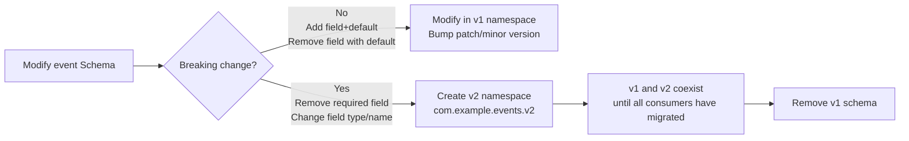

# shared-events — Avro Event Schema SDK

`shared-events` is the **Single Source of Truth** for all cross-service Kafka events.

Each microservice is an **independent project** that depends on this module via `mavenLocal()` — there is no Gradle multi-project coupling.

---

## Purpose and Responsibilities

```
Single Source of Truth for event contracts
├── Schema layer
│   ├── .avsc source files (organised by versioned namespaces; source files are the sole authority)
│   └── Schema Registry pre-registration script
├── Kafka resource layer [NEW]
│   ├── topics.yaml (centralised Topic properties: partitions, replication factor)
│   ├── ACL permissions (producers/consumers defined in topics.yaml)
│   └── manage-kafka.sh (automates Topic and ACL creation)
├── SDK layer
│   ├── Avro SpecificRecord Java classes (generated at build time)
│   ├── KafkaResourceConstants.java (Topic name and Service ID constants)
│   └── Published to mavenLocal() (the only way services reference this SDK)
└── Documentation layer
    ├── Event catalogue (field descriptions, producer/consumer matrix)
    ├── Evolution rules (BACKWARD compatibility constraints, v2 namespace strategy)
    └── CHANGELOG.md (version change history)
```

**Each microservice is responsible for:**
- Declaring Kafka Topics and configuring `schema.registry.url`
- Mapping domain events ↔ Avro messages in the `infrastructure/messaging/` adapter layer
- Configuring Kafka serializers / deserializers

> **Strictly prohibited**: `shared-events` must not contain business logic, Spring beans, or repository code.
> It is purely a **schema → code** converter that produces plain Avro `SpecificRecord` classes.

---

## Directory Structure

```
shared-events/
├── src/
│   ├── main/
│   │   ├── avro/
│   │   │   └── com/example/events/
│   │   │       ├── v1/                       # Current version namespace
│   │   │       │   ├── OrderPlaced.avsc
│   │   │       │   ├── OrderConfirmed.avsc
│   │   │       │   ├── OrderCancelled.avsc
│   │   │       │   ├── OrderShipped.avsc
│   │   │       │   ├── StockReserved.avsc
│   │   │       │   └── StockReleased.avsc
│   │   │       └── v2/                       # Created on breaking change (currently empty placeholder)
│   │   ├── java/
│   │   │   └── com/example/events/
│   │   │       └── KafkaResourceConstants.java # Type-safe constants
│   │   └── resources/
│   │       └── kafka/
│   │           └── topics.yaml               # Centralised Topic definitions
├── scripts/
│   └── manage-kafka.sh                       # One-shot script to sync Topics and ACLs
├── build/
│   └── generated-main-avro-java/             # Generated Java classes (not committed to Git)
├── CHANGELOG.md                              # Version change log (required on every change)
├── build.gradle.kts
├── .gitignore
└── README.en.md
```

> Generated Java classes live under `build/generated-main-avro-java/`, are **not committed to Git**, and are regenerated automatically on every build.

---

## Which Events Belong in shared-events

**Only events consumed across service boundaries** (at least one consumer in a different service):

| Event | Producer | Consumers |
|---|---|---|
| `OrderPlaced` | order | notification |
| `OrderConfirmed` | order | notification |
| `OrderCancelled` | order | notification, catalog |
| `OrderShipped` | order | notification |
| `StockReserved` | catalog | order |
| `StockReleased` | catalog | — (no current consumer; available for future subscribers) |

**Events that do NOT belong here**: application events used only within a single service (e.g., read-model projection events internal to `order`) — use Spring `ApplicationEvent` or a plain record instead.

---

## build.gradle.kts

```kotlin
plugins {
    `java-library`
    id("com.github.davidmc24.gradle.plugin.avro") version "1.9.1"
    `maven-publish`
}

group = "com.example"
version = "0.1.0"

dependencies {
    // Avro runtime (base dependency for generated classes)
    api("org.apache.avro:avro:1.11.3")
    // Confluent Avro Serializer (used by consumers/producers; transitive dependency for microservices)
    api("io.confluent:kafka-avro-serializer:7.6.0")
}

repositories {
    mavenCentral()
    // Confluent packages live in a separate Maven repository
    maven { url = uri("https://packages.confluent.io/maven/") }
}

avro {
    isCreateSetters.set(false)            // Generate immutable-style classes (no setters)
    fieldVisibility.set("PRIVATE")        // Private fields accessed via getters
    isEnableDecimalLogicalType.set(true)  // Support decimal logical type
    outputCharacterEncoding.set("UTF-8")
}

publishing {
    publications {
        create<MavenPublication>("maven") {
            from(components["java"])
        }
    }
    repositories {
        // During demo phase, publish to local Maven repository; services reference via mavenLocal()
        mavenLocal()
    }
}
```

---

## SDK Versioning Strategy

Starting at `0.x.y` for the demo phase, using lightweight Semantic Versioning (SemVer):

| Change type | Version bump | Example |
|---|---|---|
| New event (non-breaking) | MINOR | `0.1.0` → `0.2.0` |
| New field (with `default`) | PATCH | `0.1.0` → `0.1.1` |
| Remove/rename field (breaking) | MAJOR + new namespace | `0.x.y` → `1.0.0` |
| Documentation/comment change only | PATCH | `0.1.0` → `0.1.1` |

> **CHANGELOG.md must be updated on every schema change**, no matter how small.

---

## Build and Publish (mavenLocal)

Each microservice is an independent Gradle project that depends on this SDK via `mavenLocal()`. **After modifying a schema, you must publish first before any service can use the new version.**

```bash
# 1. Trigger Avro code generation (generateAvroJava runs automatically before compileJava)
./gradlew generateAvroJava

# 2. Build and publish to the local Maven repository
./gradlew publishToMavenLocal

# 3. All-in-one: generate + build + publish
./gradlew build publishToMavenLocal
```

Reference this SDK from each microservice's `build.gradle.kts`:

```kotlin
repositories {
    mavenLocal()   // Prefer locally published shared-events
    maven { url = uri("https://packages.confluent.io/maven/") }
    mavenCentral()
}

dependencies {
    implementation("com.example:shared-events:0.1.0")  // Keep in sync with version bumps
}
```

> **Note**: When the `shared-events` version is bumped, update the version string in each service's `build.gradle.kts` accordingly.

---

## Schema Definition Standards

### Avsc File Structure

```json
{
  "namespace": "com.example.events.v1",
  "type": "record",
  "name": "OrderPlaced",
  "doc": "One-sentence description of the event and when it is emitted",
  "fields": [
    {
      "name": "eventId",
      "type": "string",
      "doc": "UUID; globally unique event identifier used by consumers for idempotent deduplication"
    },
    {
      "name": "occurredAt",
      "type": { "type": "long", "logicalType": "timestamp-millis" },
      "doc": "Event timestamp (UTC, milliseconds)"
    }
  ]
}
```

**Field standards:**

| Rule | Explanation |
|---|---|
| Every event must have `eventId` (string/UUID) | Basis for consumer idempotent deduplication |
| Every event must have `occurredAt` (timestamp-millis) | Event sourcing timestamp |
| All fields must include `doc` | Contract description for consuming teams |
| New fields must provide a `default` | Maintain BACKWARD compatibility |
| Monetary amounts use `long` (cents) + `string` (currency code) | Avoid floating-point precision issues |
| UUIDs use `string` type | Avro has no native UUID type |
| Enumerations use Avro `enum` type | Enables compatibility checking via Schema Registry |

### Example: OrderPlaced.avsc

```json
{
  "namespace": "com.example.events.v1",
  "type": "record",
  "name": "OrderPlaced",
  "doc": "Published when a customer successfully places an order and stock has been reserved",
  "fields": [
    {
      "name": "eventId",
      "type": "string",
      "doc": "UUID used for consumer idempotent deduplication"
    },
    {
      "name": "orderId",
      "type": "string",
      "doc": "Order ID (UUID)"
    },
    {
      "name": "customerId",
      "type": "string",
      "doc": "Customer ID (UUID)"
    },
    {
      "name": "customerEmail",
      "type": "string",
      "doc": "Customer email snapshotted at order time, used for notifications"
    },
    {
      "name": "items",
      "type": {
        "type": "array",
        "items": {
          "type": "record",
          "name": "OrderItem",
          "fields": [
            { "name": "bookId",         "type": "string", "doc": "Book ID (UUID)" },
            { "name": "bookTitle",      "type": "string", "doc": "Book title snapshotted at order time" },
            { "name": "quantity",       "type": "int" },
            { "name": "unitPriceCents", "type": "long",   "doc": "Unit price snapshotted at order time (cents)" }
          ]
        }
      }
    },
    {
      "name": "totalCents",
      "type": "long",
      "doc": "Order total amount (cents)"
    },
    {
      "name": "currency",
      "type": "string",
      "default": "CNY",
      "doc": "Currency code (ISO 4217)"
    },
    {
      "name": "occurredAt",
      "type": { "type": "long", "logicalType": "timestamp-millis" },
      "doc": "Event timestamp (UTC)"
    }
  ]
}
```

---

## Kafka Resource Management (Topic & ACL)

This module acts as Single Source of Truth not only for schemas but also for Kafka Topic definitions and permissions.

### Topic Configuration (topics.yaml)

All Topics are defined in `src/main/resources/kafka/topics.yaml`:

```yaml
topics:
  - name: bookstore.order.placed
    partitions: 3
    replicationFactor: 1
    producers: ["order"]        # Granted WRITE + DESCRIBE permissions
    consumers: ["notification"] # Granted READ + DESCRIBE permissions
```

### Permission Sync Script (manage-kafka.sh)

The `scripts/manage-kafka.sh` script automates the following via Kafka admin commands:
1. **Topic creation**: Automatically creates Topics that do not yet exist.
2. **ACL binding**: Binds Service Principal permissions based on `producers`/`consumers` entries.

```bash
./scripts/manage-kafka.sh
```

---

## SDK Usage Guidelines

### Type-Safe Constants (KafkaResourceConstants)

Services **must not hard-code Topic names**; they must reference constants provided by this SDK:

```java
// Example: reference a Topic constant
kafkaTemplate.send(KafkaResourceConstants.TOPIC_ORDER_PLACED, key, event);
```

---

## Schema Evolution Rules



**Handling breaking changes:**

1. Create new version `.avsc` files under `src/main/avro/com/example/events/v2/`
2. Bump the `shared-events` version (`version` in `build.gradle.kts`, MAJOR bump)
3. Update `CHANGELOG.md` with the reason for the change
4. Run `./gradlew build publishToMavenLocal` to publish the new version
5. **Upgrade the producer first**: publish both v1 and v2 messages simultaneously (dual-write transition period)
6. Gradually upgrade consumers to v2
7. Once all consumers have migrated, stop the v1 dual-write and remove the v1 schema

---

## Producer (Publishing Events)

Actual Kafka publishing is handled by seedwork's **Outbox Pattern** — services **do not call** `kafkaTemplate.send()` directly.

Each service implements seedwork's `OutboxMapper` SPI in `infrastructure/messaging/outbox/`, mapping domain events to Avro payloads. Seedwork's `OutboxWriteListener` writes the outbox row within the same transaction; then `OutboxRelayScheduler` (or Debezium CDC) publishes asynchronously to Kafka.

```java
// infrastructure/messaging/outbox/OrderOutboxMapper.java  (in order)
// Implements seedwork's OutboxMapper SPI — the only place that imports shared-events Avro classes

@Component
public class OrderOutboxMapper implements OutboxMapper {

    @Override
    public boolean supports(DomainEvent event) {
        return event instanceof com.example.order.domain.event.OrderPlaced;
    }

    @Override
    public OutboxPayload map(DomainEvent event) {
        var domainEvent = (com.example.order.domain.event.OrderPlaced) event;
        // Map domain event → Avro message (mapping done in the infrastructure adapter layer)
        var avroEvent = com.example.events.v1.OrderPlaced.newBuilder()
            .setEventId(domainEvent.eventId().toString())
            .setOrderId(domainEvent.orderId().toString())
            .setCustomerId(domainEvent.customerId().toString())
            .setCustomerEmail(domainEvent.customerEmail())
            .setTotalCents(domainEvent.totalAmount().cents())
            .setCurrency(domainEvent.totalAmount().currency())
            .setOccurredAt(domainEvent.occurredAt().toEpochMilli())
            // ... items mapping
            .build();

        return new OutboxPayload(
            KafkaResourceConstants.TOPIC_ORDER_PLACED,
            domainEvent.orderId().toString(),  // key = orderId (partition key)
            avroEvent
        );
    }
}
```

Publishing trigger path (handled transparently by seedwork):

```
PlaceOrderCommandHandler
  → OrderPersistence.save(order)                        ← aggregate carries domain events
      → OutboxWriteListener (BEFORE_COMMIT)             ← seedwork JPA listener
          → writes outbox_event row atomically
              → OutboxRelayScheduler / Debezium CDC     ← seedwork / infrastructure
                  → KafkaOutboxEventPublisher publishes to Kafka
```

---

## Consumer (Consuming Events)

In the actual code, the notification service uses seedwork's `IdempotentKafkaListener` to guarantee idempotent consumption, and routes messages from a single Topic to dedicated handler classes rather than writing business logic directly in the `@KafkaListener` method.

```java
// interfaces/messaging/consumer/OrderEventConsumer.java  (in notification)
// Single-entry listener that routes messages to the appropriate handler

@Component
public class OrderEventConsumer {

    private final OrderPlacedHandler orderPlacedHandler;
    // ... other handlers

    @IdempotentKafkaListener(topics = KafkaResourceConstants.TOPIC_ORDER_PLACED,
                              groupId = "notification")
    public void onOrderPlaced(com.example.events.v1.OrderPlaced event) {
        // Avro deserialization is handled automatically by KafkaAvroDeserializer
        orderPlacedHandler.handle(event);
    }
}

// interfaces/messaging/consumer/OrderPlacedHandler.java  (in notification)
// Focused on handling a single event type; dispatches to the application layer via CommandBus

@Component
public class OrderPlacedHandler {

    private final CommandBus commandBus;

    public void handle(com.example.events.v1.OrderPlaced event) {
        commandBus.dispatch(new SendOrderNotificationCommand(
            UUID.fromString(event.getCustomerId()),
            event.getCustomerEmail(),
            event.getOrderId()
        ));
    }
}
```

---

## .gitignore

```gitignore
# Generated Avro Java classes are not committed to Git; regenerated automatically on every build
build/
.gradle/
```
